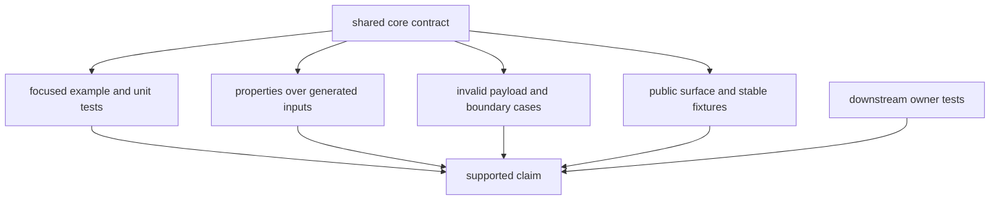
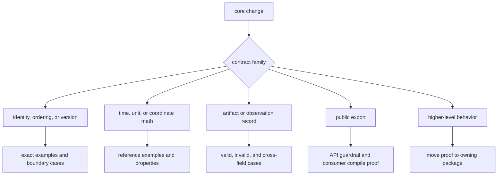

# Core Contract Test Strategy

The core suite protects shared meaning: public identities, units, time,
observations, diagnostics, and artifact records. It should fail when a
downstream assumption becomes ambiguous, even if every package still compiles.
It should not duplicate receiver orchestration or navigation algorithms.

## Proof Layers



No layer substitutes for the others. An example explains intended behavior; a
property explores a domain; a negative case proves invalid states are visible;
compatibility evidence protects consumers; downstream tests prove that the
contract is used correctly in a real workflow.

## Current Evidence

| evidence family | what it proves | primary evidence |
| --- | --- | --- |
| curated public surface | stable public items are reachable through `bijux_gnss_core::api` rather than private implementation modules | [public API guardrail](https://github.com/bijux/bijux-gnss/blob/main/crates/bijux-gnss-core/tests/public_api_guardrail.rs) |
| navigation payload validity | inconsistent versions, counts, clock units, DOPs, residual summaries, covariance, sigmas, and error ellipses produce diagnostics | [navigation artifact validation](https://github.com/bijux/bijux-gnss/blob/main/crates/bijux-gnss-core/tests/nav_artifact_validation.rs) |
| tracking payload validity | invalid uncertainty and navigation-bit signs produce diagnostics | [tracking artifact validation](https://github.com/bijux/bijux-gnss/blob/main/crates/bijux-gnss-core/tests/tracking_artifact_validation.rs) |
| time properties | GPS-second round trips and sample-clock monotonicity hold over generated finite ranges | [timekeeping properties](https://github.com/bijux/bijux-gnss/blob/main/crates/bijux-gnss-core/tests/prop_timekeeping.rs) |
| known property counterexamples | previously minimized time failures remain reproducible | [timekeeping regression corpus](https://github.com/bijux/bijux-gnss/blob/main/crates/bijux-gnss-core/tests/prop_timekeeping.proptest-regressions) |
| repository boundary | core follows source and API policy without depending upward into product workflows | [integration guardrail](https://github.com/bijux/bijux-gnss/blob/main/crates/bijux-gnss-core/tests/integration_guardrails.rs) |
| focused primitive behavior | selected leap-second, GPS week, geodetic round-trip, convention, and status behavior | unit tests beside the owning implementations |

## Choosing The Proof



### Identities And Ordering

Use exact assertions for constellation, satellite, signal, version, status, and
stability-key behavior. Cover invalid constructors or lookups and ordering
across constellation boundaries. If serialized, include a compatibility case
that a reader can inspect.

### Time, Units, And Coordinates

Use independent reference points plus algebraic properties such as round trip,
monotonicity, periodicity, and frame consistency. Derive tolerances according to
[numerical evidence](numerical-budgets.md). Include week boundaries, leap-second
boundaries, poles, antimeridian behavior, high and negative altitude where the
API supports them, and non-finite input policy.

### Artifact And Observation Records

Test a coherent payload, then mutate one invariant at a time. Assert the
diagnostic code and severity that consumers rely on. Cross-field checks are more
valuable than parse-only examples: counts must reconcile, units must agree,
status must match refusal or integrity metadata, and numerical evidence must be
finite where promised.

### Public API

Run the public guardrail for every export change and compile at least one
consumer-shaped use of the new surface. A symbol being public is not enough; it
must have stable shared meaning and remain reachable without private paths.

## Honest Limits In The Current Suite

The existing evidence does not support unlimited claims:

- Time property generation currently covers positive GPS seconds and positive
  sample rates, but does not systematically generate leap-second boundaries,
  week rollovers, invalid rates, or GPS/UTC/TAI round trips.
- Geodetic unit coverage includes a basic equatorial round trip, not broad
  latitude, longitude, altitude, pole, or antimeridian properties.
- Artifact integration tests strongly exercise selected navigation and tracking
  invariants, but do not constitute exhaustive compatibility evidence for every
  acquisition, observation, support-matrix, and version-conversion payload.
- The observation fixture and property regression corpus preserve useful
  examples, but a checked-in fixture is only evidence for the fields and
  versions it actually exercises.
- Core tests prove record coherence, not receiver accuracy, estimator
  convergence, uncertainty calibration, or artifact persistence.

Changes touching one of these gaps should add the missing focused evidence or
state the residual limitation in review. Do not broaden documentation claims
because an adjacent test happens to pass.

## Focused Commands

Run the narrowest evidence from the repository root:

```sh
cargo test -p bijux-gnss-core --test public_api_guardrail
cargo test -p bijux-gnss-core --test nav_artifact_validation
cargo test -p bijux-gnss-core --test tracking_artifact_validation
cargo test -p bijux-gnss-core --test prop_timekeeping
```

For a contract change that spans families, run the package suite after the
focused failure is understood:

```sh
cargo test -p bijux-gnss-core
```

## Review Standard

A core test is ready when its name states the contract, its data exposes units
and frames, its failure identifies the moved invariant, and its proof is no
broader than the exercised domain. If the assertion is meaningful only inside
acquisition, tracking, persistence, or estimation, move it to that owner and
retain only the shared contract proof here.
