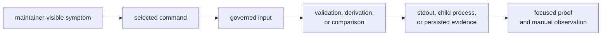
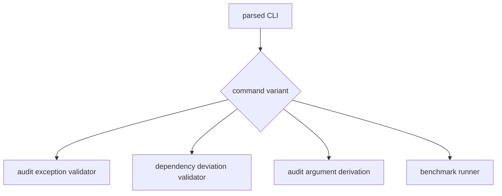
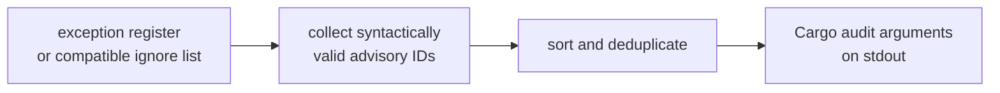
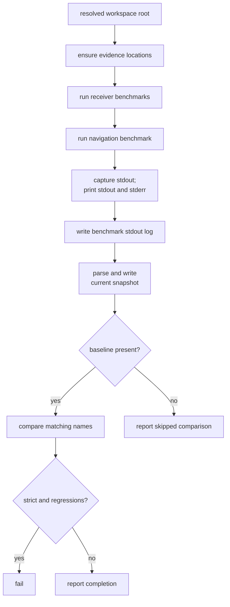

# Tracing Maintainer Command Behavior

The maintainer binary currently keeps parsing, dispatch, validation,
derivation, benchmark execution, normalization, and comparison in one
[command source](https://github.com/bijux/bijux-gnss/blob/main/crates/bijux-gnss-dev/src/main.rs). Read it by
workflow and effect rather than from top to bottom.

This guide connects a maintainer-visible symptom to the decision code,
governed input, side effect, and available proof.

## Trace From The Symptom

| symptom or change | trace first | verify against |
| --- | --- | --- |
| a command is missing or parses an option incorrectly | command enum and dispatch | [command reference](https://github.com/bijux/bijux-gnss/blob/main/crates/bijux-gnss-dev/docs/COMMANDS.md) |
| an audit exception is accepted or rejected unexpectedly | audit exception validator, advisory identifier predicate, date lookup, and date predicate | [audit policy](https://github.com/bijux/bijux-gnss/blob/main/crates/bijux-gnss-dev/docs/AUDIT_POLICY.md) and the reviewed exception register |
| a dependency-policy deviation fails governance | deviation validator and its review-link rule | [governance input guide](https://github.com/bijux/bijux-gnss/blob/main/crates/bijux-gnss-dev/docs/GOVERNANCE_FILES.md) |
| Cargo audit receives the wrong ignore arguments | argument derivation, both supported input shapes, identifier filtering, sorting, and deduplication | the validated exception register and captured stdout |
| a benchmark did not run | benchmark inventory, child-process construction, and process status handling | product benchmark declarations and console stderr |
| a benchmark result is absent from the current snapshot | bencher-line parser and snapshot writer | captured benchmark stdout and [benchmark contract](https://github.com/bijux/bijux-gnss/blob/main/crates/bijux-gnss-dev/docs/BENCHMARKS.md) |
| strict mode did not fail | baseline-presence branch, ratio calculation, and strictness branch | baseline availability, comparable names, and selected threshold |
| fast or slow nextest selection is wrong | suite-selection integration proof, slow roster, and expression generator | [repository test policy](../quality/repository-test-policy.md) |

## Parsing And Dispatch

Start with the command enum to establish the complete binary surface. Each
variant owns its options, and the main dispatch should route it to exactly one
workflow.

When adding a command, check more than parser syntax:

- the governed contract that gives the command ownership;
- workspace-root resolution;
- read, write, clock, and process effects;
- stdout and stderr consumers;
- exit-status behavior;
- the package guide and handbook contract;
- direct behavioral evidence.

The [workflow ownership boundary](../ownership-boundaries.md) is the admission
test. A parser variant without a durable repository decision is not enough.

## Audit Exception Validation

Trace audit validation in this order:

1. workspace-root resolution;
2. required exception-register lookup;
3. TOML parsing;
4. advisory-record extraction;
5. identifier, rationale, owner, link, and expiry checks;
6. current-day lookup through the platform date command;
7. aggregate failure or success output.

The date predicate verifies shape and compares the text to the current ISO day.
It is not a full calendar parser. A change to date handling therefore affects
governance semantics, platform effects, and diagnostics together.

An empty advisory array passes. A missing register fails. Keep those cases
separate when reviewing a regression.

## Dependency-Deviation Validation

The deviation workflow follows the same broad shape but has different policy:

- every record needs an identity, owner, reason, expiry, and review link;
- the review link must use HTTP or HTTPS;
- the link must reference the shared-standards repository;
- all record errors are collected before the command fails.

Do not merge the two validators merely because their loops look similar.
Their record fields and policy owners differ. Extract only shape predicates
whose semantics are genuinely shared.

## Audit Argument Derivation

Argument derivation is intentionally not the validator:

Trace both accepted input shapes before changing parsing. The command ignores
malformed identifiers rather than failing record-quality validation. If the
register is absent, it prints an empty line and succeeds.

Automation that needs policy enforcement must run audit exception validation
first. Changing derivation to reject richer record defects would alter the
composition contract.

## Benchmark Execution And Comparison

Benchmark behavior crosses the most boundaries. Trace it as one pipeline:

Review these details explicitly:

- the benchmark inventory is hard-coded in the maintainer command;
- product packages own the benchmark implementations;
- child-process stderr is printed but not persisted in the benchmark log;
- only stdout lines matching the expected bencher format enter the snapshot;
- snapshot rows are sorted by benchmark name;
- only names present in both current and baseline snapshots are compared;
- a missing baseline skips comparison, even in strict mode;
- threshold failure occurs only when strict mode is enabled.

The repository currently has no maintained baseline. Any documentation or test
that assumes an enforced regression gate is ahead of implementation.

## Suite Selection Lives Outside Dispatch

The [suite-selection proof](https://github.com/bijux/bijux-gnss/blob/main/crates/bijux-gnss-dev/tests/integration_nextest_suite_selection.rs)
does not call the maintainer binary. It reads the governed slow roster, scans
Rust test functions, invokes the expression generator, and checks fast/slow
coherence.

Trace a suite failure through those inputs. Adding a binary command or changing
dispatch cannot repair a stale roster entry or malformed generated expression.

## Current Proof Coverage

The package has:

- a structural guardrail test;
- a suite-selection integration test.

It does not currently have dedicated tests that execute the four command
workflows against temporary governed inputs or benchmark outputs. For command
semantic changes, direct invocation is necessary unless the change adds focused
behavioral tests. Do not cite the structural guardrail as proof that validation,
derivation, or comparison logic is correct.

Use the [test guide](https://github.com/bijux/bijux-gnss/blob/main/crates/bijux-gnss-dev/docs/TESTS.md) to identify
what is protected and the [state and persistence guide](state-and-persistence.md)
to interpret outputs and stale-evidence risk.

## Review A Change End To End

For the affected workflow, record:

1. the command and option surface;
2. the governed input and absent-input behavior;
3. every parser and decision predicate;
4. every clock, process, stdout, stderr, and filesystem effect;
5. partial-failure and stale-output behavior;
6. the exact evidence that exercises the changed decision;
7. documentation that must remain consistent.

That route remains useful if helper names or source layout change. A source
line tour does not.
