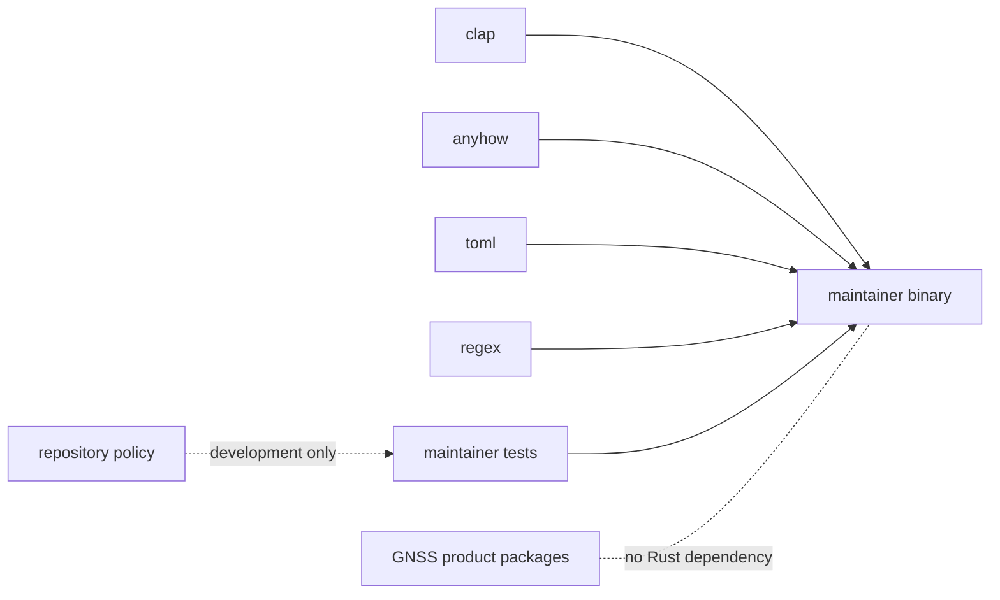
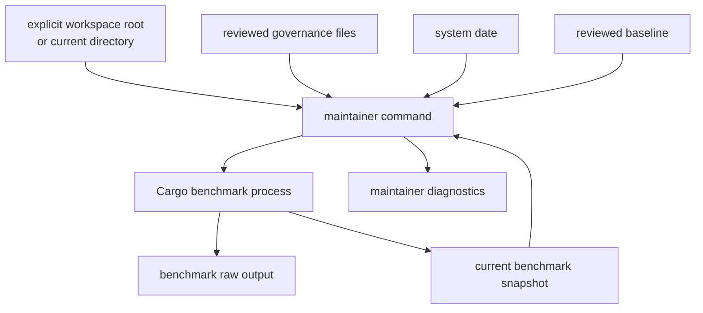

# Maintainer Tool Dependency Direction

The maintainer package is repository tooling, not a product integration layer.
Its compiled binary depends only on general-purpose libraries. Product packages
remain outside its Rust dependency graph even when a maintenance command
launches their benchmarks as child processes.

## Separate Compile-Time And Process Dependencies

The [package manifest](https://github.com/bijux/bijux-gnss/blob/main/crates/bijux-gnss-dev/Cargo.toml) defines four
production dependencies:

| Dependency | Owned use |
| --- | --- |
| `clap` | maintainer command and argument parsing |
| `anyhow` | command-boundary errors with repository context |
| `toml` | reviewed governance-file parsing |
| `regex` | benchmark output extraction |

The policy package is development-only and supports the package guardrail.
There are no production dependencies on core, signal, navigation, receiver,
infrastructure, or the operator command package.

Do not add a product dependency to reuse one parser, constant, or runtime
helper. Move genuinely reusable product behavior to its owning public API, or
keep repository-specific interpretation in the maintainer command.

## Child Processes Are Explicit Effects

No product package is linked into the binary, but the
[benchmark command](https://github.com/bijux/bijux-gnss/blob/main/crates/bijux-gnss-dev/src/main.rs) invokes Cargo
benchmarks owned by receiver and navigation. Audit validation also invokes the
system `date` command to compare expiry fields.

These process edges do not transfer receiver or navigation ownership. The
product packages own benchmark implementation and scientific meaning;
maintainer tooling owns orchestration, extraction, comparison, and repository
evidence.

The root is taken from `--workspace-root` when provided and otherwise from the
current directory. The binary does not search parent directories. Callers must
therefore set their working directory or root argument deliberately.

## Read And Write Boundaries

The four binary commands have different effects:

| Command family | Reads | Writes or emits |
| --- | --- | --- |
| audit allowlist validation | reviewed advisory exceptions | pass/failure diagnostics |
| deny-policy deviation validation | reviewed standards deviations | pass/failure diagnostics |
| audit ignore argument generation | current and legacy advisory entries | sorted command arguments on standard output |
| benchmark comparison | benchmark output and an optional baseline | raw benchmark log, current snapshot, comparison diagnostics |

Missing input is not handled uniformly. Validation commands reject absent
governance files, while ignore-argument generation returns successfully when
the allowlist is absent. Benchmark comparison creates its output directories
and skips regression comparison when no baseline exists. Callers must not infer
one command’s absence policy from another.

The [governance-file guide](https://github.com/bijux/bijux-gnss/blob/main/crates/bijux-gnss-dev/docs/GOVERNANCE_FILES.md)
describes reviewed inputs. The
[workflow guide](https://github.com/bijux/bijux-gnss/blob/main/crates/bijux-gnss-dev/docs/WORKFLOWS.md) describes
command effects and output ownership.

## Test-Only Repository Dependencies

Slow-test roster governance is not a subcommand. The
[lane-selection integration test](https://github.com/bijux/bijux-gnss/blob/main/crates/bijux-gnss-dev/tests/integration_nextest_suite_selection.rs)
reads the roster, scans Rust test functions, and executes the
[nextest expression generator](https://github.com/bijux/bijux-gnss/blob/main/makes/bin/nextest_expr.sh). This is a
test-time repository edge, separate from the binary’s command inventory.

The source scan is heuristic: it recognizes test attributes followed by named
functions. It does not parse Rust syntax or prove that every selected test is
slow. Its contract is roster integrity and lane-expression agreement.

## Review A New Dependency

Before adding a library, file, or process edge:

1. name the maintainer workflow that owns it
2. state whether the edge exists at compile time, test time, or process time
3. identify reviewed inputs and all outputs
4. define missing, malformed, and partial-output behavior
5. keep product semantics with the product owner
6. add a narrow command or integration test for the new effect

Use the [package boundary](https://github.com/bijux/bijux-gnss/blob/main/crates/bijux-gnss-dev/docs/BOUNDARY.md) to
reject generic scripting and product behavior. The
[Make integration](https://github.com/bijux/bijux-gnss/blob/main/makes/rust.mk) shows current audit and benchmark
callers; it should remain a caller rather than a second implementation.

## Warning Signs

- a product package enters production dependencies
- a child process is described as an in-process API
- a command searches or writes outside its declared workspace root
- a governed file is read without malformed and missing-input behavior
- a test-only source scanner is presented as a binary capability
- a benchmark parser begins deciding scientific performance policy
- a Make target duplicates validation instead of invoking the typed command

The direction is sound when repository effects remain explicit, product
packages retain product meaning, and every compile-time, test-time, and process
edge has one named maintainer purpose.
