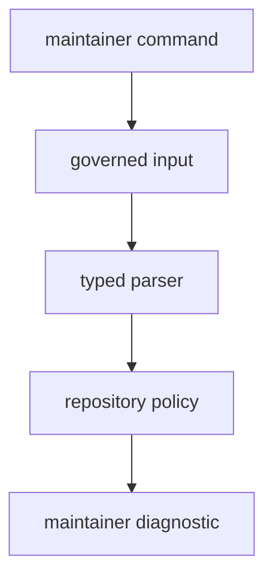

# Error Model

The binary uses command-oriented failure rather than a shared library error
taxonomy.

Every failure should be useful to a maintainer deciding what repository input
to inspect next. The message should name the governed file, parsed field,
benchmark output, or suite-selection rule that failed.

## Error Families

- missing governed files
- malformed TOML or malformed reviewed fields
- expired governance entries
- failed external benchmark execution
- malformed benchmark output or baseline parsing
- slow-test roster entries that no longer resolve to real tests
- generated evidence that lands outside the documented output contract

## Architectural Role

Errors here are maintainer-facing diagnostics. They should explain what
governed contract failed and why. They are not meant to become a reusable Rust
error API for downstream crates.

## Message Rules

- Name the command and governed input before naming parser internals.
- Prefer "which reviewed entry failed" over "which helper returned an error."
- Keep remediation tied to repository policy, not to a developer's local shell.
- Do not promote this error vocabulary into a reusable crate API unless a
  separate public contract is created and documented.

## Proof Path

Inspect the [maintainer command guide](https://github.com/bijux/bijux-gnss/blob/main/crates/bijux-gnss-dev/docs/COMMANDS.md),
[governance file guide](https://github.com/bijux/bijux-gnss/blob/main/crates/bijux-gnss-dev/docs/GOVERNANCE_FILES.md),
and command implementation. Then inspect the integration tests to confirm
diagnostics are still tied to governed repository contracts instead of an
accidental internal error taxonomy.
