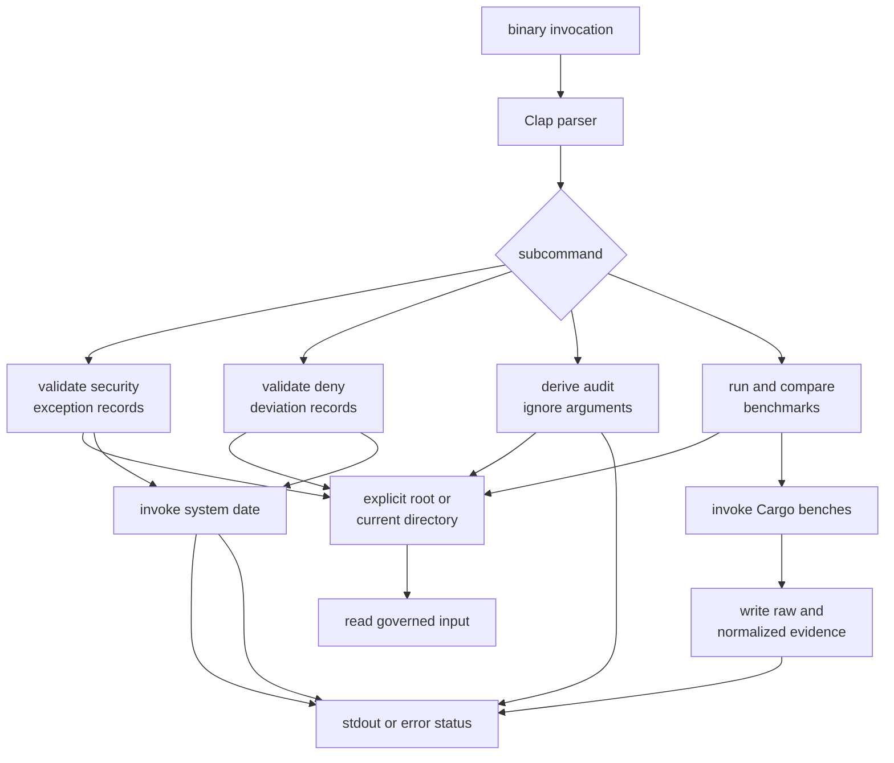
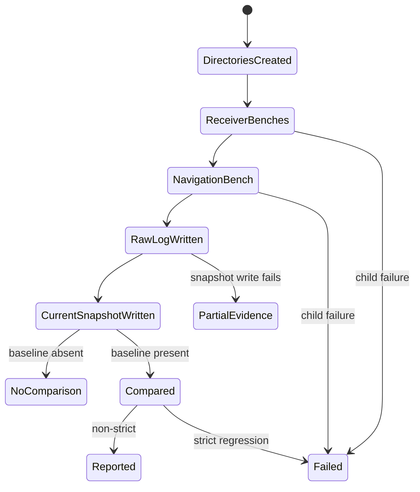

# Maintainer Command Execution

`bijux-gnss-dev` is a private, binary-only package. Each invocation parses one
subcommand, chooses a workspace root, performs one bounded maintenance
workflow, and reports through process status, terminal streams, or
repository-local evidence.

The binary does not discover a repository ancestor. Unless
`--workspace-root` is supplied, the process current directory is the root for
every relative input and output.

## Dispatch and Effects

The [binary implementation](https://github.com/bijux/bijux-gnss/blob/main/crates/bijux-gnss-dev/src/main.rs) is the
authority for ordering and effects. The
[command contract](../interfaces/command-surface.md) explains caller-visible
syntax, while the [workflow guide](https://github.com/bijux/bijux-gnss/blob/main/crates/bijux-gnss-dev/docs/WORKFLOWS.md)
states intended maintenance ownership.

## Execution Paths

| Command | Reads | External process | Writes | Success condition |
| --- | --- | --- | --- | --- |
| `audit-allowlist` | [security exception ledger](https://github.com/bijux/bijux-gnss/blob/main/audit-allowlist.toml) | system date | none | all reviewed rows satisfy implemented identifier, ownership, link, and lexical-expiry rules |
| `deny-policy-deviations` | [local deviation ledger](https://github.com/bijux/bijux-gnss/blob/main/configs/rust/deny.deviations.toml) | system date | none | all rows satisfy implemented ownership, rationale, review-link, and lexical-expiry rules |
| `audit-ignore-args` | [security exception ledger](https://github.com/bijux/bijux-gnss/blob/main/audit-allowlist.toml), when present | none | none | input parses and recognized identifiers are emitted; absence is successful empty output |
| `bench-compare` | optional benchmark baseline after execution | four Cargo benchmark targets | raw combined output and normalized current snapshot | child processes and writes succeed; regression findings fail only in strict mode |

The validators aggregate record findings into one error. They still fail
immediately for missing files, unreadable files, invalid TOML, or inability to
obtain the current date. Their date helper checks formatted text from the
system utility; it does not use a typed calendar API.

The argument adapter is intentionally stdout-only because Make captures it.
Invalid identifiers are skipped, duplicates are removed, and output is sorted.
Validation is a separate command and must execute before the adapter’s output
is trusted.

## Benchmark Transaction Boundary

Receiver benchmark targets run first, followed by the navigation benchmark.
Child stdout and stderr are replayed to the maintainer. The command accumulates
stdout in memory and writes the raw log only after every child succeeds.
Therefore:

- a child failure can produce terminal output without a persisted raw log
- a raw-log write can succeed before current-snapshot creation fails
- writes replace existing evidence directly rather than through an atomic
  commit
- an absent baseline is reported as a successful skipped comparison
- only benchmark names present in both snapshots participate in ratio checks
- a non-strict run can report regressions and still return success

The current checkout tracks no benchmark baseline. Until one is governed,
benchmark execution produces current evidence but no historical regression
decision.

## Process Status and Streams

Clap owns help, unknown-command, and invalid-flag errors. Workflow functions
return `anyhow::Result`; an error from parsing, validation, filesystem access,
date resolution, a child process, UTF-8 conversion, or strict regression
becomes a non-zero process result.

Output has two audiences:

- exact stdout from `audit-ignore-args` is machine-consumed
- validation messages, benchmark progress, child streams, and regression lines
  are maintainer-facing

Do not parse maintainer prose when process status or typed evidence can carry
the decision. Conversely, do not add commentary to the adapter’s stdout without
migrating its caller.

## Environment and Determinism

The executable inherits the caller environment. Benchmark behavior additionally
depends on Cargo, compiler state, machine load, and target-directory settings
provided by orchestration. The validators depend on local filesystem content
and the system date. None of the commands currently snapshots its complete
environment.

Deterministic output exists only where implemented:

- audit identifiers are ordered by a sorted set
- normalized benchmark rows are sorted by benchmark name
- validation findings follow input record order
- benchmark measurements themselves are environment-sensitive

## Evidence Gaps

The package has no dedicated command-level test harness. Its two integration
targets protect package guardrails and nextest roster policy, not the four
execution paths above. Direct invocation over current repository inputs does
not prove malformed records, alternate roots, process failures, write failures,
or benchmark parser boundaries.

Use [maintainer validation](../quality/change-validation.md) to add controlled
evidence when an execution path changes. Use
[output contracts](../interfaces/output-contracts.md) before changing streams
or files, and [integration seams](integration-seams.md) before changing a
caller boundary.
