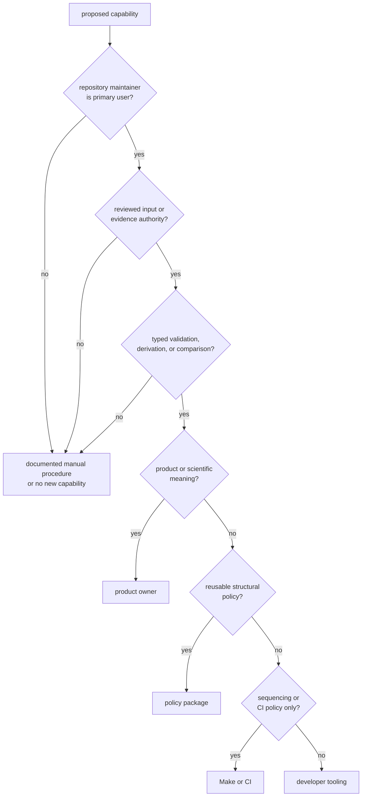
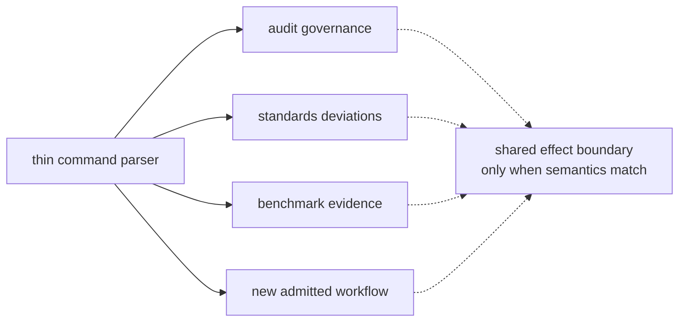

# Extending Maintainer Tooling

The package should grow only when a durable repository-maintenance decision
needs typed parsing, explicit effects, and a stable caller contract. Repeated
shell syntax or local convenience does not justify a new command.

## Admission Decision

An accepted proposal can state:

> From this reviewed authority, the command makes this maintenance decision,
> exposes these effects, and serves this named caller.

If any noun is missing, the design is not ready.

## Supported Extension Forms

| Form | Appropriate use | Required proof |
| --- | --- | --- |
| validator | enforce a reviewability schema for a named repository record | valid, missing, malformed, boundary, duplicate, and unknown-field cases |
| deterministic adapter | derive exact machine input from one reviewed source | byte-exact output, ordering, empty/absent behavior, quoting, and first-consumer proof |
| evidence comparator | normalize and compare bounded maintenance evidence | parser fixtures, identity matching, threshold boundaries, absent/new/missing records, and strictness |
| package integration guard | prove this package’s relationship to an external repository mechanism | producer and consumer behavior plus limitations of the integration assertion |

A generic command runner, filesystem utility, network client, or product-data
transform does not become appropriate by being wrapped in Clap.

## Design the Extension

Before adding parser syntax, define:

- authority and owner of the input’s meaning
- schema and compatibility policy
- root and path resolution
- absence, empty, malformed, duplicate, stale, and unknown values
- stdout versus human diagnostics
- process-status policy
- files created, replaced, or appended
- subprocess executable, arguments, environment, and working directory
- partial-failure and retry behavior
- first direct and orchestrated consumers
- deterministic automated evidence
- limitations that remain human-reviewed

Use [maintainer interface contracts](../interfaces/index.md) for observable behavior
and [contributing maintainer workflows](../operations/contribution-guide.md)
for review evidence.

## Grow by Workflow Ownership

The implementation currently places all commands in one binary source file.
That shape is already carrying parsing, validation, date lookup, filesystem
effects, child processes, benchmark normalization, and comparison.

Split when one or more of these become true:

- a workflow cannot be reviewed without skipping unrelated command logic
- controlled tests need pure functions that are inaccessible behind command
  effects
- error types or schemas differ materially by workflow
- another workflow duplicates logic with different policy meaning
- file size makes ownership and effect boundaries difficult to trace

Split by stable responsibility such as `audit_governance` or
`benchmark_evidence`. Do not introduce generic `helpers`, `common`, `misc`, or
delivery-sequence modules. Shared code is justified only when the semantics,
not merely the syntax, are the same.

## Keep the Package Binary-Only

Do not add a library target to make private command functions easier to test.
Rust supports internal modules and testable pure functions inside a binary
package. A public library is justified only if a legitimate external owner
needs a stable reusable maintainer API and the dependency direction remains
sound.

Product packages must not import this package. Reusable structural policy
belongs in the [policy package](https://github.com/bijux/bijux-gnss/blob/main/crates/bijux-gnss-policies/README.md);
product behavior belongs with its scientific or runtime owner.

## Compatibility Cost

A new command immediately creates commitments:

- command and flag names for direct and Make callers
- governed file location and schema
- standard output consumed by automation
- diagnostics and process-status semantics
- evidence location and lifecycle
- subprocess requirements
- documentation and focused tests

Changing or removing an existing command requires migrating every caller and
governed input in one coherent change. Internal function names are not
compatibility contracts, but moving logic must preserve externally visible
effects.

## Refuse These Extensions

| Proposal | Correct owner or action |
| --- | --- |
| operator-facing GNSS command | public command package |
| signal, acquisition, tracking, observation, or navigation calculation | owning product package |
| dataset registry, run layout, manifest, or product artifact interpretation | infrastructure |
| shared record, identity, unit, diagnostic, or artifact envelope | core |
| reusable source-shape or dependency rule | policy package |
| release workflow orchestration or general tool sequencing | Make, CI, or shared standards |
| one-off report with no governed consumer | keep manual until a durable decision exists |

## Extension Review Record

A reviewable extension includes:

1. ownership decision and rejected alternatives
2. input and output contracts
3. effect and failure ledger
4. compatibility impact on callers
5. controlled positive and negative evidence
6. first-consumer evidence
7. updated command, workflow, output, test, and limitation guides
8. package changelog entry for maintainer-visible behavior

The [repository placement guide](../foundation/repository-fit.md) protects
dependency and publication boundaries. The
[execution model](execution-model.md) describes current effect ordering.
