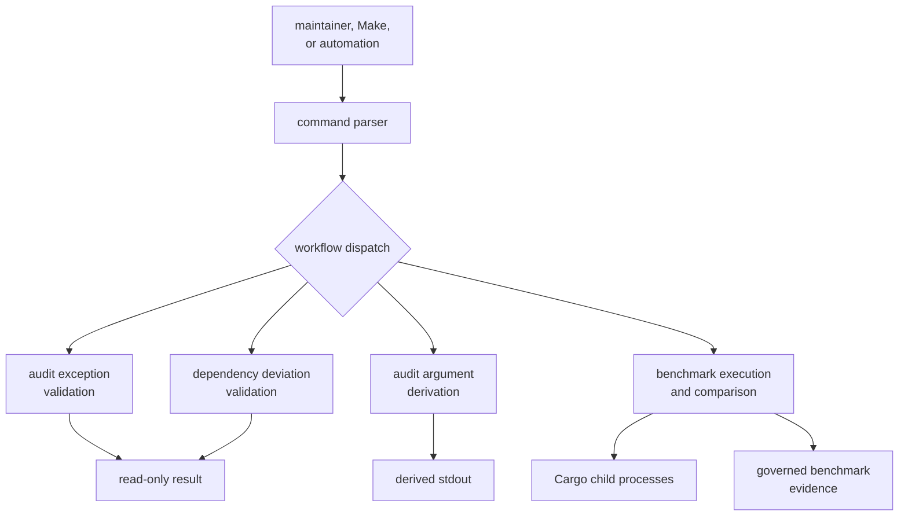
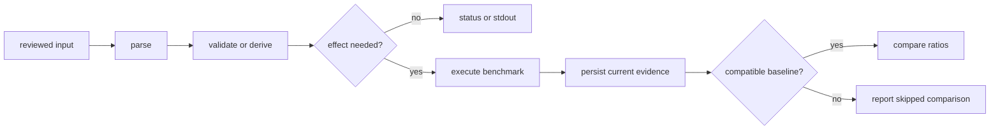
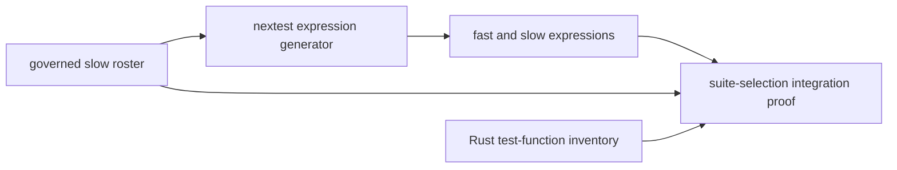
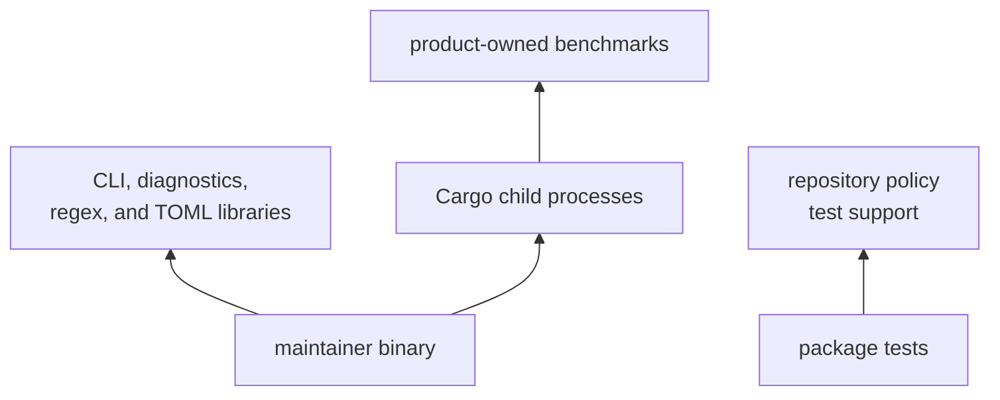

# Maintainer Tooling Architecture

The architecture is small but effectful. One binary parses four command
workflows; a separate integration test protects nextest lane policy. Read this
section when changing command ownership, governed inputs, process execution,
evidence persistence, or failure behavior.

The current implementation fits in one
[command source](https://github.com/bijux/bijux-gnss/blob/main/crates/bijux-gnss-dev/src/main.rs). Treat its
conceptual workflow boundaries as real even though they are not separate
modules. File count is not architecture; ownership and effects are.

## Runtime Shape

The first architecture question is therefore not “which file should contain
this helper?” It is “which workflow owns the decision, and what effects does it
need?”

## Navigate By Question

| question | read |
| --- | --- |
| Which workflow owns a command or decision? | [maintainer command ownership](module-map.md) |
| What may the binary read, write, print, or execute? | [execution model](execution-model.md) |
| Which effects must remain outside this package? | [repository boundary rules](repository-boundary-rules.md) |
| Where do current measurements and durable evidence belong? | [state and persistence](state-and-persistence.md) |
| How do command parsing, governed records, and evidence meet? | [integration seams](integration-seams.md) |
| How should failures identify maintainer action? | [error model](error-model.md) |
| When does a new workflow belong in this binary? | [extensibility model](extensibility-model.md) |
| Which architectural weaknesses need active review? | [architecture risks](architecture-risks.md) |
| How do I trace an existing behavior into implementation and tests? | [code navigation](code-navigation.md) |
| Which packages may this binary depend on? | [dependency direction](dependency-direction.md) |

Use the [package overview](../foundation/package-overview.md) first if the
ownership question is still unresolved. Use the
[command contracts](../interfaces/command-entry-contracts.md) when the
architecture is clear and the concern is caller-visible behavior.

## Workflow Boundaries

### Governance Validation

Audit and dependency-deviation checks parse reviewed records, collect all
record-level errors, and fail once with actionable diagnostics. They are
read-only. Their responsibility ends at record quality; the underlying security
and dependency tools make separate decisions.

### Derived Audit Arguments

Argument derivation reads advisory identifiers, removes duplicates, sorts them,
and prints one command-line fragment. It is deliberately usable as process
substitution by repository automation. It is not a substitute for allowlist
quality validation.

### Benchmark Evidence

Benchmark comparison invokes product-owned microbenchmarks, retains their
stdout, normalizes matching bencher lines, and compares names that exist in
both the current and baseline snapshots. Benchmark stderr remains console
output. Missing baseline entries are not treated as regressions. A missing
baseline skips comparison entirely.

This behavior makes baseline presence and provenance architectural concerns,
not incidental files. The [output contract](../interfaces/output-contracts.md)
defines the evidence categories, and the
[benchmark interpretation guide](https://github.com/bijux/bijux-gnss/blob/main/crates/bijux-gnss-dev/docs/BENCHMARKS.md)
defines their review use.

### Suite-Selection Proof

The [suite-selection proof](https://github.com/bijux/bijux-gnss/blob/main/crates/bijux-gnss-dev/tests/integration_nextest_suite_selection.rs)
reads the slow roster, scans Rust test functions, executes the expression
generator, and verifies the lane relationship. This is repository architecture
evidence owned by the package's tests, but it is not dispatched through the
maintainer binary.

## Dependency Rule

The binary depends on command parsing, diagnostics, regular expressions, and
TOML parsing. Repository-policy support is a development dependency used by
the package guardrail test. Product benchmarks run as child processes; the
binary does not link product implementation crates. This keeps dependency
direction from turning a maintenance command into a product integration layer.

If a proposed command needs to link receiver or navigation internals, first
ask whether the reusable behavior belongs in that product package and whether
the maintainer workflow only needs to invoke its public entrypoint.

## When Structure Must Change

Keep the compact binary while workflows remain independently reviewable and
share no hidden mutable state. Split by durable responsibility when:

- governance records need reusable typed parsers and focused unit tests;
- benchmark execution gains multiple runners, formats, or baseline policies;
- command families require different dependencies or permissions;
- one workflow's changes repeatedly obscure review of another;
- a real non-binary consumer requires a reusable library boundary.

Do not split by arbitrary file size, delivery sequence, or one module per
command. A useful split would expose stable owners such as governance
validation and benchmark evidence, with parsing and dispatch remaining at the
binary boundary.

## Architecture Review

For every change, state:

- the workflow that owns it;
- the reviewed input or product entrypoint it consumes;
- the decision it makes;
- every filesystem, stdout, clock, or process effect;
- the evidence or diagnostic a maintainer receives;
- the narrow test that proves the contract;
- the package that should own the behavior if it is not repository
  maintenance.

That review is more durable than a source-tree tour. Helpers can move without
changing architecture; ownership, effects, and caller-visible contracts cannot.
