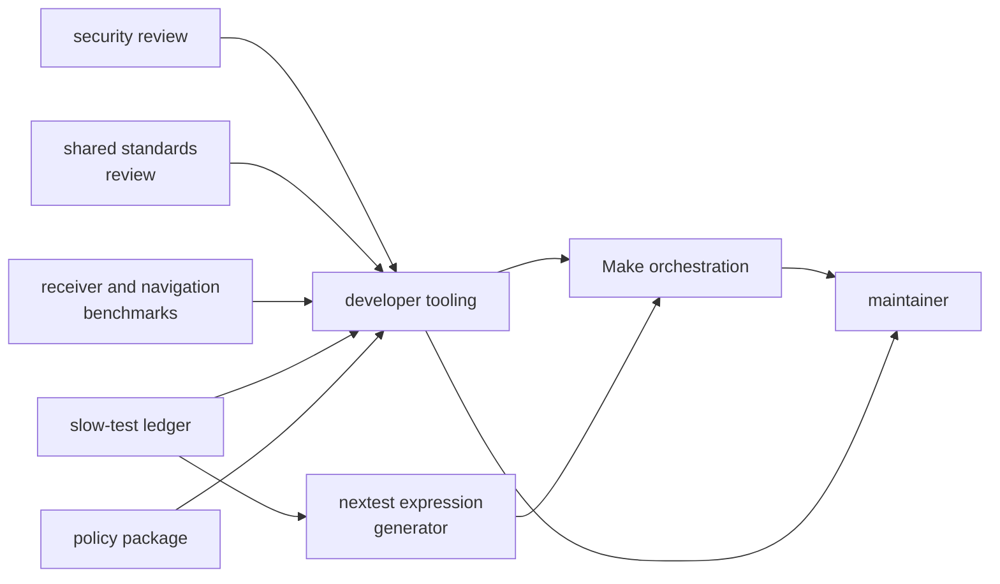
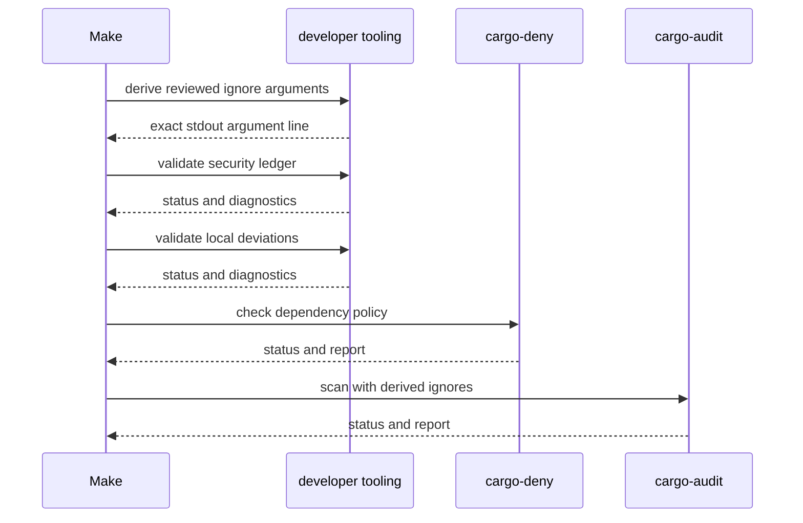

# Maintainer Integration Seams

Developer tooling connects reviewed repository state to Make and maintainer
decisions. It does not own the meaning of security exceptions, shared
standards, product benchmarks, or test-lane orchestration. Each seam needs a
named authority, transport contract, and failure owner.

## Seam Map

The arrows do not imply ownership transfer. Developer tooling validates local
records, adapts one reviewed ledger into audit arguments, compares selected
benchmark output, and tests the generated test-lane relationship.

## Active Seams

| Seam | Transport | Consumer expectation | Failure owner |
| --- | --- | --- | --- |
| security review to allowlist validator | [reviewed security ledger](https://github.com/bijux/bijux-gnss/blob/main/audit-allowlist.toml) | records remain attributable, linked, and unexpired under implemented rules | repository security review owns disposition; developer tooling owns validation mechanics |
| allowlist adapter to audit workflow | one sorted stdout line of `--ignore` arguments | no commentary, valid shell tokenization, validation runs separately | developer tooling owns rendering; Make owns capture and invocation order |
| shared standards review to deviation validator | [local deviation ledger](https://github.com/bijux/bijux-gnss/blob/main/configs/rust/deny.deviations.toml) | every local deviation points to an HTTP(S) review containing the shared-standard identity | shared standards owns durable policy; developer tooling owns local enforcement |
| product benchmarks to comparison | Cargo bencher-format stdout | selected rows normalize into name/value pairs and compare with a baseline when present | product packages own benchmark meaning; developer tooling owns invocation and comparison mechanics |
| comparison to maintainer | terminal findings plus raw and normalized evidence | missing baseline, strictness, threshold, and unmatched names remain visible | developer tooling owns evidence semantics |
| slow-test ledger to lane generator | escaped exact-name regular expression | slow expression includes ledger entries and legacy names; fast expression negates the slow expression | Make tooling owns generation and lane execution |
| lane generator to developer integration test | child-process stdout | expression shape and ledger inclusion remain coherent | developer tooling owns this integration proof, not the generator |
| policy package to package guardrail | test-only Rust API | private package remains within configured repository structure | policy package owns reusable rule meaning; developer package owns its configuration |

## Audit Workflow Composition

The [Rust maintenance Make rules](https://github.com/bijux/bijux-gnss/blob/main/makes/rust.mk) preserve separate
statuses for governance validation, dependency policy, and advisory scanning.
The dev binary does not sequence those tools itself. Changing stdout, command
names, or absence behavior must be tested through this caller, not only by
direct invocation.

## Nextest Policy Seam

The slow-test ledger is not a runtime input to the dev binary. The shared
[shell expression generator](https://github.com/bijux/bijux-gnss/blob/main/.bijux/shared/bijux-makes-rs/scripts/nextest_expr.sh)
reads the ledger for Make’s fast and slow lanes. The
[suite-selection integration](https://github.com/bijux/bijux-gnss/blob/main/crates/bijux-gnss-dev/tests/integration_nextest_suite_selection.rs)
executes that generator and checks:

- sorted, unique ledger entries
- heuristic resolution to a test function name somewhere in the workspace
- exclusion of legacy `slow__` names from the explicit ledger
- inclusion of the legacy namespace in the slow expression
- exact embedding of the slow expression inside the fast negation
- matching of every ledger entry by the extracted regular expression

It does not prove test duration, exact package and test-target identity,
scientific value, or the absence of additional matches. Those decisions remain
human and product-owner responsibilities.

## Benchmark Seam

Benchmark names and measurements originate in receiver and navigation. The
developer command hard-codes the selected targets and requests Cargo’s bencher
format. It recognizes only lines matching its current regular expression.
Unrecognized lines are not persisted in the normalized snapshot, and
benchmarks absent from the baseline do not receive a comparison decision.

Review all of these together when the seam changes:

- selected product targets
- Cargo output format and parser
- normalized snapshot schema
- baseline provenance
- threshold interpretation
- strict versus non-strict status
- Make’s `BENCH_STRICT` mapping

The [benchmark evidence guide](https://github.com/bijux/bijux-gnss/blob/main/crates/bijux-gnss-dev/docs/BENCHMARKS.md)
documents intended ownership. The [execution model](execution-model.md)
documents write ordering and partial-evidence behavior.

## Reject Hidden Coupling

Block a change when it:

- imports product internals instead of invoking a product-owned public
  benchmark or interface
- duplicates exception records in Make, workflow configuration, or code
- moves orchestration and report aggregation into the binary without a durable
  command contract
- treats a policy test dependency as permission to expose policy internals at
  runtime
- lets a generated evidence file become an accepted baseline without review
- parses human diagnostics where process status or typed data should be used
- claims a roster test proves runtime cost or scientific correctness

## Review a Seam Change

1. Name the authority on both sides and the exact transported value.
2. Define absence, malformed input, duplicate input, process failure, and
   partial output.
3. Verify the producer directly.
4. Verify the first consumer with real quoting, status propagation, and paths.
5. State which semantic decisions remain outside developer tooling.
6. Update [workflow contracts](../interfaces/workflow-contracts.md) and
   [maintainer evidence limits](../quality/known-limitations.md) when the seam’s
   trust boundary changes.

A seam is explicit when a reviewer can identify who supplies meaning, who
transports it, who consumes it, and who repairs each failure.
