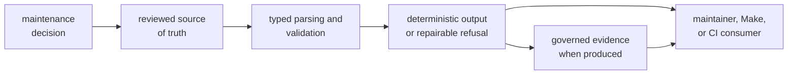
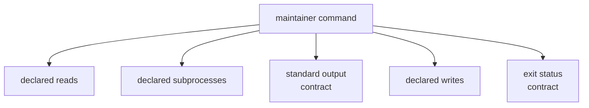

# Maintainer Workflow Design

A maintainer workflow can block security, policy, performance, and test-lane
decisions across the repository. Changes therefore need a stronger standard
than making a command convenient to invoke.

## Design From the Contract

Start with the decision and its authority. A command name, shell replacement,
or desired output format is downstream of that contract.

## One Authority Per Decision

Security exceptions, standards deviations, and benchmark baselines must each
have one reviewed authority. Automation may derive arguments or reports from
that authority, but must not maintain a second exception list.

When adding a field or accepted form, define:

- who reviews it
- whether it is required
- how it is parsed and normalized
- what makes it invalid or expired
- how a maintainer repairs it
- which consumers derive behavior from it

Reject unknown or malformed meaning rather than silently dropping it when that
could weaken a gate.

## Make Effects Visible

Each command should document and test the effects it owns:

| Effect | Required discipline |
| --- | --- |
| repository read | resolve from the selected workspace root and identify a missing required input |
| date or environment read | explain why ambient state is part of validation and make failures explicit |
| subprocess | name the executable, arguments, working directory, output handling, and failure propagation |
| standard output | keep machine-consumable output free of unrelated prose |
| standard error | report actionable context without hiding the failing record |
| file write | use a governed location, define lifecycle and overwrite behavior, and avoid partial evidence |
| exit status | distinguish success from invalid governance, execution failure, and strict threshold failure |

Benchmark comparison is intentionally effectful. Validation and argument
derivation should remain read-only.

## Prefer Narrow Commands

One command should answer one durable maintenance question. Add a new command
when its input authority, outcome, effects, or consumer differs materially from
existing commands. Add an option when the same decision remains intact and the
option only selects a documented mode.

Avoid:

- generic file, command, or repository helpers exposed as public workflow
- options that switch a command between unrelated responsibilities
- command names based on the tool being replaced rather than the decision made
- product semantics duplicated behind a maintainer-oriented name

Private helpers may be shared when they preserve one meaning, such as date
validation or workspace-root resolution. Sharing mechanics must not merge
unrelated policies.

## Preserve Determinism Where Possible

Equivalent reviewed inputs should produce equivalent validation results,
derived argument order, normalized snapshots, and threshold comparisons.
Nondeterministic benchmark measurements are unavoidable, but parsing,
normalization, ordering, ratio calculation, and reporting should be
deterministic.

When ambient state matters, record it or bound its role:

- allowlist and deviation expiry depend on the current calendar day
- benchmark values depend on machine and load, so results are evidence for a
  named environment rather than universal performance truth
- workspace-root selection determines every repository-relative input and
  output

## Refuse Without Weakening Governance

Validation must fail when a required governed file is absent, malformed,
expired, or incomplete. Derived audit-ignore arguments currently return empty
output when the allowlist file is absent; callers must not interpret that
behavior as allowlist validation. Run validation before derivation whenever the
workflow requires assurance that the reviewed source exists.

Benchmark comparison without a baseline still produces current evidence but
does not establish regression status. Strict mode can fail reported
regressions; non-strict mode reports them without making the command fail.
Documentation and automation must preserve those distinctions.

## Admit a Workflow Deliberately

Before adding or extending a command, answer:

1. What maintenance decision does it implement?
2. Which reviewed input authorizes that decision?
3. Why is typed repository tooling the correct owner?
4. What does it read, execute, print, write, and return?
5. How are malformed, absent, expired, and unsupported inputs handled?
6. Which Make, CI, or maintainer consumer relies on it?
7. What focused proof fails when its contract regresses?
8. Which neighboring owner must remain unchanged?

The [scope guide](scope-and-non-goals.md) resolves ownership, while the
[output contract](https://github.com/bijux/bijux-gnss/blob/main/crates/bijux-gnss-dev/docs/OUTPUTS.md) defines
maintained and disposable benchmark evidence.

A change is ready when its authority, parsing rules, effects, refusal behavior,
consumer, deterministic meaning, and proof are explicit without introducing a
second source of governance truth.
