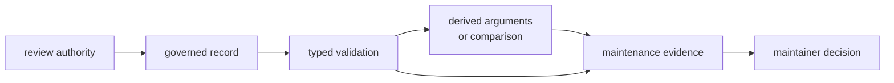
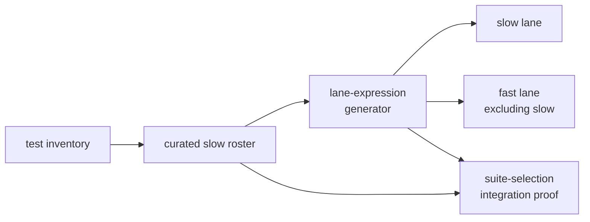

# Maintainer Tooling Vocabulary

Precise language matters because developer tooling can validate the shape of a
decision without approving the decision itself. Use these terms in command
help, diagnostics, reviews, and automation so a passing maintenance check is
not mistaken for security, policy, or performance acceptance.

## Decision and Authority

| Term | Meaning | Does not mean |
| --- | --- | --- |
| review authority | person or owning process accountable for accepting the underlying risk, exception, lane assignment, or baseline | the validation command |
| governed input | reviewed repository data whose content changes a maintenance decision | any configuration file read by a script |
| governance record | one structured exception, deviation, roster entry, or baseline row inside a governed input | an informal comment or copied command argument |
| validation | checking implemented shape, required fields, expiry, identity, and relationship rules | approving the underlying exception or scientific claim |
| derivation | deterministic output computed from a governed source, such as audit ignore arguments | a second source of policy truth |
| maintenance decision | the action a maintainer or automation takes after considering validation and evidence | command success by itself |

Security allowlist validation establishes that advisory records are attributable
and time-bounded. It does not establish that accepting the advisory risk is
correct. Deviation validation establishes that local exceptions remain linked
to review; it does not alter shared standards.

## Commands and Consumers

| Term | Meaning |
| --- | --- |
| maintainer command | private binary subcommand implementing one repository-maintenance contract |
| command contract | governed inputs, parsing rules, effects, outputs, diagnostics, and exit behavior of one command |
| automation consumer | Make or CI logic that invokes a command and relies on its output or status |
| workspace root | explicit or current directory from which repository-relative inputs and outputs are resolved |
| package guardrail | integration proof that the developer-tooling package satisfies repository shape policy |
| repairable diagnostic | failure output that identifies the invalid record and rule closely enough for a maintainer to correct it |

The public `bijux gnss` command tree is an operator interface, not a maintainer
command. Product workflows, reports, and scientific validation remain outside
this vocabulary even when Make invokes both binaries.

## Test-Lane Language

| Term | Meaning | Important distinction |
| --- | --- | --- |
| slow-test roster | sorted, unique reviewed names assigned to governed slow selection | not a list generated by measured duration |
| legacy slow namespace | tests selected through the maintained `slow__` naming convention | not duplicated in the roster |
| lane expression | generated nextest filter selecting slow tests or excluding them from fast execution | not the test result itself |
| suite-selection proof | integration test that roster entries resolve and feed coherent fast and slow expressions | does not measure duration or prove science |
| scientific test owner | product package responsible for the scenario and assertions | developer tooling owns only lane coherence |

Call a test “slow-rostered” only when it is present in the governed roster.
Call it “slow” based on observed execution only when the measurement context is
also stated.

## Benchmark Evidence

| Term | Meaning | Review caution |
| --- | --- | --- |
| product benchmark | benchmark implementation owned by receiver or navigation | developer tooling does not define measured semantics |
| curated benchmark set | package and benchmark names invoked by comparison tooling | absence from the set means no measurement |
| raw benchmark log | captured standard output from the current benchmark invocation | may include environment-sensitive measurements |
| current snapshot | normalized benchmark-name and duration rows parsed from the current run | not a maintained acceptance reference |
| maintained baseline | reviewed comparison snapshot intended to represent an accepted reference context | meaningful only with compatible environment and provenance |
| threshold ratio | configured multiplier used to classify slower current measurements | not a scientific accuracy budget |
| regression finding | matched current value exceeds its maintained baseline value by the threshold | requires investigation; environment may contribute |
| strict mode | command mode that fails when regression findings exist | cannot enforce comparison when no baseline exists |

Do not say “benchmarks passed” when the command merely ran. State whether a
baseline existed, which names matched, which threshold applied, and whether
strict mode converted findings into failure.

## Output and Evidence

Use “maintenance evidence” for output supporting repository review. Qualify it
by lifecycle:

- generated evidence belongs to the current execution and may be disposable
- normalized current evidence is structured for comparison but is not
  automatically accepted
- maintained evidence is intentionally reviewed and versioned
- standard output may be a machine contract, a human report, or both; identify
  which before changing it

Avoid using “artifact” alone in this package. Product crates use artifact for
versioned GNSS runtime records, while developer tooling emits benchmark and
governance evidence. Name the concrete output instead: benchmark log, current
snapshot, baseline, derived arguments, or diagnostic.

## Failure Language

- invalid means a governed input violates an implemented rule
- missing means a required input cannot be found at the resolved workspace root
- expired means a date-shaped governance record is earlier than the current
  day used by the command
- unsupported means the workflow does not recognize the requested meaning
- execution failure means a file, date, parser, subprocess, or write operation
  failed before a valid decision could be produced
- regression finding means comparison completed and exceeded a threshold; it
  is not synonymous with command failure outside strict mode

Use the [command inventory](https://github.com/bijux/bijux-gnss/blob/main/crates/bijux-gnss-dev/docs/COMMANDS.md),
[governance inputs](https://github.com/bijux/bijux-gnss/blob/main/crates/bijux-gnss-dev/docs/GOVERNANCE_FILES.md),
[output contract](https://github.com/bijux/bijux-gnss/blob/main/crates/bijux-gnss-dev/docs/OUTPUTS.md), and
[benchmark contract](https://github.com/bijux/bijux-gnss/blob/main/crates/bijux-gnss-dev/docs/BENCHMARKS.md) for the
concrete surfaces behind these terms.

Language is accurate when a reader can distinguish authority from validation,
policy from derivation, product evidence from maintenance evidence, lane
selection from test results, and regression findings from command failure.
