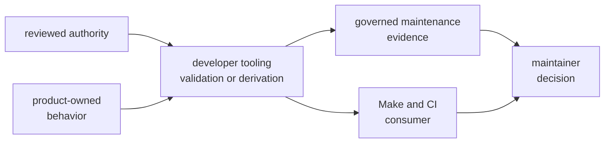
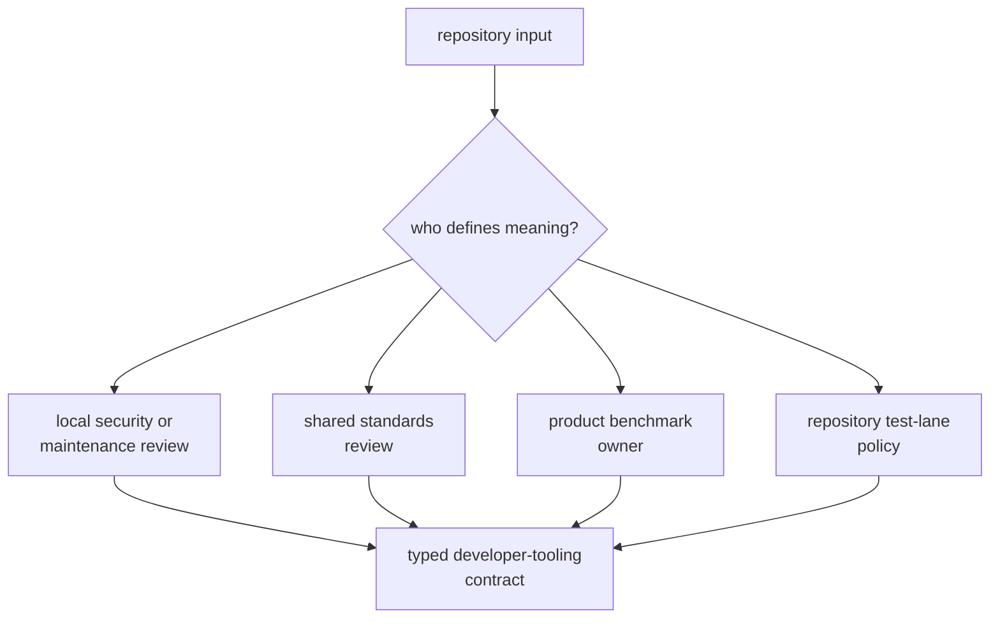

# Maintainer Tooling Ownership

Developer tooling owns typed maintenance decisions for this repository. It
does not own every file it reads, every process it invokes, or the product
behavior whose evidence it compares.

## Accountability Map

| Surface | Developer tooling owns | Another owner retains |
| --- | --- | --- |
| security advisory exceptions | field validation and deterministic ignore-argument derivation | advisory disposition and review decision |
| local deny deviations | local record validation, expiry, and required upstream review link | shared standards policy and upstream resolution |
| slow-test roster | roster integrity and generated nextest lane relationship through integration tests | scientific assertions and duration behavior in product tests |
| benchmark comparison | curated invocation, output normalization, baseline comparison, threshold reporting, and maintenance evidence paths | benchmark definitions and performance meaning in receiver and navigation |
| package guardrails | proof that the private package follows repository policy | policy definitions in the policy package |
| Make and CI integration | stable command and output contract | orchestration order, logging, and job policy in Make and workflow owners |

The package validates governance; it does not grant exceptions. A passing
allowlist or deviation command means the record is structurally reviewable and
unexpired, not that the underlying risk is acceptable.

## Governed Input Ownership

The [governance file guide](https://github.com/bijux/bijux-gnss/blob/main/crates/bijux-gnss-dev/docs/GOVERNANCE_FILES.md)
lists the current inputs. Developer tooling owns how they are parsed for its
maintenance decisions, but review authority stays with the domain that gives
each record meaning.

## Output Ownership

Developer tooling owns:

- machine-consumable audit ignore arguments on standard output
- validation diagnostics and command exit behavior
- raw benchmark output in the repository artifact area
- normalized current benchmark snapshots
- comparison against the maintained benchmark baseline

It does not own:

- audit reports assembled by Make
- receiver or navigation benchmark implementations
- receiver run artifacts or infrastructure manifests
- operator-facing command reports
- shared artifact envelopes

The [output contract](https://github.com/bijux/bijux-gnss/blob/main/crates/bijux-gnss-dev/docs/OUTPUTS.md) describes
the maintained and generated benchmark evidence.

## Neighbor Boundaries

- Command owns public operator workflows and reports.
- Core owns cross-package records, identities, units, diagnostics, and schemas.
- Signal, receiver, and navigation own GNSS behavior and scientific claims.
- Infrastructure owns datasets, product run layout, manifests, histories, and
  persisted run interpretation.
- Policy tooling owns reusable repository guardrail definitions.
- Shared standards owns the policy that local deny deviations reference.

A developer command may consume an interface or invoke a product benchmark
without absorbing that neighbor's semantics.

## Ownership Tests

Ask these questions before accepting a change:

1. Who decides whether the input is authoritative?
2. Does this package validate or derive maintenance behavior rather than grant
   policy?
3. Who owns the scientific or product meaning behind any consumed evidence?
4. Who owns orchestration and logging around the command?
5. Is each output maintenance evidence rather than a product artifact?
6. Can the package remain private and free of product dependencies?

## Boundary Violations

Reject or reroute a proposal when it:

- imports product internals to reproduce a runtime decision
- turns a structural exception check into risk acceptance
- stores receiver or navigation outputs as if they were maintenance evidence
- moves Make or CI orchestration policy into command implementation
- defines scientific benchmark thresholds without the product owner
- gives downstream packages a reusable API from this private binary
- introduces a generic script runner or unrestricted filesystem operation
- duplicates a reviewed exception or roster in command code

Use the [maintainer tooling scope](scope-and-non-goals.md) for command admission
and the [workflow contract](https://github.com/bijux/bijux-gnss/blob/main/crates/bijux-gnss-dev/docs/WORKFLOWS.md)
for current input-to-output behavior.

Ownership is clear when the authority, validator, orchestrator, product owner,
evidence owner, and final reviewer can be named independently.
