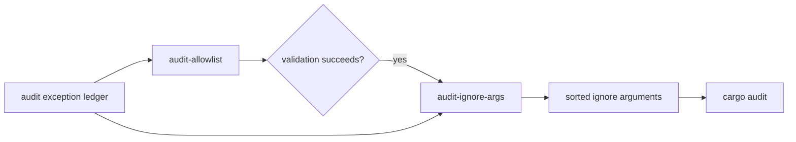
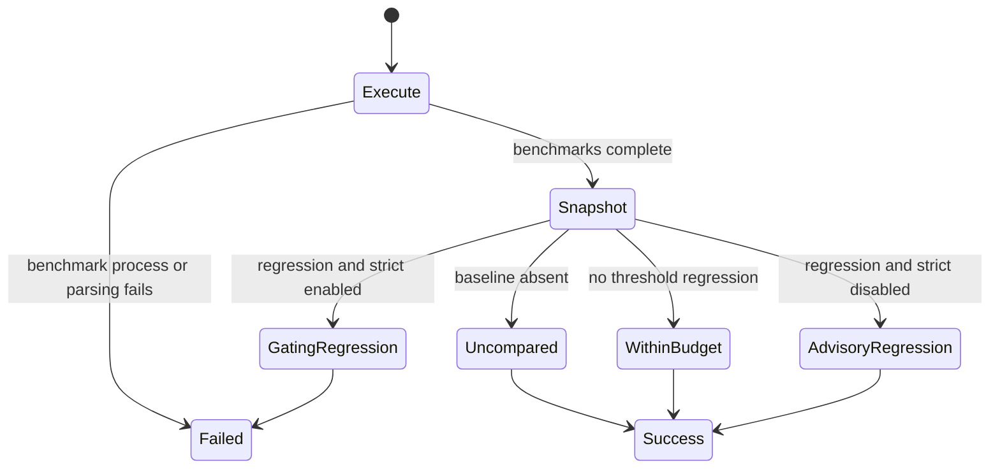

# Command Surface

The binary exposes four repository-maintenance commands. They do not share one
generic success contract: validation, argument derivation, and benchmark
comparison have different missing-input and failure behavior.

## Command Semantics

| command | reads | writes or prints | non-success condition | successful but incomplete condition |
| --- | --- | --- | --- | --- |
| `audit-allowlist` | [audit exception ledger](https://github.com/bijux/bijux-gnss/blob/main/audit-allowlist.toml) | human pass or error output | required ledger is missing, cannot be parsed, has malformed current advisory records, or contains expired records | an empty current advisory list passes |
| `deny-policy-deviations` | [local standards deviations](https://github.com/bijux/bijux-gnss/blob/main/configs/rust/deny.deviations.toml) | human pass or error output | required file is missing, malformed, expired, or lacks required ownership and upstream review fields | an empty deviation list passes |
| `audit-ignore-args` | [audit exception ledger](https://github.com/bijux/bijux-gnss/blob/main/audit-allowlist.toml) | sorted, deduplicated audit ignore arguments on stdout | an existing ledger cannot be read or parsed | a missing ledger succeeds with empty output; malformed IDs are omitted |
| `bench-compare` | curated product benchmarks and the [benchmark output contract](https://github.com/bijux/bijux-gnss/blob/main/crates/bijux-gnss-dev/docs/OUTPUTS.md) | raw evidence, normalized current snapshot, messages, and optional regression findings | benchmark execution or parsing fails; strict mode finds a threshold regression | absent baseline skips comparison; non-strict regressions are reported without failing |

Every command accepts `--workspace-root`. Without it, the current directory is
treated as the root. The executable does not walk parent directories.

## Audit Validation And Derivation Are Different

Run validation before derivation. The validator checks current advisory records
for identifier, `why`, owner, review link, and expiry. The derivation command
collects valid-looking identifiers from both current advisory records and a
legacy ignore list, silently ignores malformed identifiers, and does not
validate ownership or expiry itself.

A repository that still carries only legacy ignore entries can therefore
produce arguments without receiving the metadata checks applied to current
records. Treat that as migration debt, not equivalent governance.

## Benchmark Modes

The command runs a fixed receiver and navigation benchmark inventory, writes
raw run evidence and a normalized current snapshot to the locations defined by
the [benchmark output contract](https://github.com/bijux/bijux-gnss/blob/main/crates/bijux-gnss-dev/docs/OUTPUTS.md),
then compares against the baseline when one exists.

Do not translate process success into “performance passed” unless a baseline
was present and the intended strictness was selected. The default threshold is
a ratio of `1.10`, and strict mode controls whether findings become a gate.

## Output Stability

Command output is currently intended for maintainers and simple shell
composition. Only the audit-ignore argument line is designed for direct
consumption, and even that command relies on validation being run separately.
No command publishes a versioned JSON report or stable error code taxonomy.

If automation needs structured status such as “baseline absent,” “advisory
regression,” or “expired exception,” add a typed output contract and process
tests instead of parsing human prose.

## Change Review

For any command change:

1. State whether input absence is success or failure.
2. State whether malformed records are rejected or filtered.
3. Identify stdout, stderr, exit, and filesystem effects.
4. Preserve a safe sequencing rule for commands used together.
5. Add process-level evidence when automation depends on observable behavior.
6. Update the
   [command inventory](https://github.com/bijux/bijux-gnss/blob/main/crates/bijux-gnss-dev/docs/COMMANDS.md) and
   [output contract](https://github.com/bijux/bijux-gnss/blob/main/crates/bijux-gnss-dev/docs/OUTPUTS.md).

Use the [workflow contracts](workflow-contracts.md) for safe operational
sequences.
