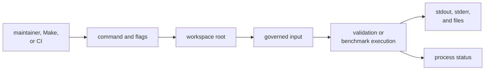
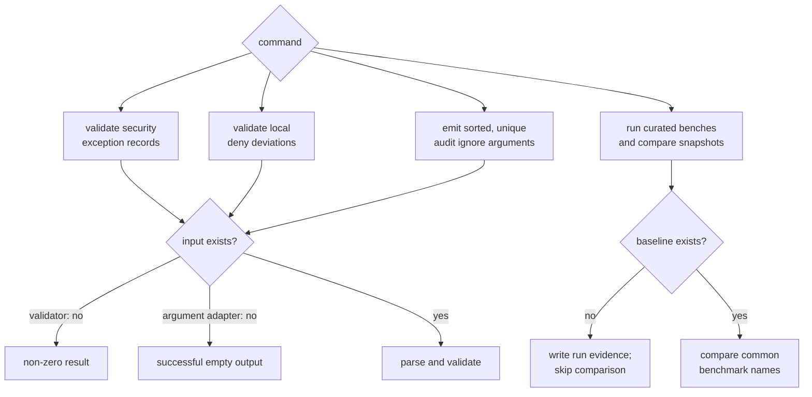

# Maintainer Interface Contracts

`bijux-gnss-dev` is a repository maintenance executable. It is not a product
library and is not published as a crate. Its users are maintainers, Make
targets, and CI jobs that need a typed boundary around reviewed policy files or
benchmark evidence.

The interface is therefore larger than command spelling. A caller depends on
how the executable finds the repository, what it reads, what it writes, what it
prints, and which conditions produce failure.

## Contract Map

| Contract | Current implementation | Reader guide |
| --- | --- | --- |
| command grammar | four Clap subcommands, each with an optional workspace-root override | [Command surface](command-surface.md) |
| root selection | explicit override, otherwise the process current directory; no ancestor discovery | [Command entry contracts](command-entry-contracts.md) |
| governed input | audit exceptions, deny deviations, or benchmark baselines, depending on command | [Governed input contracts](governed-input-contracts.md) |
| output | human text, shell-consumable audit arguments, benchmark logs, and a normalized snapshot | [Output contracts](output-contracts.md) |
| failure | parser errors, unreadable or invalid required input, expired governance records, subprocess failure, and strict benchmark regression | [Compatibility commitments](compatibility-commitments.md) |
| workflow composition | repository Make targets call the executable rather than duplicate policy parsing | [Workflow contracts](workflow-contracts.md) |

The [binary implementation](https://github.com/bijux/bijux-gnss/blob/main/crates/bijux-gnss-dev/src/main.rs) is the
executable authority. The [maintainer command inventory](https://github.com/bijux/bijux-gnss/blob/main/crates/bijux-gnss-dev/docs/COMMANDS.md)
and [repository contract guide](https://github.com/bijux/bijux-gnss/blob/main/crates/bijux-gnss-dev/docs/CONTRACTS.md)
describe the intended policy. When prose and executable behavior disagree,
treat that as a defect; do not infer behavior from prose alone.

## Command Semantics

| Command | Reads | Observable result | Important limit |
| --- | --- | --- | --- |
| `audit-allowlist` | [security exception ledger](https://github.com/bijux/bijux-gnss/blob/main/audit-allowlist.toml) | pass text or one aggregated validation error | validates the array of reviewed advisory records; an absent file is an error |
| `deny-policy-deviations` | [local deviation ledger](https://github.com/bijux/bijux-gnss/blob/main/configs/rust/deny.deviations.toml) | pass text or one aggregated validation error | review links must use HTTP(S) and mention `bijux-std`; an absent file is an error |
| `audit-ignore-args` | [security exception ledger](https://github.com/bijux/bijux-gnss/blob/main/audit-allowlist.toml) | one sorted, deduplicated shell argument line | an absent file succeeds with an empty line; invalid identifiers are omitted rather than reported |
| `bench-compare` | [benchmark baseline contract](https://github.com/bijux/bijux-gnss/blob/main/crates/bijux-gnss-dev/docs/BENCHMARKS.md) | benchmark subprocess output, current evidence, and optional regression findings | without a baseline it records results and succeeds without a regression comparison |

The ignore-argument adapter accepts identifiers from both the reviewed advisory
records and the older ignore-array shape. Only the reviewed records are checked
by `audit-allowlist`. A caller must run validation before trusting derived
arguments; the repository audit workflow does this.

## Process and Output Behavior

Clap owns help, unknown-command, and malformed-flag handling. Command functions
return structured errors through `anyhow`; the Rust entrypoint turns an error
into a non-zero process result and a diagnostic. Successful validators print a
short human message. The ignore adapter prints only arguments because the Make
workflow captures its stdout.

`bench-compare` has wider effects:

- it runs a fixed receiver and navigation benchmark set
- it creates repository-local evidence directories when absent
- it writes raw benchmark stdout and a sorted name/value snapshot
- it compares only names present in both current and baseline snapshots
- it reports regressions above the ratio threshold to stderr
- it fails for those regressions only when strict mode is enabled

The current repository does not track a benchmark baseline or current snapshot.
Consequently, a normal benchmark comparison invocation currently exercises the
benchmarks and writes evidence but cannot enforce regression history. This is a
real evidence gap, not an implied passing comparison.

See the [output contract guide](https://github.com/bijux/bijux-gnss/blob/main/crates/bijux-gnss-dev/docs/OUTPUTS.md)
for intended locations. Its claim that benchmark snapshots are checked or
reviewed is aspirational until a baseline is actually governed in version
control.

## Stability Levels

Not every observable detail deserves equal compatibility weight.

| Surface | Expected treatment |
| --- | --- |
| command names and flag meanings | reviewed maintainer interface; change callers and documentation together |
| governed file schemas | repository policy contract; migrate files and validators atomically |
| success versus failure conditions | automation contract; regression tests should pin consequential behavior |
| shell-consumed stdout | exact integration contract where a workflow parses it |
| human diagnostics | keep actionable, but do not parse incidental wording |
| benchmark set and thresholds | reviewed evidence policy, not scientific API |
| internal functions and types | implementation detail; no library consumer contract |

The [stability commitments](stability-commitments.md) and
[binary boundary](binary-boundary.md) define how to evolve these surfaces
without turning maintainer internals into product dependencies.

## Review a Contract Change

Trace the whole caller-observable path:

1. Identify every direct caller and whether it parses output or only checks
   process status.
2. Define input absence, malformed input, empty input, expired records, and
   subprocess failure.
3. Check default-root behavior from outside the repository root.
4. Separate human diagnostics from machine-consumed output.
5. Record every created or modified file and whether it is ephemeral evidence
   or reviewed state.
6. Add focused command tests for semantics that automation relies on.
7. Update the [workflow guide](https://github.com/bijux/bijux-gnss/blob/main/crates/bijux-gnss-dev/docs/WORKFLOWS.md)
   and [maintainer proof inventory](https://github.com/bijux/bijux-gnss/blob/main/crates/bijux-gnss-dev/docs/TESTS.md)
   with the implementation.

For executable examples, use [entrypoints and examples](entrypoints-and-examples.md).
For ownership disputes, use the [developer boundary](../foundation/scope-and-non-goals.md).
