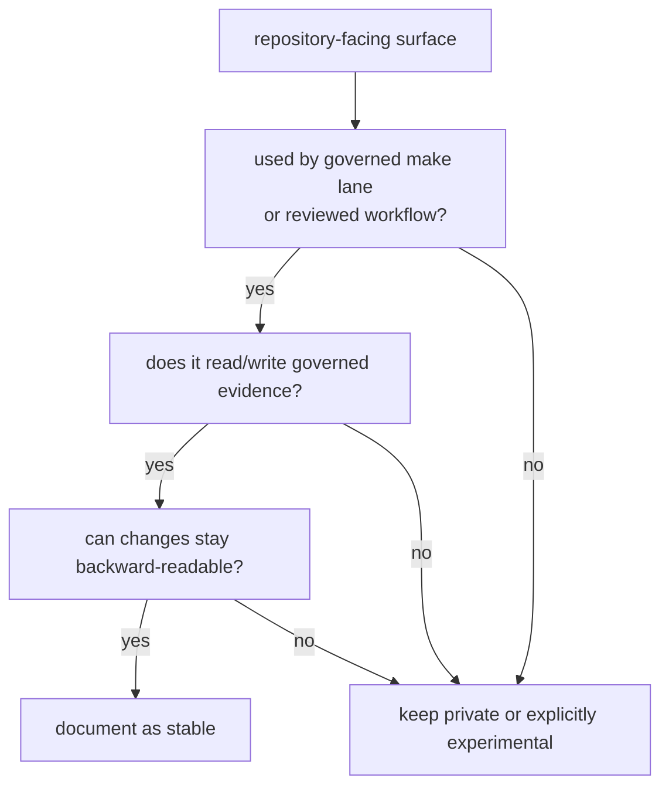

# Stability Commitments

Maintainer stability means the repository is willing to pay compatibility cost
for a command, governed input, or evidence location. Existing callers alone do
not make a surface stable.

## Stability Decision Route

## Stable Surfaces

| surface | stability reason | proof route |
| --- | --- | --- |
| `audit-allowlist.toml` validation | security exceptions must remain reviewed and attributable | governance file guide and guardrail tests |
| `configs/rust/deny.deviations.toml` validation | standards deviations must keep owner, reason, review link, and expiry | governance docs and policy tests |
| audit ignore argument derivation | automation must derive ignores from one reviewed source | command docs and workflow tests |
| benchmark comparison outputs | performance evidence is reviewed through governed benchmark files | benchmark docs and comparison tests |
| documented maintainer command outputs | reviewed workflows need stable evidence locations | output guide and integration tests |

## Not Stable By Default

- Private module layout inside `crates/bijux-gnss-dev`.
- Product crate internals used by benchmark workflows.
- CLI output schemas that are not documented as governed maintainer evidence.
- Experimental maintainer helpers without a governed make lane or review path.

## Change Rules

- When a stable surface changes, update command docs, output docs, and tests in
  the same change.
- When a workflow stops being governed, remove the stability claim instead of
  leaving stale compatibility promises.
- When a product behavior changes, update product docs; dev docs only cover the
  maintainer workflow that detects or records it.

## First Proof Check

Inspect the [maintainer command guide](https://github.com/bijux/bijux-gnss/blob/main/crates/bijux-gnss-dev/docs/COMMANDS.md),
[workflow guide](https://github.com/bijux/bijux-gnss/blob/main/crates/bijux-gnss-dev/docs/WORKFLOWS.md),
[output guide](https://github.com/bijux/bijux-gnss/blob/main/crates/bijux-gnss-dev/docs/OUTPUTS.md),
[governance file guide](https://github.com/bijux/bijux-gnss/blob/main/crates/bijux-gnss-dev/docs/GOVERNANCE_FILES.md),
command implementation, and maintainer guardrail tests.
