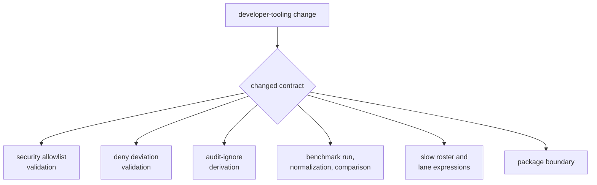
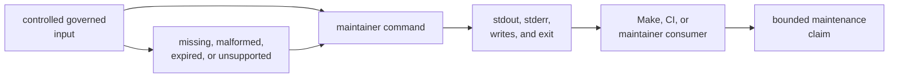

# Maintainer Tooling Verification Guide

Verify the maintenance decision that changed, its governed input, and the
consumer that relies on its output. A package guardrail cannot prove advisory
validation, and a command succeeding on the current repository file cannot
prove malformed records are rejected.

## Select the Contract



## Current Entry Points

Run from the repository root:

```sh
cargo test -p bijux-gnss-dev --test integration_guardrails
cargo test -p bijux-gnss-dev --test integration_nextest_suite_selection
cargo run -q -p bijux-gnss-dev -- audit-allowlist
cargo run -q -p bijux-gnss-dev -- deny-policy-deviations
cargo run -q -p bijux-gnss-dev -- audit-ignore-args
```

Benchmark comparison is intentionally separate because it runs product
benchmarks and writes evidence:

```sh
cargo run -q -p bijux-gnss-dev -- bench-compare
cargo run -q -p bijux-gnss-dev -- bench-compare --strict --threshold 1.10
```

Do not run benchmark comparison merely to validate documentation or command
parsing. It is appropriate only when the curated benchmarks, normalization,
baseline, threshold, or comparison behavior changed and the environment can
support meaningful measurement.

## Know What Each Entry Point Proves

| Entry point | Direct evidence | Important limitation |
| --- | --- | --- |
| package guardrail integration | the private package satisfies configured repository policy | no governance command behavior |
| nextest suite-selection integration | roster order and uniqueness, mapping to known test functions, legacy slow naming, and fast/slow expression relationship | no test duration or scientific correctness |
| allowlist command | the current allowlist exists and its advisory rows satisfy current field, identifier, link, and expiry rules | no malformed fixture matrix or risk acceptance |
| deviation command | the current deviation file exists and rows satisfy current ownership, reason, expiry, and upstream-review-link rules | no malformed fixture matrix or upstream acceptance |
| ignore-argument command | current recognized advisory identifiers are sorted, deduplicated, and rendered | absence of the file returns empty output; validation is a separate command |
| benchmark command | curated benchmarks execute, raw output is parsed, current evidence is written, and an available baseline is compared | no dedicated automated command test; measurements remain environment-sensitive |

The command implementations currently have no dedicated unit or command-level
integration tests. Direct execution proves behavior for checked-in governed
inputs only. Changes to parsing, negative cases, missing-file behavior,
threshold math, or output writing should add focused automated proof rather
than relying solely on a successful current-repository run.

## Build Evidence Around Failure



For validation changes, cover:

- required file absent
- invalid document syntax
- missing required field
- malformed identifier, date, or review link
- expired record
- several errors reported together where supported
- successful current and empty-record behavior

For ignore derivation, cover both accepted allowlist shapes, invalid
identifiers, duplicates, deterministic ordering, absent input, and output that
contains no commentary.

For benchmark changes, cover:

- successful and failed benchmark subprocesses
- output with and without matching benchmark rows
- stable normalized ordering
- missing and malformed baseline
- absent and newly appearing benchmarks
- ratio behavior at, below, and above the threshold
- strict and non-strict outcomes
- write failures and partial-evidence avoidance

## Verify the Consumer

The audit workflow invokes ignore derivation, allowlist validation, deviation
validation, and audit reporting through Make. When an output or exit contract
changes, inspect and exercise that first consumer. A command can behave
correctly in isolation while breaking quotation, logging, or failure
propagation in orchestration.

The nextest integration target invokes the repository's expression generator
and verifies that the fast lane negates the generated slow lane. Roster edits
must preserve sorted uniqueness and map to real test functions; adding a name
to the file without this target passing leaves lane selection unproven.

## Interpret Benchmark Results Honestly

A benchmark comparison is evidence from one environment and execution window.
Record the machine context, selected benchmark names, threshold, baseline
revision, and observed ratios. A missing baseline means regression comparison
was skipped even though current evidence may have been written.

Do not:

- describe non-strict success as absence of regressions
- update a baseline solely to make strict mode pass
- compare snapshots from materially different environments without saying so
- treat performance evidence as scientific correctness
- hide missing or unparsed benchmark rows

## Record the Verification

Report:

1. maintenance decision and governed input
2. exact command and selected workspace root
3. positive and negative fixtures
4. standard output, diagnostics, writes, and exit behavior
5. first Make, CI, or maintainer consumer
6. benchmark environment and baseline when applicable
7. current command-level test gaps

Use the [command inventory](https://github.com/bijux/bijux-gnss/blob/main/crates/bijux-gnss-dev/docs/COMMANDS.md),
[governance file guide](https://github.com/bijux/bijux-gnss/blob/main/crates/bijux-gnss-dev/docs/GOVERNANCE_FILES.md),
and [benchmark contract](https://github.com/bijux/bijux-gnss/blob/main/crates/bijux-gnss-dev/docs/BENCHMARKS.md) to
bound the claim.

Verification is complete when the governed input, failure modes, observable
effects, consumer behavior, and unautomated cases are explicit.
