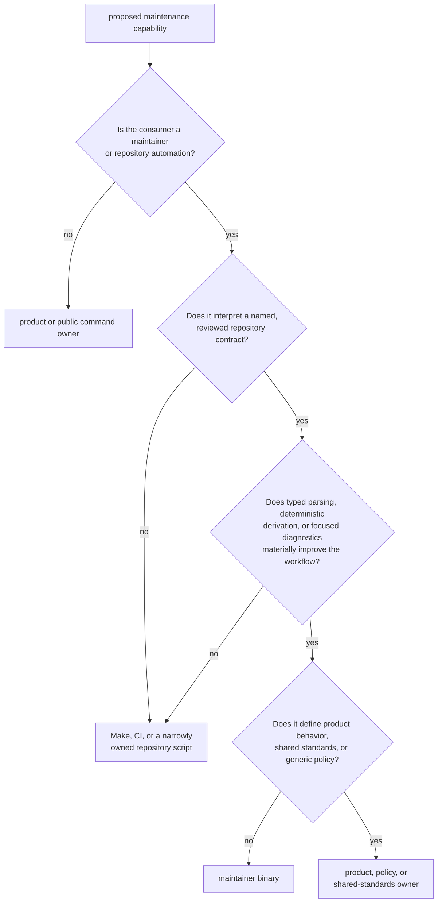
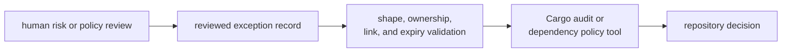
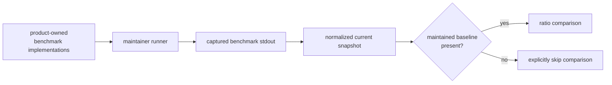

# Maintainer Workflow Ownership Boundaries

`bijux-gnss-dev` owns typed, repository-specific maintenance workflows whose
inputs, decisions, effects, and outputs require one durable implementation. It
is a private binary, not a reusable product library or a general automation
bucket.

A workflow belongs here because it interprets a reviewed repository contract,
not because maintainers happen to run it.

## Admit A Workflow

All of these conditions should hold:

1. The workflow has a stable maintainer or automation consumer.
2. A named repository input, output, or invariant gives it durable ownership.
3. Its effects can be enumerated and kept in governed locations.
4. Its diagnostics tell a maintainer how to repair the repository state.
5. It does not duplicate product logic or shared standards.

“It is convenient to put this beside the other development commands” is not an
ownership argument.

## Current Binary Workflows

| workflow | owned decision | effects | decision not made here |
| --- | --- | --- | --- |
| audit exception validation | whether local exception records satisfy identifier, rationale, owner, link, and expiry rules | reads the [audit exception register](https://github.com/bijux/bijux-gnss/blob/main/audit-allowlist.toml); prints status or diagnostics | whether accepting the vulnerability is justified |
| dependency-policy deviation validation | whether local deviations are identified, owned, explained, unexpired, and linked to shared-standards review | reads the [dependency-policy deviation register](https://github.com/bijux/bijux-gnss/blob/main/configs/rust/deny.deviations.toml); prints status or diagnostics | what shared dependency policy should be |
| audit argument derivation | which syntactically valid advisory identifiers become sorted, deduplicated Cargo audit arguments | reads the audit exception register; writes stdout | whether every source record has valid rationale, ownership, link, and expiry |
| benchmark comparison | which curated benchmarks run, how stdout is normalized, and which comparable names exceed a ratio | starts Cargo child processes; writes local evidence and a current snapshot | whether a product change is scientifically or operationally acceptable |

The [command implementation](https://github.com/bijux/bijux-gnss/blob/main/crates/bijux-gnss-dev/src/main.rs) is the
authority for actual behavior. The
[command reference](https://github.com/bijux/bijux-gnss/blob/main/crates/bijux-gnss-dev/docs/COMMANDS.md) should match
it exactly.

## Validation Is Not Approval

The binary can reject an incomplete or expired exception. It cannot establish
that the remaining risk is acceptable. Shared standards remain owned by the
standards repository; this package validates the quality of explicit local
deviations and requires an upstream review link.

Do not add a local field or validator that silently redefines shared policy.
Change the shared owner first, or document a narrowly reviewed local exception.

## Derivation Is Not Validation

Audit argument derivation accepts syntactically valid advisory identifiers,
sorts and deduplicates them, and prints the command fragment consumed by
automation. It succeeds with empty output when the exception register is
absent.

The audit exception validator rejects an absent register and checks richer
record quality. Callers that need a governance gate must run validation before
consuming derived arguments. Do not widen derivation into a second,
slightly-different policy engine.

## Benchmark Ownership

Product packages own benchmark workloads and the behavior being measured.
Maintainer tooling owns the curated run set, process execution, normalization,
optional comparison, and repository-scoped evidence.

No maintained benchmark baseline exists at this review. Therefore:

- current measurements can be collected;
- no repository regression pass can be established;
- strict mode has no comparison to enforce;
- a new baseline requires provenance and review, not merely a generated file.

The [benchmark contract](https://github.com/bijux/bijux-gnss/blob/main/crates/bijux-gnss-dev/docs/BENCHMARKS.md) and
[receiver performance evidence](../bijux-gnss-receiver/operations/performance-and-profiling.md)
define how to interpret the result.

## Slow-Lane Boundary

The package contains an
[integration proof for suite selection](https://github.com/bijux/bijux-gnss/blob/main/crates/bijux-gnss-dev/tests/integration_nextest_suite_selection.rs).
That proof verifies the governed slow roster against Rust test functions and
the generated fast and slow nextest expressions.

The binary does not:

- classify a test as slow;
- edit or own the roster contents;
- generate nextest expressions;
- dispatch a suite-selection command.

Repository configuration and tooling own those inputs. This package's test
owns evidence that they remain coherent. A failure in the proof should be fixed
at the roster, test inventory, or expression generator rather than hidden in
command dispatch.

## Keep Composition Outside

Make and CI should compose commands when the work is simply:

- run a validator, then invoke the underlying tool;
- sequence package checks;
- select environment-specific execution;
- collect already-governed outputs.

Move composition into the binary only when it gains a real typed contract,
repository-specific decision, or diagnostic responsibility. Otherwise a new
subcommand obscures rather than clarifies ownership.

## Product And Infrastructure Boundaries

| concern | owner |
| --- | --- |
| operator-facing GNSS commands and reports | [command workflows](../bijux-gnss/index.md) |
| signal, receiver, and navigation algorithms or runtime state | the relevant product package |
| product datasets, run manifests, captures, and persisted execution evidence | [repository infrastructure](../bijux-gnss-infra/index.md) |
| reusable repository-shape checks | [policy support](https://github.com/bijux/bijux-gnss/blob/main/crates/bijux-gnss-policies/README.md) |
| shared dependency and governance standards | the shared-standards repository |
| local benchmark orchestration and maintainer evidence | this package |

A product package must never depend on this binary. If product code needs a
helper currently buried in maintainer tooling, move the reusable behavior to
the package that owns the contract rather than creating a maintainer library
for convenience.

## Reject Boundary Drift

Reject a maintainer workflow that:

- has no named governed input, output, or invariant;
- duplicates GNSS algorithms or product validation;
- changes shared policy through a downstream-only parser;
- writes outside documented repository evidence locations;
- hides network, filesystem, clock, or process effects;
- converts missing governance inputs into success without an explicit contract;
- treats benchmark execution as proof of performance acceptance;
- exists only to wrap one stable shell command without adding typed value.

Review proposed commands against the
[binary boundary](interfaces/binary-boundary.md),
[governed input contracts](interfaces/governed-input-contracts.md),
[output contracts](interfaces/output-contracts.md), and
[extensibility model](architecture/extensibility-model.md). The durable owner
must remain clear after the immediate maintenance need is gone.
