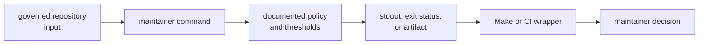
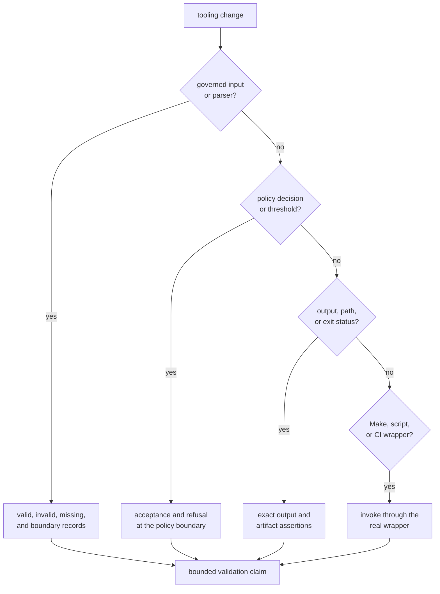

# Validating Maintainer Tooling

Maintainer tooling is correct when it reads the governed input, applies the
documented policy, emits reviewable evidence, and fails in a way that identifies
the broken repository contract. A green command over an unrelated file does
not validate the workflow that changed.

## Trace the Whole Workflow



Validate every moved edge. A command implementation can remain correct while a
Make target passes the wrong argument, a governed path moves, or CI interprets
the exit status differently.

## Route the Change

| Workflow | Governed input | Observable contract | Minimum focused evidence |
| --- | --- | --- | --- |
| Audit allowlist validation | security exception entries | required identity, ownership, rationale, link, expiry, and a nonzero exit for invalid entries | run the allowlist command against valid and deliberately invalid records |
| Audit ignore arguments | the same reviewed allowlist | deterministic Cargo audit arguments derived only from accepted advisory identifiers | assert exact output ordering and empty-input behavior |
| Deny-policy deviations | local standards exceptions | required ownership, review linkage, rationale, expiry, and visible refusal of malformed entries | run the deviation command over valid, expired, and malformed examples |
| Benchmark comparison | curated benchmark commands, optional baseline, threshold, and strictness | normalized measurements, comparison result, artifact location, and explicit behavior when no baseline exists | exercise parsing and threshold logic; run the real benchmark when claiming execution or performance safety |
| Slow-lane selection | governed slow-test roster and expression generator | sorted unique entries, resolvable test names, exact fast-lane exclusion, and slow-lane inclusion | run the [suite-selection integration](https://github.com/bijux/bijux-gnss/blob/main/crates/bijux-gnss-dev/tests/integration_nextest_suite_selection.rs) |
| Package guardrails | developer package source and repository policy | boundary and source-policy compliance | run the [package guardrail](https://github.com/bijux/bijux-gnss/blob/main/crates/bijux-gnss-dev/tests/integration_guardrails.rs) |

The [command reference](https://github.com/bijux/bijux-gnss/blob/main/crates/bijux-gnss-dev/docs/COMMANDS.md)
defines the available maintainer commands. The
[workflow guide](https://github.com/bijux/bijux-gnss/blob/main/crates/bijux-gnss-dev/docs/WORKFLOWS.md) and
[output contract](https://github.com/bijux/bijux-gnss/blob/main/crates/bijux-gnss-dev/docs/OUTPUTS.md) define how
their evidence is consumed.

## Choose Evidence by What Moved



Most changes touch more than one branch. For example, adding an allowlist field
changes parsing, acceptance policy, error text, documentation, and every
wrapper that supplies the file.

## Focused Commands

Run commands from the repository root:

```sh
cargo run -q -p bijux-gnss-dev -- audit-allowlist
cargo run -q -p bijux-gnss-dev -- audit-ignore-args
cargo run -q -p bijux-gnss-dev -- deny-policy-deviations
cargo test -p bijux-gnss-dev --test integration_nextest_suite_selection
cargo test -p bijux-gnss-dev --test integration_guardrails
```

Use the command that owns the changed workflow. Running all of them can reveal
adjacent breakage, but it does not replace a negative case that proves the
changed rule rejects bad input.

## Validate Benchmark Claims Honestly

Benchmark comparison combines two different concerns:

- parser and comparison mechanics
- execution of the curated benchmark workload

A focused test can establish normalized line parsing, threshold comparison,
strict-mode refusal, and missing-baseline behavior. It cannot establish that
the benchmark workload ran, that the selected workloads are representative, or
that receiver and navigation performance remained stable.

If full execution is skipped, state that explicitly. Do not describe a parser
test or successful non-strict run without a baseline as benchmark regression
proof. Performance artifacts belong under the repository artifact root and
must identify the command, profile, environment, threshold, and baseline.

## Preserve Governed-Input Semantics

For file-backed policy:

1. prove one valid record
2. mutate one required field or boundary at a time
3. prove missing-file and empty-file behavior
4. prove expiry and date-boundary behavior where applicable
5. assert the failure identifies the record and violated rule
6. keep examples independent of the production parser when possible

Tests should protect semantic requirements, not incidental TOML ordering or
message punctuation unless those are public output contracts.

## Reject Misleading Validation

- only the package guardrail ran for a changed command decision
- a command was invoked directly but its Make or CI wrapper changed
- output text changed without reviewing scripts that parse it
- the slow roster changed without regenerating and inspecting both lane
  expressions
- benchmark safety is claimed without executing the benchmark workload
- a successful command is treated as approval of the underlying exception
- a new governed file or artifact location has no reader-facing contract

Use the [test guide](https://github.com/bijux/bijux-gnss/blob/main/crates/bijux-gnss-dev/docs/TESTS.md) for current
coverage and the [governance file catalog](https://github.com/bijux/bijux-gnss/blob/main/crates/bijux-gnss-dev/docs/GOVERNANCE_FILES.md)
for owned inputs.

A maintainer-tooling change is validated when the real governed input, policy
boundary, negative case, output, exit status, wrapper, and remaining execution
gap are all visible to the reviewer.
