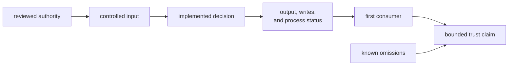

# Trusting Maintainer Evidence

Maintainer tooling can make a repository look governed while checking only file
shape or the current happy path. Trust a result only for the decision its
evidence exercises: input interpretation, policy boundary, observable effects,
and first consumer.

## Build a Bounded Claim



A green result is incomplete when any edge moved without proof. For example, a
validator can correctly reject an expired record while a Make wrapper ignores
its non-zero status, or a benchmark command can execute successfully while
skipping comparison because no baseline exists.

## Current Evidence Ledger

| Surface | Evidence that exists | What it establishes | What remains unproved |
| --- | --- | --- | --- |
| package structure | [package guardrail integration](https://github.com/bijux/bijux-gnss/blob/main/crates/bijux-gnss-dev/tests/integration_guardrails.rs) | configured repository policy accepts this private binary package | command parsing, validation, output, writes, and subprocess behavior |
| slow-test ledger | [suite-selection integration](https://github.com/bijux/bijux-gnss/blob/main/crates/bijux-gnss-dev/tests/integration_nextest_suite_selection.rs) | ledger order and uniqueness, heuristic resolution to test function names, legacy slow-name inclusion, and fast/slow expression relationship | duration, scientific value, exact package/test identity, and absence of unintended regex matches |
| security exception validation | direct execution against the [current security ledger](https://github.com/bijux/bijux-gnss/blob/main/audit-allowlist.toml) | checked records currently satisfy implemented field-shape and lexical-expiry rules | malformed fixture matrix, real calendar-date validation, unknown-field policy, and risk acceptance |
| deny deviation validation | direct execution against the [current deviation ledger](https://github.com/bijux/bijux-gnss/blob/main/configs/rust/deny.deviations.toml) | checked records currently satisfy implemented ownership, reason, link-substring, and lexical-expiry rules | malformed fixture matrix, upstream acceptance, exact review-link identity, and real calendar dates |
| audit argument derivation | direct command output consumed by the audit Make workflow | current recognized identifiers can be sorted, deduplicated, and rendered | dedicated tests for absent, malformed, legacy, duplicate, and mixed-validity inputs |
| benchmark comparison | implementation and direct execution when deliberately invoked | curated child processes can run and current output can be normalized | dedicated parser/comparison tests, atomic writes, environment control, and historical regression enforcement |

The [maintainer proof inventory](https://github.com/bijux/bijux-gnss/blob/main/crates/bijux-gnss-dev/docs/TESTS.md)
describes intended coverage. The table above reflects executable evidence in
the current checkout, including where that inventory is aspirational.

## Interpret Validator Success Narrowly

The security and deviation validators check reviewability mechanics. They do
not approve the underlying exception.

Current date validation checks the `YYYY-MM-DD` character shape and compares
the string with the system date returned by an external process. It does not
parse a calendar date, so impossible month or day values can pass shape checks.
Current link validation checks HTTP(S) prefixes, and the deviation validator
checks that the review string contains `bijux-std`; neither proves the target
exists or represents an accepted review.

TOML fields outside the recognized records are not rejected. The audit argument
adapter also accepts a legacy ignore-array shape that the allowlist validator
does not validate, and it silently omits malformed identifiers. Run validation
before derivation, but do not describe that sequence as complete schema proof.

Use [change validation](change-validation.md) to design controlled positive and
negative cases when these semantics move.

## Select Proof by Failure Consequence

```mermaid
flowchart TD
    change["changed maintainer behavior"]
    class{"failure consequence"}
    accept["bad repository record<br/>is accepted"]
    reject["valid record<br/>is rejected"]
    shell["automation consumes<br/>wrong output or status"]
    persist["evidence is missing,<br/>partial, or misleading"]
    policy["ownership boundary<br/>moves"]
    fixtures["controlled schema<br/>and boundary cases"]
    integration["real caller<br/>integration"]
    io["filesystem and process<br/>fault cases"]
    guardrail["policy-owner proof"]
    decision["reviewable evidence<br/>with limits"]

    change --> class
    class --> accept --> fixtures
    class --> reject --> fixtures
    class --> shell --> integration
    class --> persist --> io
    class --> policy --> guardrail
    fixtures --> decision
    integration --> decision
    io --> decision
    guardrail --> decision
```

| Changed claim | Minimum honest proof |
| --- | --- |
| field requirement or accepted record shape | controlled valid, missing, malformed, empty, duplicate, and unknown-field inputs |
| expiry behavior | dates before, on, and after the boundary plus invalid calendar dates and clock failure |
| exact shell output | byte-exact stdout, diagnostics separation, ordering, quoting, empty output, and real caller behavior |
| process failure | parser, filesystem, child-process, and strict-policy exits asserted independently |
| persisted evidence | creation, replacement, permissions, partial failure, provenance, and reader interpretation |
| slow-lane policy | ledger integrity and generated expressions, followed by owner review of cost and proof value |
| benchmark regression | deterministic parser/comparison proof plus an identified baseline and qualified execution environment |
| package boundary | package guardrail and policy-owner review, not command success |

Run the narrowest evidence that can fail for the changed decision. A broad
workspace pass may detect collateral damage, but it does not replace the
focused negative case.

## Benchmark Trust Boundary

The current checkout tracks no benchmark baseline or current snapshot.
`bench-compare` therefore writes current evidence and reports that comparison
was skipped. Even with a baseline, it compares only names present in both
snapshots; newly appearing names have no baseline decision, and missing current
names are not reported as regressions.

Performance evidence also depends on machine state, compiler, power policy,
contention, repetition, and source revision. A non-strict command reports
threshold findings without failing. State all of these conditions before
calling a run regression evidence.

The [benchmark evidence contract](https://github.com/bijux/bijux-gnss/blob/main/crates/bijux-gnss-dev/docs/BENCHMARKS.md)
defines the intended workflow. The [known limitations](known-limitations.md)
and [risk register](risk-register.md) should remain aligned with actual
implementation behavior.

## Avoid False Confidence

Reject these arguments:

- “the package test passed” for a command validation change
- “the current ledger passed” for malformed or boundary input behavior
- “the audit command passed” as approval of a security exception
- “the roster test passed” as proof that every selected test is slow or useful
- “the benchmarks passed” when no governed baseline comparison occurred
- “the docs say so” when implementation and caller behavior were not inspected
- “the full suite is green” when the changed maintenance decision has no
  focused assertion

## Quality Routes

- [Test strategy](test-strategy.md) organizes proof layers.
- [Repository test policy](repository-test-policy.md) explains fast, slow,
  full, and frozen lanes.
- [Maintainer invariants](invariants.md) names boundaries that should survive
  implementation changes.
- [Change validation](change-validation.md) maps workflow changes to evidence.
- [Review checklist](review-checklist.md) defines blocking review signals.
- [Completion criteria](definition-of-done.md) aligns command, input, output,
  caller, and proof.
- [Known limitations](known-limitations.md) records capability boundaries.
- [Risk register](risk-register.md) tracks ways maintainer evidence can
  mislead.

Use [changing maintainer tooling](../operations/index.md) for execution order and
[maintainer interface contracts](../interfaces/index.md) for compatibility decisions.
Quality is sufficient only when the result, its consumer, and its omissions can
be stated in one bounded claim.
