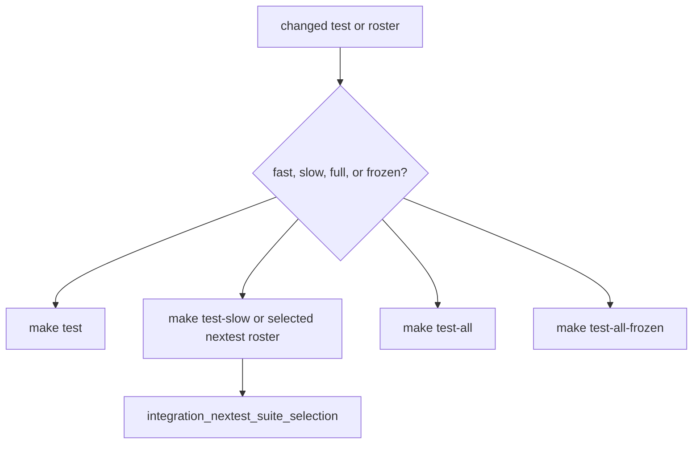

# Repository Test Policy

`bijux-gnss-dev` owns the repository policy that separates fast confidence,
slow proof, and frozen-snapshot verification. Product crates own their tests;
this maintainer crate owns the guardrails that keep repository lanes honest.

## Lane Contract

| lane | purpose | reviewer expectation |
| --- | --- | --- |
| `make test` | Fast mutable-worktree confidence. | Must exclude governed slow tests and remain usable during normal local development. |
| `make test-slow` | Explicit slow-roster execution. | Must include rostered tests that are too expensive or too broad for the fast lane. |
| `make test-all` | Full mutable-worktree proof. | Must include fast and slow lanes with repository-wide intent. |
| `make test-all-frozen` | Pinned-snapshot proof for a named commit. | Must not be treated as proof about uncommitted local edits. |
| `cargo test -p bijux-gnss-dev --test integration_nextest_suite_selection` | Roster integrity proof. | Must prove every slow-roster entry still resolves to a real test and remains excluded from the fast lane. |

## Test-Family Rules

- Unit tests stay close to implementation when locality improves clarity.
- Integration, golden, and fault tests live where they prove crate boundaries.
- Property tests need bounded ranges and durable regression seeds.
- Expensive receiver or navigation truth tests belong in a slow or full lane
  when they would make fast confidence unusable.
- Roster-governance tests prove repository test policy; they do not prove
  receiver or navigation science by themselves.

## Roster Rule

If a change touches `configs/rust/nextest-slow-roster.txt`, run
`cargo test -p bijux-gnss-dev --test integration_nextest_suite_selection`
and inspect the roster diff as policy, not as a convenience list. Each entry
needs a durable reason to stay outside the fast lane: runtime cost, external
proof breadth, frozen evidence role, or integration scope that would slow
ordinary local work.

## Blocking Signs

- A failing fast test is moved to the slow roster only to make `make test`
  green.
- A slow-roster entry no longer resolves to a real test.
- A property test uses unbounded inputs or a disposable seed.
- A frozen-lane result is cited as proof for a different mutable worktree.
- A full-lane test is expensive but does not defend a stronger repository claim
  than a narrower test could defend.

## Protecting Proof

- `configs/rust/nextest-slow-roster.txt`
- `crates/bijux-gnss-dev/tests/integration_nextest_suite_selection.rs`
- `crates/bijux-gnss-dev/docs/TESTS.md`
- `crates/bijux-gnss-dev/docs/WORKFLOWS.md`
- `docs/bijux-gnss-dev/operations/verification-commands.md`
