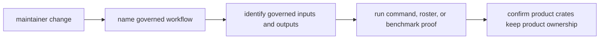

# Review Checklist

Review `bijux-gnss-dev` as maintainer workflow tooling. The crate may validate
reviewed governance files, prove nextest-roster policy, run curated benchmark
comparisons, and emit evidence into governed locations. It should not own
product behavior merely because a maintainer command can call or inspect it.

## Review Gates

| changed surface | accept only when | inspect before accepting |
| --- | --- | --- |
| command meaning | The command owns a reviewed maintainer workflow, not product runtime behavior. | [Command surface](../interfaces/command-surface.md) and [command guide](https://github.com/bijux/bijux-gnss/blob/main/crates/bijux-gnss-dev/docs/COMMANDS.md) |
| governed input file | The file is named as reviewed repository input and has typed validation or guarded test proof. | [Governed input contracts](../interfaces/governed-input-contracts.md) and [governance file guide](https://github.com/bijux/bijux-gnss/blob/main/crates/bijux-gnss-dev/docs/GOVERNANCE_FILES.md) |
| evidence output | The output path is stable, documented, and tied to a maintainer workflow. | [Output contracts](../interfaces/output-contracts.md) and [output guide](https://github.com/bijux/bijux-gnss/blob/main/crates/bijux-gnss-dev/docs/OUTPUTS.md) |
| benchmark comparison | The curated package set, raw output, normalized snapshot, and baseline comparison remain explicit. | [benchmark guide](https://github.com/bijux/bijux-gnss/blob/main/crates/bijux-gnss-dev/docs/BENCHMARKS.md) and [workflow guide](https://github.com/bijux/bijux-gnss/blob/main/crates/bijux-gnss-dev/docs/WORKFLOWS.md) |
| slow-test roster policy | The roster still resolves to real tests and stays outside `make test`. | [Repository test policy](repository-test-policy.md) and nextest suite-selection proof |

## Blocking Signs

- A maintainer command starts making product decisions instead of inspecting
  repository evidence.
- A new input or output path is introduced without being named in the interface
  docs.
- Benchmark evidence moves into an ad hoc location or loses the baseline/current
  distinction.
- A roster change is justified by runtime convenience rather than by repository
  test-lane policy.

## Evidence To Require

- Read the [workflow guide](https://github.com/bijux/bijux-gnss/blob/main/crates/bijux-gnss-dev/docs/WORKFLOWS.md),
  [governance file guide](https://github.com/bijux/bijux-gnss/blob/main/crates/bijux-gnss-dev/docs/GOVERNANCE_FILES.md),
  [output guide](https://github.com/bijux/bijux-gnss/blob/main/crates/bijux-gnss-dev/docs/OUTPUTS.md), and
  [maintainer test guide](https://github.com/bijux/bijux-gnss/blob/main/crates/bijux-gnss-dev/docs/TESTS.md) before
  accepting broad changes.
- Run `cargo test -p bijux-gnss-dev --test integration_nextest_suite_selection`
  when the slow roster or test-lane policy changes.
- State honestly when full benchmark execution is too expensive for the current
  review; do not present command-shape proof as benchmark-performance proof.
- Update governed input, workflow, output, or test-policy docs in the same
  change set as the maintained contract.
