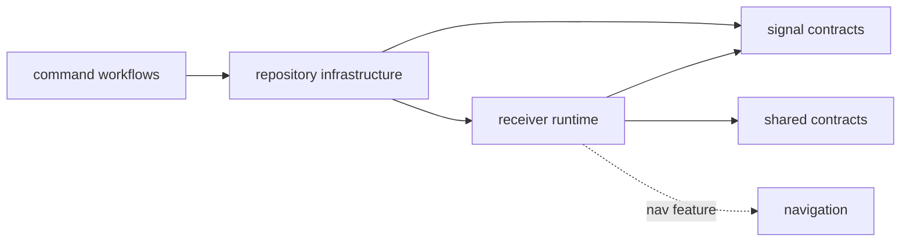
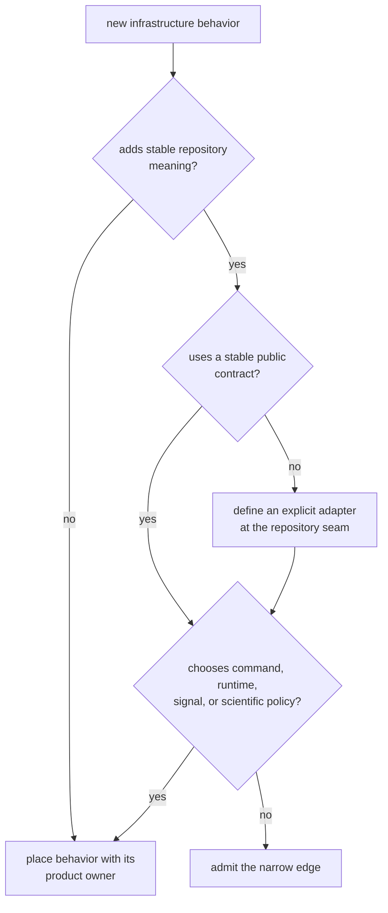

# Infrastructure Dependency Direction

Infrastructure may combine product contracts only when it adds repository
meaning: dataset identity, provenance, run placement, persistence, inspection,
or experiment definition. It is not a general integration layer and does not
own a capability merely because several packages use it.

## The Actual Production Edges

The [package manifest](https://github.com/bijux/bijux-gnss/blob/main/crates/bijux-gnss-infra/Cargo.toml) has two
GNSS production dependencies:

- signal supplies capture metadata and signal identities used when resolving
  datasets
- receiver supplies configuration, artifacts, diagnostics, and the shared
  records re-exported for command consumers

Core and navigation are not direct infrastructure dependencies. Core contracts
arrive through receiver. Navigation is enabled through receiver's `nav`
feature. Keeping this distinction explicit matters when reviewing package
metadata, feature changes, and accidental coupling.

Receiver defaults are disabled on the dependency edge. Infrastructure then
forwards three capabilities deliberately:

| Infrastructure feature | Forwarded capability | Default |
| --- | --- | --- |
| `nav` | receiver navigation support | yes |
| `precise-products` | receiver precise-product support, which also enables navigation | no |
| `tracing` | receiver tracing support | no |

Serialization, configuration parsing, hashing, and error support come from
general-purpose libraries. Repository policy and temporary-directory support
are development dependencies, not published runtime edges.

## Ownership Must Flow Downward

An accepted dependency must answer both questions:

1. What repository interpretation does infrastructure add?
2. Why can the behavior not remain with the lower owner and be consumed
   through an existing public contract?

Examples of valid added meaning include recording a receiver configuration in a
run manifest or resolving signal metadata from a registered capture. Choosing a
tracking threshold, generating a ranging code, or deciding command exit policy
adds no infrastructure meaning and belongs elsewhere.

## Re-exports Are Coupling, Not Ownership

The [public API](https://github.com/bijux/bijux-gnss/blob/main/crates/bijux-gnss-infra/src/api.rs) re-exports several
receiver, core, signal, and optional navigation contracts for command
convenience. Those re-exports shorten imports but do not transfer semantic
ownership. A breaking change still belongs to the package that defines the
contract.

Before adding another re-export:

- identify every intended consumer
- prefer a repository-specific adapter when infrastructure adds state or
  persistence meaning
- avoid exposing an entire lower API to serve one caller
- preserve feature gating when the defining contract is optional
- document which package owns compatibility and validation

If the only argument is a shorter import, consumers should depend on the
defining package directly.

## Review A New Edge

Review dependency and feature changes in this order:

1. classify the behavior using the
   [ownership boundary](../foundation/ownership-boundary.md)
2. inspect the [manifest](https://github.com/bijux/bijux-gnss/blob/main/crates/bijux-gnss-infra/Cargo.toml) rather
   than inferring edges from re-exports
3. confirm the dependency points to a public, stable contract
4. state the effect on default and disabled-feature builds
5. check whether persisted output or package metadata changes
6. validate the narrow repository contract and its first consumer

Reject the edge when it moves runtime state transitions, signal processing,
navigation models, command semantics, or maintainer policy into infrastructure.
The [architecture guide](https://github.com/bijux/bijux-gnss/blob/main/crates/bijux-gnss-infra/docs/ARCHITECTURE.md)
and [integration seams](integration-seams.md) describe the adapters that remain
inside the boundary.

## Warning Signs

- a direct dependency is described as transitive, or the reverse
- a feature silently changes persisted meaning
- infrastructure selects scientific thresholds or runtime state
- a lower API is re-exported without a named consumer
- development tooling enters the production graph
- a helper has no dataset, run, artifact, provenance, inspection, or experiment
  responsibility
- command wording or exit behavior appears below the command package

The dependency graph is healthy when each edge carries explicit repository
meaning and every non-repository decision remains with its stronger owner.
