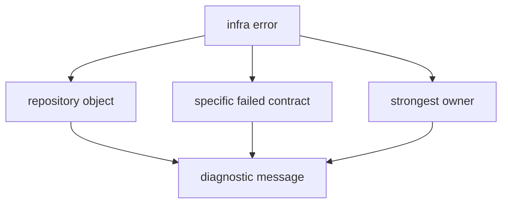

# Error Model

The infra error model should explain repository-state failures clearly without
pretending to own the product errors underneath them.

An infra error should answer three reader questions: which repository object is
untrustworthy, why it is untrustworthy, and which owner must fix the underlying
meaning if the problem is not infra-owned.

## What The Model Owns

- invalid dataset registry content
- malformed sidecars or coordinate strings
- run-layout persistence failures
- override and sweep application failures
- artifact inspection and repository-facing validation failures

## What It Does Not Own

- receiver runtime remediation
- navigation-solver refusal logic
- command wording and operator guidance
- signal-level interpretation of raw samples after metadata has been resolved
- core schema meaning after the serialized envelope has been validated

## Why This Matters

Infrastructure failures should name repository-state problems precisely while
leaving product-science errors to the crates that truly own them.

## Message Rules

- Name the repository object first: dataset entry, sidecar, run manifest,
  override, sweep spec, artifact, or validation input.
- State the violated contract in reader language before naming source internals.
- Route product-science refusal back to receiver, signal, navigation, or core.
- Avoid generic "invalid input" wording when the persisted object is known.

## Proof Path

Inspect coordinate parsing, dataset registry code, run-layout code,
artifact-inspection code, and validation adapters. Use the
[infra contract guide](https://github.com/bijux/bijux-gnss/blob/main/crates/bijux-gnss-infra/docs/CONTRACTS.md) to
confirm the message names a repository-state failure rather than a lower-crate
science failure.
