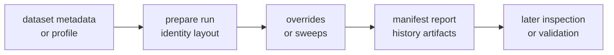

# Execution Model

Infra execution is mostly about preparing, interpreting, and validating
repository state around product runs.

## Repository Execution Flow

## Execution Responsibilities

| responsibility | infra owns | not owned here |
| --- | --- | --- |
| dataset resolution | registry lookup, sidecar loading, recorded provenance | signal sample semantics |
| run preparation | typed run identity, layout, artifact headers, and manifests | CLI command naming |
| variation | typed overrides, experiment specs, and sweep expansion | receiver algorithm policy |
| persistence | run reports, history entries, and artifact locations | core payload meaning |
| inspection | persisted artifact explanation and validation adapters | rerunning receiver stages |

## Execution Standard

The work here surrounds product execution rather than performing signal or
navigation computation itself. Infra's execution model is orchestration of
repository state, not GNSS stage math.

Review execution changes by asking:

- Does this code make repository state more typed and inspectable?
- Would command code otherwise duplicate this repository interpretation?
- Does persisted evidence remain understandable after the original run?
- Is lower-owner scientific meaning preserved rather than rephrased?
- Are generated outputs written under governed or ignored artifact locations?

## First Proof Check

Start with the infra [command adapter](https://github.com/bijux/bijux-gnss/blob/main/crates/bijux-gnss-infra/src/commands.rs),
[dataset source](https://github.com/bijux/bijux-gnss/tree/main/crates/bijux-gnss-infra/src/datasets),
[run-layout source](https://github.com/bijux/bijux-gnss/tree/main/crates/bijux-gnss-infra/src/run_layout),
[override source](https://github.com/bijux/bijux-gnss/tree/main/crates/bijux-gnss-infra/src/overrides),
[sweep source](https://github.com/bijux/bijux-gnss/blob/main/crates/bijux-gnss-infra/src/sweep.rs), and
[artifact inspection source](https://github.com/bijux/bijux-gnss/tree/main/crates/bijux-gnss-infra/src/artifact_inspection).
Then confirm the persisted shape against the [run-layout guide](https://github.com/bijux/bijux-gnss/blob/main/crates/bijux-gnss-infra/docs/RUN_LAYOUT.md).
