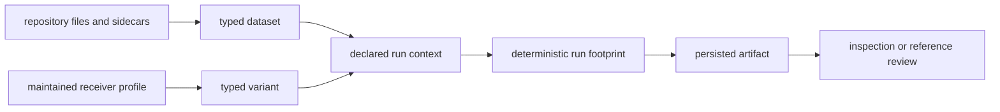

# Integration Seams

Infrastructure crosses repository, receiver, signal, core, and command
boundaries. Each seam must add typed repository meaning without taking
ownership of the underlying science.

## Trust Crossings

## Seam Contracts

| seam | accepted input | output and refusal |
| --- | --- | --- |
| dataset registry | registered identity plus repository metadata | typed dataset with provenance, or a specific missing/invalid-field error |
| raw-IQ sidecar | explicit format, sample rate, intermediate frequency, offset, and timestamp context | validated metadata, or refusal to infer absent capture facts |
| override and sweep | maintained profile plus typed parameter names and values | deterministic variants, or rejection of unsupported mutation |
| run identity | command, profile, dataset, version, feature, and replay context | deterministic directories and provenance fingerprint, or invalid-context refusal |
| persistence | typed manifest, report, history, and artifact records | governed files with explicit schema versions, or visible write failure |
| artifact inspection | known artifact kind, payload version, and read policy | typed explanation or validation result, never silent acceptance |
| reference adaptation | persisted evidence and explicit reference context | comparison-ready values or a typed prerequisite failure |

## Implementation Owners

- [Dataset resolution](https://github.com/bijux/bijux-gnss/blob/main/crates/bijux-gnss-infra/src/datasets/mod.rs)
  owns registry and sidecar trust.
- [Typed overrides](https://github.com/bijux/bijux-gnss/blob/main/crates/bijux-gnss-infra/src/overrides/mod.rs) and
  [sweep expansion](https://github.com/bijux/bijux-gnss/blob/main/crates/bijux-gnss-infra/src/sweep.rs) own
  reproducible variants.
- [Run layout](https://github.com/bijux/bijux-gnss/blob/main/crates/bijux-gnss-infra/src/run_layout.rs) owns identity,
  paths, persistence, records, and provenance.
- [Artifact inspection](https://github.com/bijux/bijux-gnss/blob/main/crates/bijux-gnss-infra/src/artifact_inspection/mod.rs)
  owns schema policy and later review.
- [Reference adaptation](https://github.com/bijux/bijux-gnss/blob/main/crates/bijux-gnss-infra/src/validate_reference.rs)
  bridges evidence into comparison without owning scientific truth.

## Boundary Failures

- Commands must not construct run paths or manifests independently.
- Receiver code must not discover datasets or write repository histories.
- Inspection must not repair invalid artifacts while reading them.
- Reference adapters must not invent truth, tolerances, or missing provenance.
- Convenience re-exports are not permission to move receiver or signal behavior
  into infrastructure.

The [architecture guide](https://github.com/bijux/bijux-gnss/blob/main/crates/bijux-gnss-infra/docs/ARCHITECTURE.md)
maps these seams to package ownership, and the
[release guide](../operations/release-and-versioning.md) defines compatibility
for persisted behavior.
