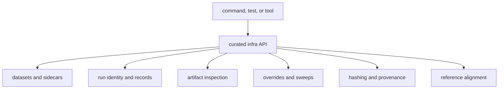

# Module Map

Enter `bijux-gnss-infra` through the repository object being interpreted. The
crate contains several filesystem-facing subsystems, but each has a distinct
contract: registered input, run footprint, persisted artifact, experiment
variation, provenance, or reference comparison.

## Choose A Repository Route

| question | owning subsystem | what belongs there |
| --- | --- | --- |
| How does a registry entry become a normalized capture? | [Dataset registry](https://github.com/bijux/bijux-gnss/tree/main/crates/bijux-gnss-infra/src/datasets/registry) | entry parsing, registry loading, and relative-location resolution |
| Which raw-IQ metadata source wins, and what must it contain? | [Raw-IQ metadata](https://github.com/bijux/bijux-gnss/tree/main/crates/bijux-gnss-infra/src/datasets/raw_iq_metadata) | sidecar loading, source precedence, cross-source agreement, and required-field validation |
| How is an execution named and placed? | [Run directories and identity](https://github.com/bijux/bijux-gnss/tree/main/crates/bijux-gnss-infra/src/run_layout/directories) and [run identity](https://github.com/bijux/bijux-gnss/tree/main/crates/bijux-gnss-infra/src/run_layout/identity) | deterministic identity, output and resume precedence, and typed locations |
| What execution context survives after a run? | [Persisted run records](https://github.com/bijux/bijux-gnss/tree/main/crates/bijux-gnss-infra/src/run_layout/records) | reports, manifests, history, artifact headers, and build metadata |
| What provenance is needed for comparison or replay? | [Run provenance](https://github.com/bijux/bijux-gnss/tree/main/crates/bijux-gnss-infra/src/run_layout/provenance) and [provenance hashing](https://github.com/bijux/bijux-gnss/tree/main/crates/bijux-gnss-infra/src/hash) | replay scope, front-end context, config identity, Git state, and feature inventory |
| How is an existing JSONL artifact interpreted? | [Artifact inspection](https://github.com/bijux/bijux-gnss/tree/main/crates/bijux-gnss-infra/src/artifact_inspection) | kind detection, explanation, schema policy, payload diagnostics, and sequence checks |
| How does declared experiment variation become receiver configuration? | [Override application](https://github.com/bijux/bijux-gnss/tree/main/crates/bijux-gnss-infra/src/overrides), [experiment records](https://github.com/bijux/bijux-gnss/blob/main/crates/bijux-gnss-infra/src/experiments.rs), and [sweep expansion](https://github.com/bijux/bijux-gnss/blob/main/crates/bijux-gnss-infra/src/sweep.rs) | typed mutation, accepted parameter policy, and Cartesian case expansion |
| How are persisted solutions paired with reference epochs? | [Reference alignment adapter](https://github.com/bijux/bijux-gnss/blob/main/crates/bijux-gnss-infra/src/validate_reference.rs) | repository-facing alignment and empty-result refusal |
| How does a command establish the standard footprint and artifact header? | [Run preparation](https://github.com/bijux/bijux-gnss/blob/main/crates/bijux-gnss-infra/src/commands.rs) | composition of existing infra contracts, not command policy |

## Public Boundary

The [curated infra API](https://github.com/bijux/bijux-gnss/blob/main/crates/bijux-gnss-infra/src/api.rs) is the only
downstream entrypoint. The
[crate boundary](https://github.com/bijux/bijux-gnss/blob/main/crates/bijux-gnss-infra/src/lib.rs) keeps the
subsystems private and prevents callers from depending on internal layout.

Small coordinate parsing support lives in the
[infrastructure parser](https://github.com/bijux/bijux-gnss/tree/main/crates/bijux-gnss-infra/src/parse), but a new
parser belongs there only when it serves a repository contract rather than a
product format.

## Boundary Tests

- Dataset code owns identity and metadata interpretation, not signal quality.
- Run layout owns placement and context, not receiver outcomes.
- Artifact inspection owns post-run diagnostics, not producer correctness.
- Overrides own typed application, not receiver defaults or command policy.
- Reference alignment owns pairing, not navigation accuracy.

Use [Integration Seams](integration-seams.md) for cross-package questions and
[Run Footprint Contracts](../interfaces/run-footprint-contracts.md) before
changing persisted run behavior.
