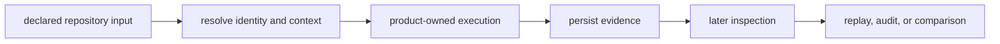
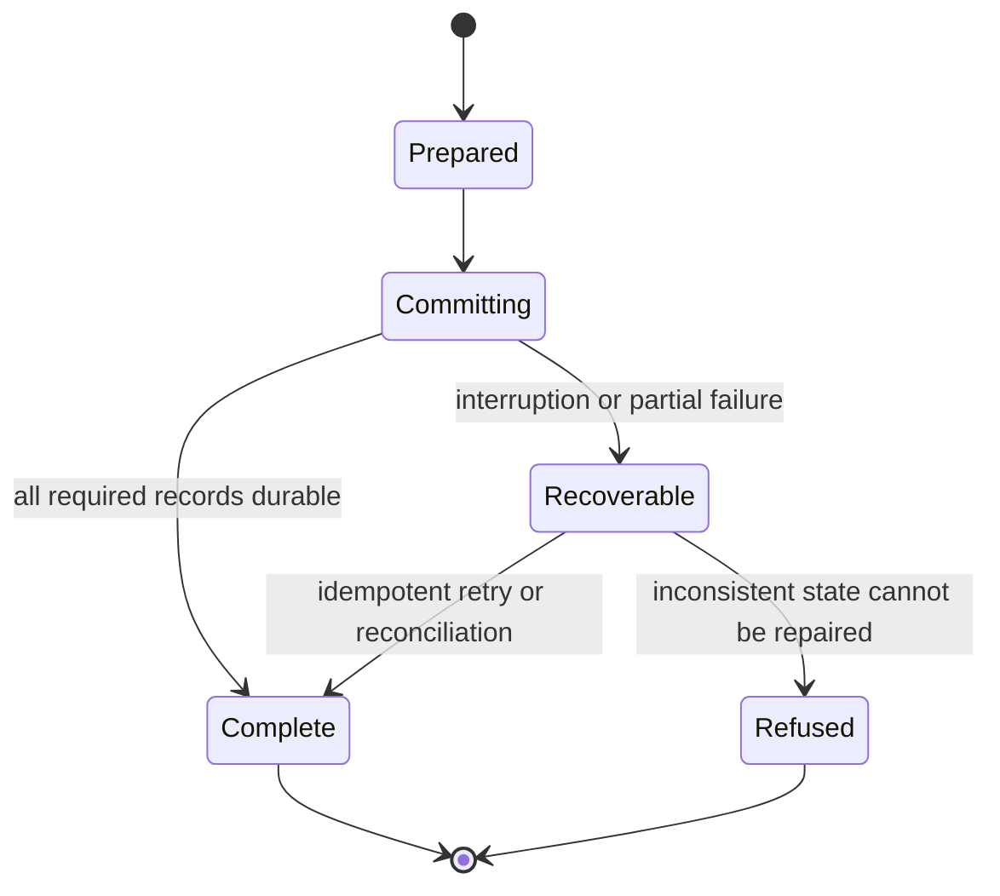
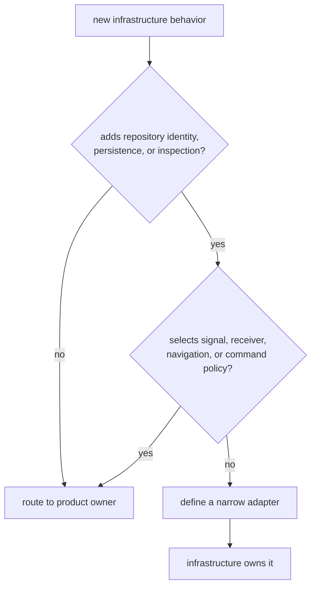

# Evolving Repository Evidence Contracts

Infrastructure changes alter how later readers identify, locate, trust, and
compare GNSS evidence. A successful write is not enough. The persisted result
must retain its context, remain interpretable, and fail visibly when those
properties cannot be guaranteed.

## Begin With The Reader Promise

Classify the repository contract before editing code:

| Contract family | Reader promise |
| --- | --- |
| dataset registry | a declared identity resolves to explicit capture metadata and provenance |
| run identity and layout | the same declared context resolves predictably, while materially different contexts do not collide |
| manifest, report, and history | related records describe one execution and can be reconciled after failure or retry |
| artifact inspection | kind, schema, payload, and diagnostics are interpreted without filename guesswork becoming truth |
| overrides and sweeps | typed configuration variation preserves receiver-owned meaning |
| reference adapters | persisted evidence reaches the owning validator without losing epoch, frame, unit, refusal, or provenance context |

A change is infrastructure-owned only when it strengthens or deliberately
evolves one of these repository promises. Product calculations remain with
their scientific or runtime owners.

## Preserve Identity And Provenance

Before changing normalization, hashing, defaults, or run naming, list every
input that makes two executions equivalent:

- dataset content and declared metadata
- receiver configuration
- command or workflow identity
- enabled capabilities
- source revision and dirty or unknown state
- toolchain and build context when relevant
- deterministic seed and replay context
- product versions and schema versions

Do not collapse unknown provenance into a clean or absent value. Do not mix a
location-dependent path with content identity without documenting the
consequence. Add equality and inequality examples that show both stable matches
and required separation.

The [run-layout contract](https://github.com/bijux/bijux-gnss/blob/main/crates/bijux-gnss-infra/docs/RUN_LAYOUT.md)
defines current persisted identity, while the
[dataset contract](https://github.com/bijux/bijux-gnss/blob/main/crates/bijux-gnss-infra/docs/DATASETS.md) defines
metadata resolution.

## Design Writes Together With Recovery

Manifest, report, and history updates describe one run but are currently
separate operations. New write behavior must define what readers observe after
interruption, retry, or concurrent execution.

For every multi-record change, state:

1. commit order and completion marker
2. atomic replacement strategy for individual records
3. idempotency behavior after ambiguous failure
4. concurrency ownership or locking
5. reconciliation between manifests and shared history
6. reader behavior for incomplete footprints

Append mode alone is not a concurrency protocol. Serialization before a write
does not make replacement atomic.

## Add Readers Before Changing Durable Schemas

Version fields do not create compatibility on their own. Before changing a
manifest, report, history, registry, or artifact interpretation:

- define accepted historical versions
- retain fixtures produced by an independent older writer
- distinguish migration, compatibility, and explicit end of support
- reject unknown versions rather than interpreting them as current
- preserve fields required for units, provenance, and validity
- test old reader/new writer and new reader/old writer behavior where promised

Current run records are primarily write-oriented and do not provide a complete
versioned reader or migration path. Do not expand durable schemas while
describing that gap as solved.

## Keep Product Meaning With Its Owner

Infrastructure may preserve receiver diagnostics, navigation refusal, signal
metadata, and core artifact validity. It must not reinterpret those outcomes to
make persisted evidence appear successful.

Examples:

- recording a receiver refusal with provenance belongs here
- choosing the receiver threshold that caused the refusal does not
- identifying the artifact schema belongs at the core/inspection seam
- inferring scientific acceptance from a filename does not
- applying a typed sweep value belongs here
- defining the runtime meaning of that receiver field does not

Use the [ownership boundary](ownership-boundary.md) and
[dependency direction](../architecture/dependency-direction.md) before adding a
cross-package helper or re-export.

## Make Failure Semantics Part Of The Contract

Cover failures that can leave plausible but misleading evidence:

- missing, malformed, conflicting, and future-version metadata
- unavailable Git or build provenance
- identity collisions and cross-checkout variation
- permission failure and interrupted replacement
- duplicate retry and concurrent history writers
- misleading artifact names and unsupported schemas
- diagnostics returned inside a transport-success result
- optional capability disabled

Tests should assert the resulting persisted state, diagnostic, and acceptance
decision. An error without an inspectable reason is insufficient; a successful
return containing ignored error diagnostics is also insufficient.

The [validation guide](https://github.com/bijux/bijux-gnss/blob/main/crates/bijux-gnss-infra/docs/VALIDATION.md)
defines adapter ownership, and the
[change-validation guide](../quality/change-validation.md) maps contract
families to focused evidence.

## Review The Current Risks Honestly

The [infrastructure risk register](../quality/risk-register.md) records active
issues including process-global context reuse, under-specified identity,
checkout-dependent dataset hashes, metadata fallback, uncertain Git state,
non-atomic records, split history commits, concurrent appends, write-only
schemas, filename-derived artifact type, latest-only readers, and ambiguous
strict validation.

These principles do not close those risks. A change that touches one must:

1. reproduce the failure mode
2. implement the durable treatment
3. add focused evidence
4. update compatibility behavior
5. narrow or close the risk only when residual exposure is explicit

Do not add another path that relies on an unresolved risk merely because the
current implementation already does.

## A Reviewable Infrastructure Change

A complete change states:

- the reader promise being changed
- identity and provenance impact
- schema and historical-reader behavior
- write, retry, interruption, and concurrency semantics
- product owner preserved at each adapter
- focused evidence and remaining risk

Infrastructure evolves safely when a future reader can distinguish complete,
partial, unsupported, degraded, and refused evidence without reconstructing the
producing command’s hidden assumptions.
