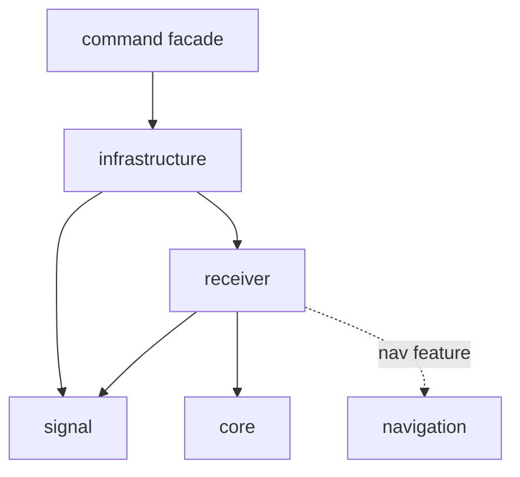
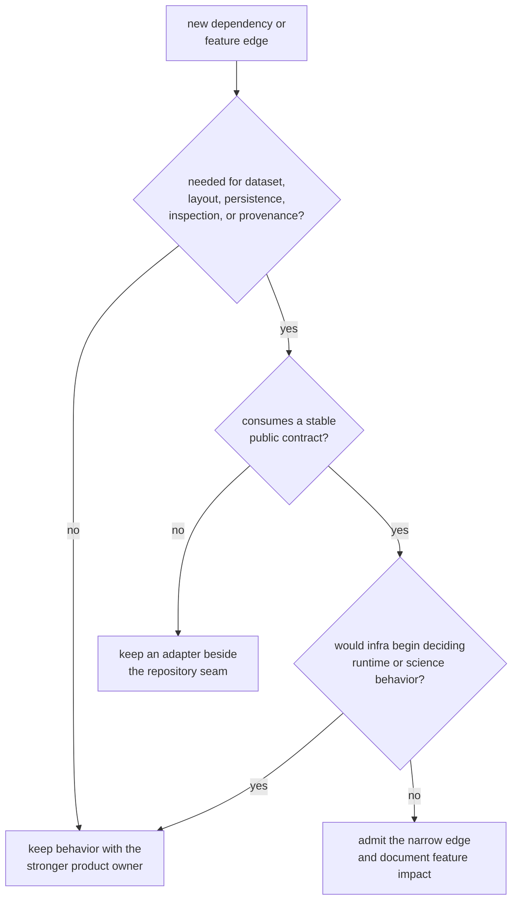

# Infrastructure Dependencies and Adjacencies

Infrastructure is a repository aggregation boundary. It may consume lower
product contracts when it adds dataset, provenance, run-layout, persistence,
inspection, or experiment meaning. Existing access to a type is not permission
to absorb the type’s scientific or runtime owner.

## Current Production Graph

The [package manifest](https://github.com/bijux/bijux-gnss/blob/main/crates/bijux-gnss-infra/Cargo.toml) directly
depends on signal and receiver. It does not directly depend on core or
navigation; those contracts are reachable through receiver dependencies and
features.

The receiver dependency disables receiver defaults. Infrastructure features
then forward navigation, precise-product, and tracing capabilities
deliberately. A feature change can alter transitive code, package metadata, and
runtime capability even when infrastructure source does not change.

General-purpose production dependencies support errors, serialization,
configuration parsing, and hashing. The repository policy package and temporary
directory helper are development-only.

## What Each Adjacency Means

| Adjacent package | Infrastructure consumes | Infrastructure must not own |
| --- | --- | --- |
| Signal | raw-IQ metadata, sample representation, and signal identity needed to interpret registered captures | code generation, modulation, DSP, or receiver suitability |
| Receiver | typed configuration, run inputs, artifacts, diagnostics, and optional feature surfaces | stage execution, lock lifecycle, observations, or validation budgets |
| Navigation | optional types and products exposed through receiver capabilities | estimators, corrections, integrity, PPP, or RTK decisions |
| Core | transitive shared records, units, identities, artifact envelopes, and diagnostics | canonical contract meaning or schema evolution |
| Command facade | workflow intent and operator selections arrive from above | command names, flags, rendering, exit policy, or user remediation |
| Maintainer tooling | repository governance validates infrastructure | product repository behavior or persisted run contracts |

Infrastructure adds durable repository interpretation: registered identity,
provenance, deterministic placement, manifests, history, inspection, and
reference adaptation.

## Admit a Dependency Only for Repository Meaning

An adapter may translate a product contract into repository state without
re-exporting the lower API wholesale. The adapter must make the added
repository meaning visible.

## Feature Review

For a new or changed feature:

1. identify the direct dependency and the transitive capability enabled
2. state whether default builds change
3. verify published package metadata resolves registry dependencies
4. document which repository workflows gain or lose behavior
5. confirm disabled-feature builds retain coherent refusal or absence
6. review command consumers that select the capability

Do not use feature forwarding to hide an upward dependency or make
infrastructure choose scientific policy.

## Dependency Smells

Stop when:

- a lower package is imported only to shorten one command implementation
- infrastructure exposes an unchanged lower API without repository semantics
- a helper has no dataset, run, artifact, inspection, provenance, or experiment
  responsibility
- receiver state transitions or navigation thresholds appear in repository
  code
- a direct dependency is described as transitive, or a transitive edge is
  presented as an explicit contract
- development tooling enters the published dependency graph
- a default feature silently changes the meaning of persisted output

Use the [ownership boundary](ownership-boundary.md) to route the capability and
the [integration seams](../architecture/integration-seams.md) to define the
adapter. The [infrastructure architecture](https://github.com/bijux/bijux-gnss/blob/main/crates/bijux-gnss-infra/docs/ARCHITECTURE.md)
maps current repository owners, while the
[package guardrail](https://github.com/bijux/bijux-gnss/blob/main/crates/bijux-gnss-infra/tests/integration_guardrails.rs)
provides policy evidence rather than complete dependency semantics.

The dependency posture is healthy when every edge adds explicit repository
meaning, feature forwarding is visible, and scientific, runtime, and operator
decisions remain with their owners.
