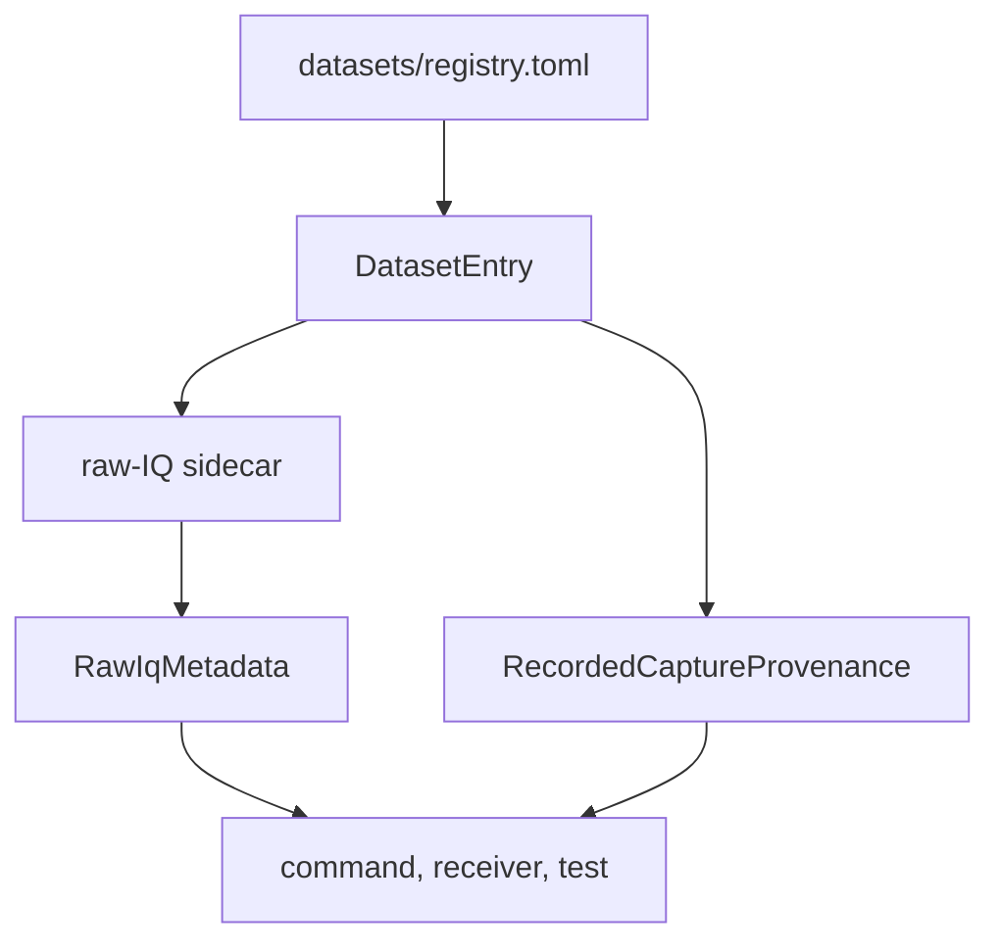

# Dataset Contracts

Dataset contracts turn repository files into typed capture metadata. They keep
commands, tests, receiver runs, and validation tooling from inventing separate
rules for registry lookup, sidecar loading, coordinates, and recorded capture
provenance.

## Dataset Resolution Flow

## Contract Families

| family | owns | first proof |
| --- | --- | --- |
| registry | dataset ids, capture file routes, declared metadata, and dataset entries | dataset registry source |
| sidecar loading | file-backed raw-IQ metadata loading and validation handoff | raw-IQ metadata source |
| metadata resolution | dataset-aware sidecar and explicit metadata resolution | raw-IQ metadata source |
| capture provenance | recorded capture context attached to dataset entries | capture provenance source |
| coordinate parsing | repository-side ECEF parsing for dataset records | coordinate parsing source |

## Boundary Rules

- Infra owns where repository metadata comes from and how callers resolve it.
- Signal owns raw-IQ metadata types, quantization, and sample semantics.
- Receiver owns execution over resolved datasets.
- Command owns operator flags and report rendering, not registry semantics.

## Reader Checks

- Does the dataset id resolve to the same capture meaning from every caller?
- Is sidecar metadata validated once instead of reinterpreted by command code?
- Is coordinate parsing explicit enough to avoid silent frame or unit changes?
- Can the reader see which capture provenance came from the registry and which
  came from runtime execution?

## First Proof Check

Inspect the [dataset guide](https://github.com/bijux/bijux-gnss/blob/main/crates/bijux-gnss-infra/docs/DATASETS.md),
dataset registry source, raw-IQ metadata source, coordinate parsing source, and
dataset or sidecar integration tests before changing dataset contract claims.
