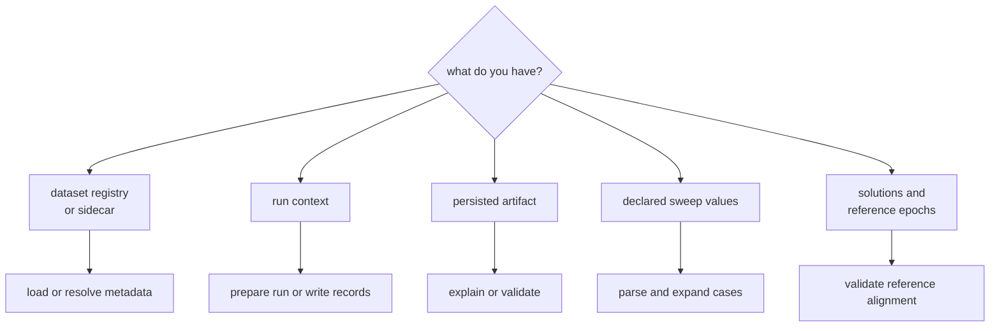

# Entrypoints and Examples

Start with the object you have and the repository state you need. Infra
entrypoints turn registered files, run context, or persisted artifacts into
typed results; they do not execute acquisition, tracking, or navigation.

## Find The Right Entrypoint



| need | entrypoint | result or effect |
| --- | --- | --- |
| read registered capture identity | `DatasetRegistry::load` | normalized `DatasetEntry` records |
| resolve raw-IQ ingest metadata | `resolve_raw_iq_metadata` | validated signal metadata from an explicit or registered sidecar |
| create the standard run context | `prepare_run` | directory layout, artifact header, and persisted run report |
| persist execution context | `write_manifest`, `write_run_report` | versioned repository records |
| inspect an existing artifact | `artifact_explain`, `artifact_validate` | typed summary or diagnostic events |
| expand experiment cases | `parse_sweep`, `expand_sweep` | Cartesian products of typed override pairs |
| align reference epochs | `validate_reference` | aligned epochs, or an error when none align |
| capture build context | `hash_config`, `git_hash`, `git_dirty`, `cpu_features` | provenance fields for reports |

## Load A Registered Dataset

```rust
use std::path::Path;
use bijux_gnss_infra::api::{core::InputError, DatasetEntry, DatasetRegistry};

fn load_capture(registry_path: &Path, dataset_id: &str) -> Result<DatasetEntry, InputError> {
    let registry = DatasetRegistry::load(registry_path)?;
    registry.find(dataset_id).ok_or_else(|| InputError {
        message: format!("dataset is not registered: {dataset_id}"),
    })
}
```

Registry loading normalizes relative dataset and sidecar locations against the
registry location. Looking up an unknown identifier returns `None`; the caller
must decide whether that is a refusal or whether an explicitly unregistered
workflow is allowed.

For raw-IQ input, prefer `resolve_raw_iq_metadata` over separately loading every
possible source. It validates an explicit sidecar against registered metadata
when both are present and refuses input when neither source provides metadata.

## Expand Declared Experiment Cases

```rust
use bijux_gnss_infra::api::expand_sweep;

let spec = vec![
    (
        "tracking.pll_bandwidth_hz".to_string(),
        vec!["12.0".to_string(), "18.0".to_string()],
    ),
    (
        "navigation.elevation_mask_deg".to_string(),
        vec!["5.0".to_string(), "10.0".to_string()],
    ),
];
let cases = expand_sweep(&spec);
assert_eq!(cases.len(), 4);
```

`expand_sweep` returns the Cartesian product. An empty specification produces
one empty case, which lets a caller use the same loop for baseline and swept
runs. Use `apply_sweep_value` to validate each key and value against the receiver
profile rather than treating the returned strings as trusted configuration.

## Align Persisted Solutions With Reference Epochs

```rust
use bijux_gnss_infra::api::{validate_reference, ReferenceAlign};

let aligned = validate_reference(
    &solutions,
    &reference_epochs,
    ReferenceAlign::Closest,
)?;
```

The adapter guarantees that at least one reference epoch aligned. It does not
claim the resulting navigation solution is accurate; use receiver or navigation
validation for that scientific judgment.

## Error Handling

Most entrypoints return the shared `InputError`. Preserve its specific message
when reporting a missing dataset, invalid sidecar, unsupported override, failed
write, or empty reference alignment. Replacing these failures with a generic
"infrastructure error" removes the evidence an operator needs.

For deeper contracts, continue with the
[dataset guide](https://github.com/bijux/bijux-gnss/blob/main/crates/bijux-gnss-infra/docs/DATASETS.md),
[run layout guide](https://github.com/bijux/bijux-gnss/blob/main/crates/bijux-gnss-infra/docs/RUN_LAYOUT.md),
[validation guide](https://github.com/bijux/bijux-gnss/blob/main/crates/bijux-gnss-infra/docs/VALIDATION.md), or
[override guide](https://github.com/bijux/bijux-gnss/blob/main/crates/bijux-gnss-infra/docs/OVERRIDES.md). The
[curated API source](https://github.com/bijux/bijux-gnss/blob/main/crates/bijux-gnss-infra/src/api.rs) remains the
authoritative list of available names.
