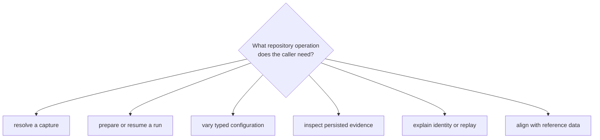
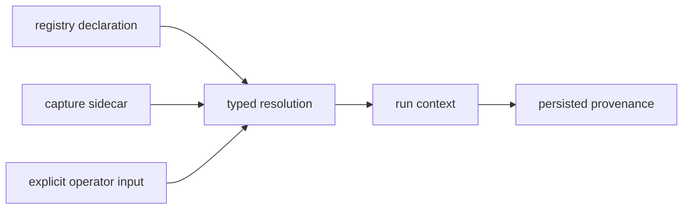

# Infrastructure Interface Guide

Callers use `bijux_gnss_infra::api` to turn repository declarations into typed
inputs, create attributable run footprints, persist evidence, and inspect that
evidence later. The API also re-exports selected lower-package contracts for
repository-facing convenience; those re-exports do not transfer scientific
ownership to infrastructure.

## Choose The Repository Contract

| caller need | contract | result |
| --- | --- | --- |
| Resolve a registry entry, sidecar, coordinates, and capture provenance | [Dataset contracts](dataset-contracts.md) | typed capture location and explicit raw-IQ context |
| Determine output, resume behavior, identity, records, and history | [Run footprint contracts](run-footprint-contracts.md) | governed run layout, report, manifest, headers, and discovery entry |
| Understand persisted domain records independently of run placement | [Persisted artifact contracts](persisted-artifact-contracts.md) | core-owned payload meaning with infrastructure-owned storage context |
| Identify, explain, or validate an existing artifact | [Artifact inspection contracts](artifact-inspection-contracts.md) | kind, header, entry count, diagnostics, or an input error |
| Apply supported profile changes or expand experiment cases | [Override and sweep contracts](override-and-sweep-contracts.md) | deterministic typed mutation and case expansion |
| Explain matching or different run identities | [Provenance and hashing](provenance-and-hashing.md) | configuration, repository, machine, and front-end context |
| Pair persisted outcomes with supplied reference epochs | [Validation adapters](validation-adapters.md) | aligned evidence for the scientific owner to interpret |

## Preserve Input Provenance

Resolution must expose which source supplied each governed fact and reject
contradiction rather than silently choosing convenient metadata. Signal owns
the meaning of sample format and quantization; infrastructure owns where those
facts came from and how they travel with a repository run.

## Read Inspection Outcomes Correctly

An inspection input error means the artifact could not be established as a
supported readable stream. Diagnostics mean records were readable but violated
payload, sequence, or signal-compatibility checks. Keep those outcomes
separate.

Non-strict validation may accept a known empty artifact with no diagnostics.
Callers requiring evidence must select strict behavior or enforce non-empty
policy themselves. Strict mode does not automatically turn every warning into
a failing workflow.

Artifact inspection establishes structural and selected semantic coherence. It
does not prove receiver accuracy, navigation convergence, or scientific truth.

## Public Surface Rules

- Import repository-facing contracts through the
  [curated API](api-surface.md), using [public imports](public-imports.md) for
  supported patterns.
- Do not reconstruct run paths, identity hashes, or manifest fields in command
  code.
- Do not replace typed overrides with string mutation outside the owned
  override contract.
- Do not infer artifact kind or validity from a successful file read alone.
- Keep lower-package re-exports attributable to their original owner.
- Treat persisted fields, identity inputs, hashes, and reader policy as
  compatibility surfaces.

Use [compatibility commitments](compatibility-commitments.md) before changing
those surfaces and [entrypoints and examples](entrypoints-and-examples.md) for
consumer-shaped calls.

## Sources Of Truth

The [curated infrastructure API](https://github.com/bijux/bijux-gnss/blob/main/crates/bijux-gnss-infra/src/api.rs)
is the supported import surface. The
[contract guide](https://github.com/bijux/bijux-gnss/blob/main/crates/bijux-gnss-infra/docs/CONTRACTS.md),
[dataset guide](https://github.com/bijux/bijux-gnss/blob/main/crates/bijux-gnss-infra/docs/DATASETS.md),
[run-layout guide](https://github.com/bijux/bijux-gnss/blob/main/crates/bijux-gnss-infra/docs/RUN_LAYOUT.md), and
[validation guide](https://github.com/bijux/bijux-gnss/blob/main/crates/bijux-gnss-infra/docs/VALIDATION.md) define
the behavior behind it.
