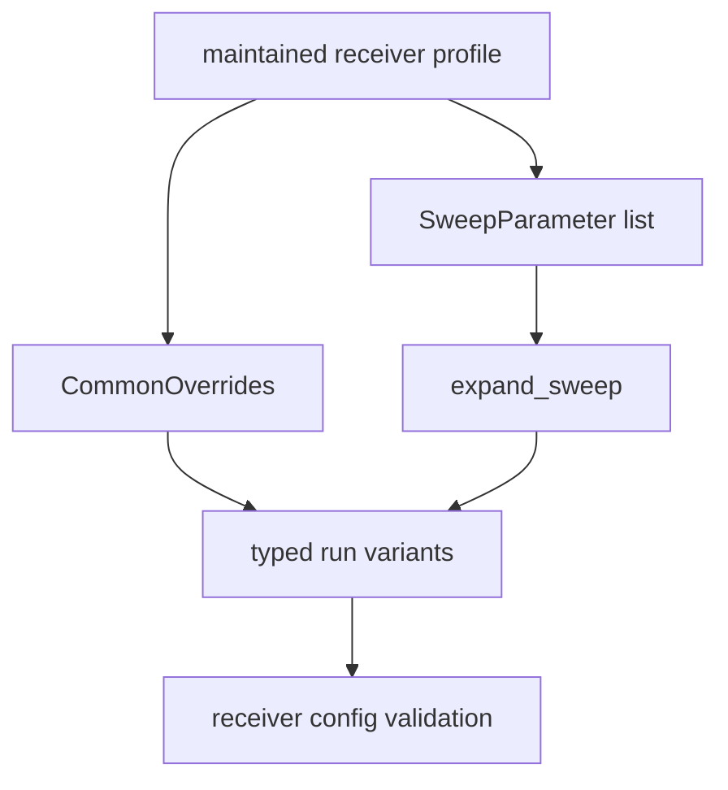

# Override and Sweep Contracts

Overrides and sweeps let repository workflows vary maintained receiver
profiles without turning configuration changes into unreviewed strings. Infra
owns the typed mutation mechanics; the receiver owns what each parameter means
at runtime.

## Experiment Expansion

## Contract Families

| family | owns | first proof |
| --- | --- | --- |
| common overrides | typed mutation of shared receiver-profile fields | receiver-profile override source |
| direct override application | applying reviewed override values to a profile | override application source |
| sweep parsing | converting `PARAM=VALS` input into typed sweep parameters | sweep parser and sweep-parameter source |
| sweep expansion | Cartesian expansion into reproducible run variants | experiment expansion source |
| experiment specs | repository-facing batch-run descriptions | experiment spec source |

## Boundary Rules

- Infra owns typed variation, expansion, and reviewable experiment shape.
- Receiver owns parameter validation and runtime behavior after the profile is
  mutated.
- Command owns how operators request sweeps, not how sweep keys mutate a
  profile.
- Tests must prove expansion order, invalid keys, and value parsing because
  those details affect reproducibility.

## Reader Checks

- Can a reviewer see every run variant before execution?
- Does the same sweep input expand deterministically?
- Are invalid keys rejected at the infrastructure boundary?
- Does the documentation separate parameter mutation from receiver science?

## First Proof Check

Inspect the [override guide](https://github.com/bijux/bijux-gnss/blob/main/crates/bijux-gnss-infra/docs/OVERRIDES.md),
[experiment guide](https://github.com/bijux/bijux-gnss/blob/main/crates/bijux-gnss-infra/docs/EXPERIMENTS.md),
override source, sweep source, experiment source, and the override integration
test.
