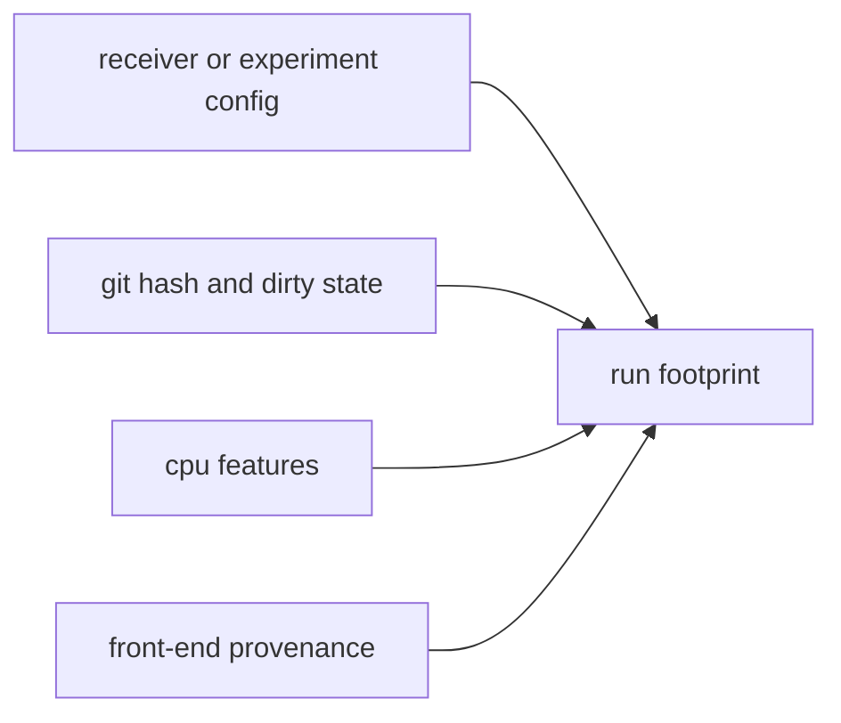

# Provenance and Hashing

Infra hashing describes how repository evidence was produced. It is not a
general cryptography toolkit and it is not the scientific identity of a GNSS
record.

The goal is reproducibility: a later reader should be able to see which
configuration, repository state, dirty-worktree status, CPU features, and
front-end provenance were attached to a run.

## Provenance Flow

## Contract Families

| family | owns | first proof |
| --- | --- | --- |
| configuration hash | stable hash of run-preparation configuration | the [provenance hash source](https://github.com/bijux/bijux-gnss/blob/main/crates/bijux-gnss-infra/src/hash/provenance.rs) |
| repository state | git commit hash and dirty-state capture | the [provenance hash source](https://github.com/bijux/bijux-gnss/blob/main/crates/bijux-gnss-infra/src/hash/provenance.rs) |
| machine context | CPU feature capture for run explainability | the [provenance hash source](https://github.com/bijux/bijux-gnss/blob/main/crates/bijux-gnss-infra/src/hash/provenance.rs) |
| front-end provenance | persisted front-end capture context beside run footprints | the [front-end provenance source](https://github.com/bijux/bijux-gnss/blob/main/crates/bijux-gnss-infra/src/run_layout/provenance/front_end.rs) |

## Boundary Rules

- Core owns stable identifiers and artifact record meaning.
- Infra owns reproducibility metadata tied to repository runs.
- Commands may display provenance, but they should not compute a separate
  provenance model.
- Receiver may emit runtime facts; infra decides which repository provenance
  is persisted with them.

## Reader Checks

- Can a reader distinguish run provenance from scientific truth?
- Does a hash change only when the governed input meaning changes?
- Is dirty repository state recorded visibly instead of hidden behind a clean
  manifest?
- Does front-end provenance travel with the run footprint that depends on it?

## First Proof Check

Start with the infra [hashing guide](https://github.com/bijux/bijux-gnss/blob/main/crates/bijux-gnss-infra/docs/HASHING.md),
the [provenance hash source](https://github.com/bijux/bijux-gnss/blob/main/crates/bijux-gnss-infra/src/hash/provenance.rs),
and the [front-end provenance source](https://github.com/bijux/bijux-gnss/blob/main/crates/bijux-gnss-infra/src/run_layout/provenance/front_end.rs).
Then inspect the provenance-related run-layout tests before changing this
contract.
