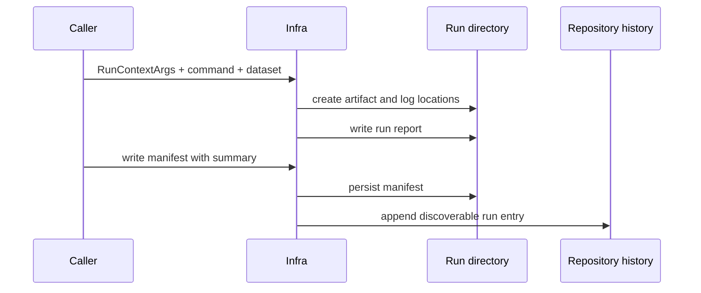

# Run Footprint Contracts

A run footprint is the durable account of an execution: where its evidence
lives, which inputs shaped it, which build produced it, and how a later reader
can compare or replay it. Callers provide intent through `RunContextArgs`; infra
resolves and persists the repository representation.

## Footprint Lifecycle

## Records And Their Jobs

| record or helper | answers | important side effect |
| --- | --- | --- |
| `RunContextArgs` | Which config, dataset, output override, resume target, sidecar, and determinism policy apply? | none until resolved |
| `RunDirectoryLayout` | Where do artifacts, logs, summary, and manifest belong? | `create` establishes artifact and log locations |
| `prepare_run` | What standard layout and artifact header should a command use? | creates the layout and writes the run report |
| `RunReport` | Which deterministic identity, dataset hash, build, replay scope, and front-end provenance describe the run? | writing it also publishes `BIJUX_RUN_ID` to the process |
| `RunManifest` | Which command, configuration snapshot, dataset metadata, provenance, and summary should survive? | writing it persists the manifest and appends history |
| `RunHistoryEntry` | How can later tooling discover the run without scanning every directory? | append-only repository history |
| `artifact_header` | Which shared envelope should produced artifacts carry? | none; core still owns envelope semantics |

## Directory Resolution

Resolution follows declared intent:

1. A resume target reuses that run location.
2. An output override selects the caller-provided location.
3. Otherwise infra derives a run identity from configuration, dataset, build
   version, command, and determinism policy.
4. A dataset is required unless the caller explicitly permits an unregistered
   dataset.

Callers must not reproduce this logic or assemble child paths themselves. Doing
so can separate artifacts from their report, manifest, or history record.

## Durability Rules

- Treat layout and report schema versions as compatibility boundaries.
- Preserve enough configuration and dataset context to explain a run after the
  producing command is unavailable.
- Keep replay scope and front-end provenance explicit; a matching command line
  alone does not establish equivalent input conditions.
- Do not rewrite history while appending a new run.
- Keep product claims in their producing package. A manifest can record a
  receiver outcome, but infra does not establish its scientific validity.

## What To Read After A Failure

| symptom | inspect first |
| --- | --- |
| run location differs from expectation | resolved output, resume, dataset, and deterministic inputs |
| manifest exists but discovery misses the run | history append result and manifest write completion |
| two runs cannot be compared | report schema, configuration hash, dataset hash, replay scope, and front-end provenance |
| artifact cannot be attributed | artifact header and the run report that supplied its identity |
| an old reader rejects a footprint | layout or report schema compatibility before field-level content |

The [run layout guide](https://github.com/bijux/bijux-gnss/blob/main/crates/bijux-gnss-infra/docs/RUN_LAYOUT.md)
defines the crate-local contract. Verify behavior against the
[run context resolver](https://github.com/bijux/bijux-gnss/blob/main/crates/bijux-gnss-infra/src/run_layout/directories/context.rs),
[manifest persistence](https://github.com/bijux/bijux-gnss/blob/main/crates/bijux-gnss-infra/src/run_layout/records/manifest.rs),
and [report persistence](https://github.com/bijux/bijux-gnss/blob/main/crates/bijux-gnss-infra/src/run_layout/records/report.rs).
