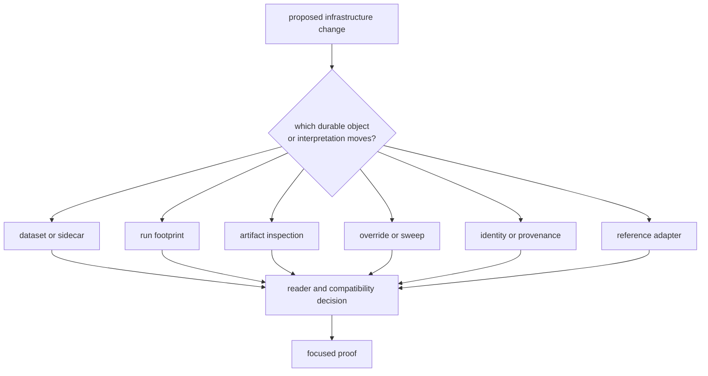
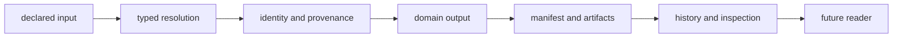

# Infrastructure Change Guide

Infrastructure changes rewrite how the repository remembers inputs and runs.
Treat dataset metadata, run identity, manifests, reports, history, hashes,
overrides, and artifact inspection as durable contracts rather than incidental
file handling.

## Start With The Repository Object

If the changed meaning is acquisition, tracking, signal processing, or
navigation science, route it to the producing package before editing
infrastructure.

## Choose The Maintenance Route

| changed surface | operational route | required evidence |
| --- | --- | --- |
| Registry entry, sidecar, coordinates, or reusable capture | [Dataset registration](dataset-registration.md) | source precedence, required metadata, provenance, contradiction, and consumer resolution |
| Run identity, output, resume, manifest, report, or history | [Change sequence](change-sequence.md) | deterministic resolution, old-reader impact, persistence, and discoverability |
| Artifact kind, parser, strict behavior, diagnostics, or sequence checks | [Fixture and artifact care](fixture-and-artifact-care.md) | supported and malformed inputs, current-schema policy, empty behavior, and diagnostic meaning |
| Profile override, experiment, or sweep dimension | [Common workflows](common-workflows.md) | typed mutation, unsupported value refusal, deterministic expansion, and receiver ownership |
| Hash or provenance field | [Review scope](review-scope.md) | governed inputs, equality meaning, dirty state, and replay interpretation |
| Local focused work | [Local development](local-development.md) and [verification commands](verification-commands.md) | exact proof and residual gap |
| Published repository contract | [Release and versioning](release-and-versioning.md) | compatibility for stored records, hashes, paths, and readers |

## Preserve The Evidence Chain

A change is incomplete if a future reader cannot explain which input produced
an artifact, why a run identity changed, or whether an older record is
unsupported rather than corrupt.

Do not repair a broken chain by assembling paths manually, editing generated
manifests, accepting contradictory metadata, or weakening artifact validation.

## Generated Evidence And Fixtures

Keep generated run evidence under governed output locations. Tests must isolate
their files from real run history and must not leave repository state behind.
Checked-in examples should represent an intentional contract and include an
active reader or validator before being cited as compatibility proof.

When artifact interpretation changes, state whether:

- stored payload meaning changed;
- only repository dispatch or schema policy changed;
- older records remain readable;
- diagnostics changed severity or meaning;
- strict and non-strict empty behavior changed.

## Commit Boundary

Commit when one repository contract, its docs, reader or writer behavior,
focused evidence, and compatibility decision agree. Keep generated output
separate from handwritten contract changes unless correctness requires them to
move together.

The [infrastructure test guide](https://github.com/bijux/bijux-gnss/blob/main/crates/bijux-gnss-infra/docs/TESTS.md),
[run-layout guide](https://github.com/bijux/bijux-gnss/blob/main/crates/bijux-gnss-infra/docs/RUN_LAYOUT.md),
[dataset guide](https://github.com/bijux/bijux-gnss/blob/main/crates/bijux-gnss-infra/docs/DATASETS.md), and
[validation guide](https://github.com/bijux/bijux-gnss/blob/main/crates/bijux-gnss-infra/docs/VALIDATION.md) are the
package-level authorities.
