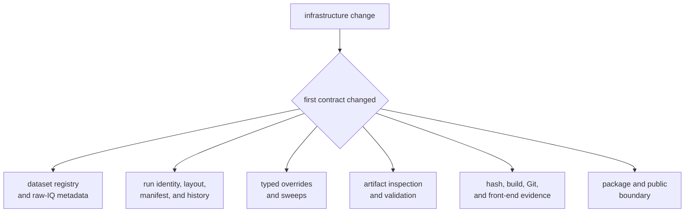
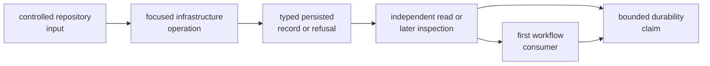

# Infrastructure Verification Guide

Infrastructure verification protects durable repository meaning: how a capture
is identified, how metadata is reconciled, how a run footprint is formed, how
variation is recorded, and how persisted evidence is interpreted later. It
does not prove receiver performance or navigation accuracy.

## Route the Persisted Contract



Begin at the repository-owned record or decision that changed. A receiver test
cannot establish that a manifest remains interpretable, and a guardrail test
cannot establish that raw-IQ metadata is reconciled correctly.

## Current Automated Entry Points

Run from the repository root:

```sh
cargo test -p bijux-gnss-infra --test integration_overrides
cargo test -p bijux-gnss-infra --test integration_guardrails
cargo test -p bijux-gnss-infra --lib
cargo test -p bijux-gnss-infra
```

| Command | Direct evidence | Does not establish |
| --- | --- | --- |
| override integration | selected typed receiver-profile mutation and sweep behavior | every supported override, persistence, datasets, or artifacts |
| guardrail integration | configured package-boundary policy | runtime behavior, public semantics, or persisted compatibility |
| library tests | current module cases for datasets, metadata, parsing, artifacts, overrides, and selected provenance | untested public workflows or feature combinations |
| full package | the integration and library cases compiled into the selected feature set | comprehensive run-layout, history, validation-adapter, or provenance coverage |

The [infrastructure test map](https://github.com/bijux/bijux-gnss/blob/main/crates/bijux-gnss-infra/docs/TESTS.md)
describes the current families. Treat its missing-target guidance as a coverage
gap, not as evidence that source review is equivalent to an executable test.

## Select Evidence by Behavior

| Changed behavior | Focused starting point | Required additional evidence |
| --- | --- | --- |
| Registry normalization or capture provenance | matching dataset registry library test | missing entry, relative location, identity, and consumer resolution |
| Raw-IQ metadata precedence or validation | matching metadata library test | registry-only, sidecar-only, agreement, contradiction, required fields, format, and quantization |
| Coordinate parsing | focused coordinate parser test | complete, incomplete, whitespace, units, and consumer interpretation |
| Override or sweep | override integration plus matching module test | accepted value, rejected key or value, deterministic seed behavior, and serialized run variation |
| Artifact inspection | matching artifact library test | supported kind, malformed payload, sequence fault, diagnostic meaning, and older-schema behavior where promised |
| Configuration or input hashing | matching provenance library test | stable byte definition, missing optional path, changed input, and report consumer |
| Front-end provenance | matching front-end library test | complete sidecar plus missing sample rate and intermediate frequency |
| Run identity, paths, manifest, report, or history | no dedicated integration target today | deterministic path review, write/read round trip, append behavior, compatibility decision, and new focused proof |
| Reference-validation adapter | no dedicated integration target today | owning scientific contract, malformed persisted input, feature behavior, refusal preservation, and new focused proof |
| Public boundary or dependency direction | guardrail integration | direct consumer-shaped use and the owning behavioral test |

Run a named test with an exact filter when diagnosing one module case:

```sh
cargo test -p bijux-gnss-infra --lib dataset_registry_load_normalizes_relative_paths
cargo test -p bijux-gnss-infra --lib resolve_raw_iq_metadata_prefers_validated_sidecar
cargo test -p bijux-gnss-infra --lib artifact_validate_rejects_non_monotonic_track_sample_index
cargo test -p bijux-gnss-infra --lib hash_config_uses_profile_snapshot_without_a_config_path
```

Filters can match more than one test. Read the test names Cargo reports rather
than assuming the filter selected exactly one case.

## Build Durable Evidence



For persistence changes, an in-memory assertion is insufficient. Verify the
written representation, reopen it through the supported reader, and inspect the
first workflow that relies on its meaning. Use isolated test directories and
keep generated evidence outside repository-owned run history.

## Cover Failure and Compatibility

Exercise the relevant negative case:

- missing, contradictory, stale, or malformed metadata
- unsupported override key or invalid typed value
- incomplete coordinates or front-end context
- unknown artifact kind, malformed payload, or invalid sequence
- unavailable feature-gated validation
- unwritable destination, partial record, or failed history append

A refusal should preserve the offending field, expected contract, and useful
diagnostic without exposing incidental host paths.

When a persisted schema or layout changes, state whether existing runs remain
readable. If compatibility is promised, prove an older representative record
through the current reader. If it is not promised, identify the support
boundary rather than silently changing interpretation.

## Account for Features

Navigation support is enabled by default, while precise-product and tracing
behavior are optional. Validation and re-export changes must be checked in the
feature configuration that exposes them and in a coherent build without the
optional capability. A default-feature package pass does not establish every
feature combination.

## Record the Result

Report:

1. repository contract and durable record affected
2. exact command, test names selected, and feature set
3. controlled inputs and isolated output location
4. accepted, malformed, missing, and contradictory behavior
5. write/read or later-inspection evidence
6. first workflow consumer
7. compatibility decision
8. missing integration coverage

Use the [run-layout contract](https://github.com/bijux/bijux-gnss/blob/main/crates/bijux-gnss-infra/docs/RUN_LAYOUT.md),
[dataset contract](https://github.com/bijux/bijux-gnss/blob/main/crates/bijux-gnss-infra/docs/DATASETS.md), and
[validation boundary](https://github.com/bijux/bijux-gnss/blob/main/crates/bijux-gnss-infra/docs/VALIDATION.md) to
name the affected meaning.

Verification is complete only when the durable record, refusal behavior,
reader, consumer, feature scope, compatibility boundary, and uncovered
behavior are explicit.
