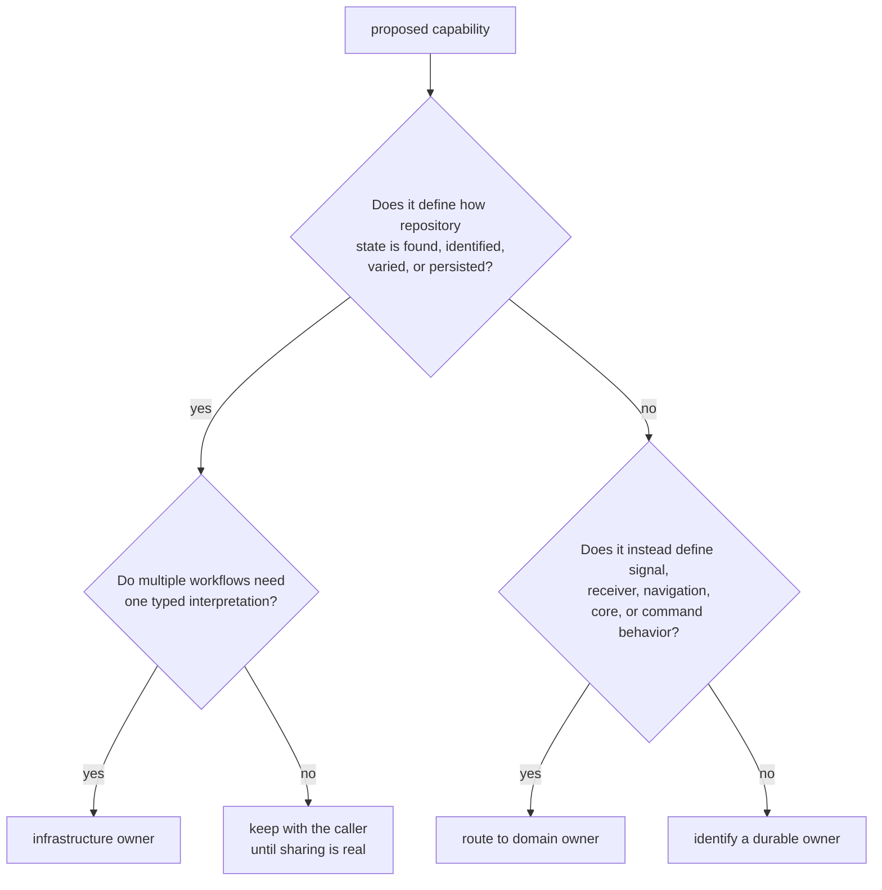
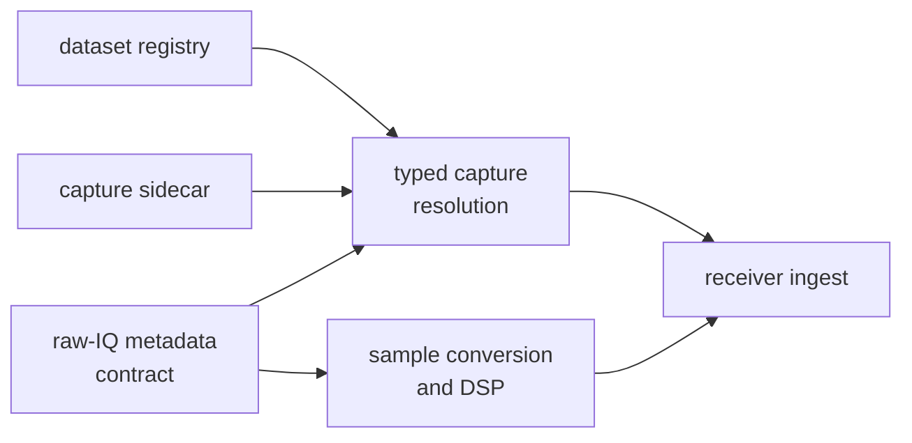
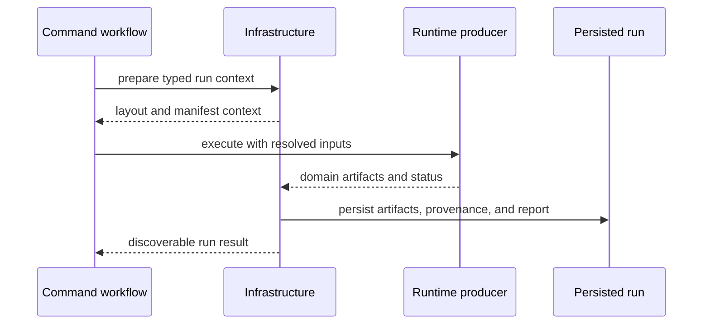

# Infrastructure Ownership Boundaries

`bijux-gnss-infra` gives repository state one typed interpretation across
commands, receiver runs, validation, and review. It owns dataset registration,
run layout, manifests, persisted evidence, provenance, configuration overrides,
and repository-facing validation adapters.

Touching a file is not enough to make behavior infrastructure-owned. The
deciding question is whether the behavior defines repository state or merely
loads domain data for another owner.

## Decide By Durable State

Infrastructure is the right owner for:

- resolving a registered dataset and its sidecar metadata;
- assigning deterministic run identity and typed output locations;
- writing and reading run manifests, reports, and history;
- recording repository provenance and configuration hashes;
- expanding declared experiment sweeps and typed profile overrides;
- inspecting persisted artifact kinds and payload validity;
- adapting persisted solutions and references into a comparison workflow.

## Persistence Does Not Transfer Meaning

| persisted concern | infrastructure owns | domain owner retains |
| --- | --- | --- |
| raw-IQ capture registration | location, sidecar resolution, capture provenance | [signal processing](../bijux-gnss-signal/) defines sample format, quantization, rate, and signal meaning |
| receiver artifacts | run placement, manifest membership, inspection, history | [receiver execution](../bijux-gnss-receiver/) defines stage state, diagnostics, and runtime validity |
| navigation products and solutions | repository discovery, provenance, and reference alignment adapter | [navigation science](../bijux-gnss-nav/) defines format semantics, interpolation, correction, estimation, and acceptance |
| shared artifact envelopes | durable storage and lookup | [shared GNSS contracts](../bijux-gnss-core/) define header, payload, version, units, and portable validation |
| operator-selected inputs and outputs | resolve and execute the typed repository operation | [command workflows](../bijux-gnss/) define flags, defaults, workflow order, and presentation |

Persisting a record does not authorize infrastructure to reinterpret it. If
the producer reports degraded tracking, infrastructure preserves that state
and provenance; it does not invent a second threshold for calling the run
healthy.

## Raw-IQ Boundary

Infrastructure owns registry entries, path resolution, and recorded-capture
provenance. Signal owns the metadata and conversion semantics. Receiver owns
whether a resolved capture is admissible for a configured run and what happens
after ingest.

Do not add quantization math, front-end quality thresholds, or acquisition
policy to dataset resolution. Do not make signal code discover repository
sidecars.

## Run And Artifact Boundary

The [infrastructure public facade](../../crates/bijux-gnss-infra/src/api.rs)
exposes run preparation, typed run layout, manifests, reports, history,
artifact inspection, datasets, overrides, sweeps, hashes, and reference
validation. Its product API re-exports exist for caller convenience; they do
not make infrastructure the scientific owner.

Infrastructure may validate that a payload matches its declared artifact
schema. Scientific correctness still requires producer-owned truth evidence.
A valid file is not necessarily a valid measurement or solution.

## Overrides And Sweeps

Infrastructure owns deterministic mutation of declared configuration fields
and stable expansion of experiment specifications. The package that owns a
configuration field still owns:

- its units and admissible range;
- interactions with runtime state;
- default scientific or operational policy;
- refusal behavior when the value is unsafe.

An override mechanism should not contain hidden per-field science. It should
apply typed values and preserve enough provenance to reconstruct the effective
configuration.

## Validation Adapter Boundary

Reference validation here aligns repository evidence with reference epochs and
packages comparison output for workflows. Receiver and navigation packages own
the budgets, consistency rules, and scientific interpretation used by that
comparison.

Keep a validation function here when its primary work is resolving persisted
inputs or presenting repository evidence. Move it to the scientific owner when
it defines a new error metric, threshold, correction, or acceptance rule.

## Reject Boundary Drift

Reject an infrastructure change that:

- uses filesystem proximity as the only ownership argument;
- reimplements a signal, receiver, or navigation threshold;
- changes a shared payload because a local layout is inconvenient;
- exposes a re-export as if infrastructure authored the underlying contract;
- hides file writes, environment reads, or process state behind a pure-looking
  helper;
- treats a hash as complete reproducibility evidence;
- places operator report policy in a run manifest writer.

Use the [dataset contract](../../crates/bijux-gnss-infra/docs/DATASETS.md),
[run-layout contract](../../crates/bijux-gnss-infra/docs/RUN_LAYOUT.md),
[artifact inspection contract](../../crates/bijux-gnss-infra/docs/CONTRACTS.md), and
[validation boundary](../../crates/bijux-gnss-infra/docs/VALIDATION.md) to
review the affected seam. Repository state belongs here; product truth does
not.
