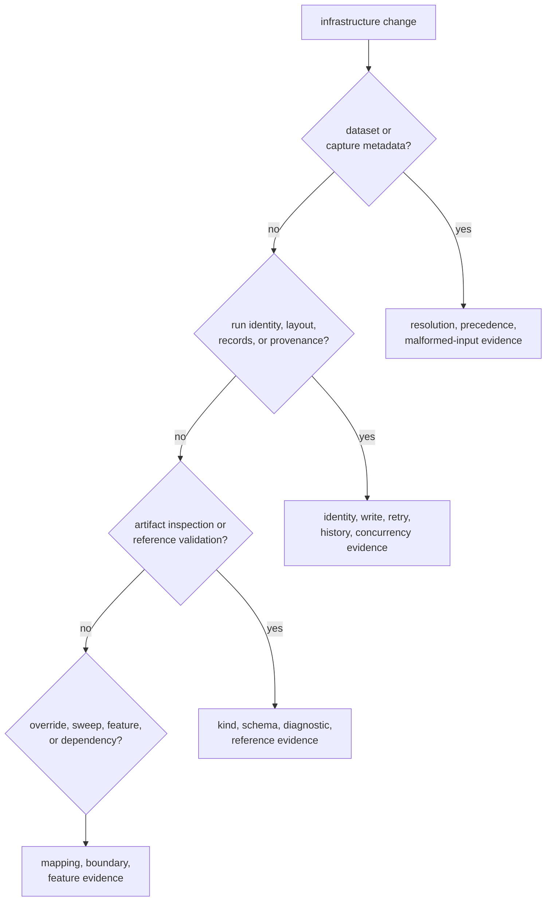
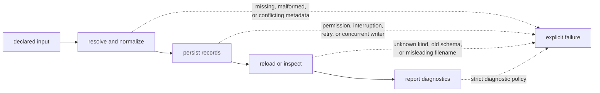

# Validating Infrastructure Changes

Infrastructure changes are correct only when repository meaning survives
failure, restart, and later inspection. Compilation proves type compatibility;
it does not prove that a dataset resolves consistently, a run remains
discoverable, or an artifact is interpreted honestly.

## Start With The Contract At Risk



| Contract family | Claims that need evidence | Existing narrow evidence |
| --- | --- | --- |
| dataset registry and raw IQ metadata | relative paths, precedence, required fields, quantization, recorded provenance | source-local registry, metadata, and front-end provenance tests |
| overrides and sweeps | supported keys map to the intended typed fields; unsupported keys fail explicitly | source-local override tests and the [override integration test](https://github.com/bijux/bijux-gnss/blob/main/crates/bijux-gnss-infra/tests/integration_overrides.rs) |
| run identity and records | stable identity, deterministic layout, coherent manifest/report/history writes | source-local helpers; dedicated end-to-end integration coverage is still limited |
| hashing and provenance | comparison inputs are represented without overstating reproducibility | source-local configuration hash evidence |
| artifact inspection | artifact kind, supported schema, payload diagnostics, and explanation agree | source-local acquisition, tracking, and navigation artifact tests |
| ownership and dependencies | behavior remains within the repository boundary | the [package guardrail](https://github.com/bijux/bijux-gnss/blob/main/crates/bijux-gnss-infra/tests/integration_guardrails.rs) and direct manifest review |

The [test guide](https://github.com/bijux/bijux-gnss/blob/main/crates/bijux-gnss-infra/docs/TESTS.md) explicitly
records the missing integration depth. Do not present a package-wide pass as
proof for run persistence, concurrent history writes, schema migration, or
cross-checkout dataset identity when no focused test exercises that claim.

## Exercise Failure Semantics

Repository code often fails at boundaries hidden by a clean happy-path run.
Choose cases from the changed contract rather than applying a generic list.



Relevant failure cases include:

- absent, malformed, and conflicting registry or sidecar metadata
- paths interpreted from a different checkout
- a failed write between manifest, report, and history updates
- repeated preparation of the same run
- concurrent history writers
- historical or unknown artifact schemas
- a filename that suggests the wrong artifact family
- diagnostics that must be distinguished from transport success
- behavior with the defining feature disabled

Tests should assert the returned diagnostic or persisted state, not merely that
an error occurred.

## Select Evidence By Change

### Dataset Resolution

Verify registry-relative normalization, sidecar precedence, required metadata,
and quantization compatibility. Review the [dataset contract](https://github.com/bijux/bijux-gnss/blob/main/crates/bijux-gnss-infra/docs/DATASETS.md)
when precedence or identity changes.

### Run Layout And Persistence

Verify the identity inputs first, then directory derivation, manifest and
report contents, history behavior, retry behavior, and reloadability. The
[run-layout contract](https://github.com/bijux/bijux-gnss/blob/main/crates/bijux-gnss-infra/docs/RUN_LAYOUT.md)
defines the reader-visible footprint.

Where focused integration evidence is absent, add it with the change or record
the exact unproved behavior. In particular, do not infer atomicity or
concurrency safety from successful serialization tests.

### Artifact Inspection And Reference Adapters

Use artifacts from each affected family. Cover valid payloads, malformed
payloads, unsupported schemas, and diagnostics that should change the reported
outcome. Reference adapters also need epoch alignment and mismatch evidence;
the [validation contract](https://github.com/bijux/bijux-gnss/blob/main/crates/bijux-gnss-infra/docs/VALIDATION.md)
defines their limits.

### Overrides, Sweeps, And Dependencies

Run the narrow integration target for changed parameter mappings:

```console
cargo test -p bijux-gnss-infra --test integration_overrides
```

For ownership or package-edge changes, run the guardrail and inspect the
manifest diff:

```console
cargo test -p bijux-gnss-infra --test integration_guardrails
```

These checks prove their named contracts only. They do not substitute for
dataset, persistence, or inspection evidence.

## Include Feature Evidence

The default build enables navigation; precise-product and tracing support are
optional. When a change touches a forwarded contract, compare:

- the default feature set
- a build without default features
- each affected optional feature
- the command or package that first consumes the capability

Check serialized output and refusal behavior as well as compilation. A feature
that removes a type cleanly can still leave a persisted or operator-facing
contract ambiguous.

## Record The Result Precisely

A useful validation note names:

- the repository claim under review
- the narrow evidence that passed
- the failure cases exercised
- feature combinations covered
- any behavior still lacking automated proof

The [risk register](risk-register.md) identifies known infrastructure hazards.
Treat those entries as test-design input, not as permission to accept another
unverified path. Validation is complete when the evidence matches the changed
claim and its limitations remain visible.
