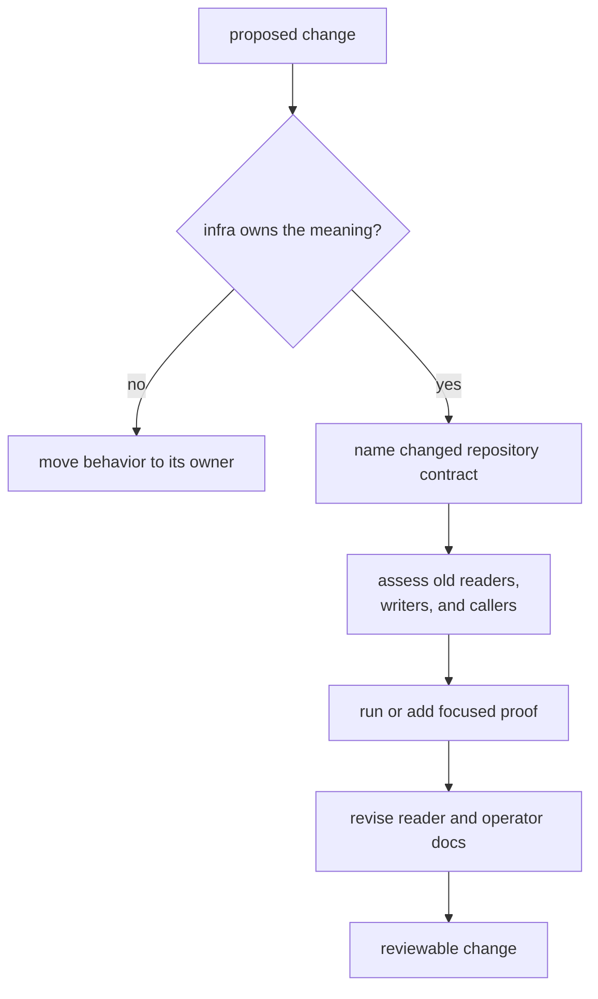

# Definition of Done

A completed infra change leaves a later reader able to identify the repository
state, understand its compatibility boundary, and locate evidence for the new
behavior. Compilation alone is not enough when a change alters datasets,
persisted records, output placement, provenance, overrides, or inspection.

## Completion Decision

## Required Evidence By Surface

| changed surface | completion condition | evidence route |
| --- | --- | --- |
| dataset registry or raw-IQ metadata | identity, normalization, precedence, and refusal behavior are explicit | focused dataset tests and the [dataset guide](https://github.com/bijux/bijux-gnss/blob/main/crates/bijux-gnss-infra/docs/DATASETS.md) |
| run layout, report, manifest, or history | deterministic identity and persisted compatibility are explained for old and new readers | named source review plus the [run layout guide](https://github.com/bijux/bijux-gnss/blob/main/crates/bijux-gnss-infra/docs/RUN_LAYOUT.md); add focused persistence proof when behavior changes |
| artifact inspection | kind dispatch, schema policy, diagnostics, and empty-input policy agree | artifact module tests and [Artifact Inspection Contracts](../interfaces/artifact-inspection-contracts.md) |
| overrides or sweeps | accepted values mutate typed configuration and rejected values remain explicit | override integration and module tests plus the [override guide](https://github.com/bijux/bijux-gnss/blob/main/crates/bijux-gnss-infra/docs/OVERRIDES.md) |
| provenance or hashing | the captured inputs and omissions are named | focused hash proof where available and the [hashing guide](https://github.com/bijux/bijux-gnss/blob/main/crates/bijux-gnss-infra/docs/HASHING.md) |
| reference validation | alignment policy and empty-alignment refusal remain visible without claiming solution accuracy | named adapter review and the [validation guide](https://github.com/bijux/bijux-gnss/blob/main/crates/bijux-gnss-infra/docs/VALIDATION.md) |
| public exports | ownership, feature availability, and downstream compatibility are explicit | [API Surface](../interfaces/api-surface.md), curated export review, and boundary proof |

## Compatibility Questions

Answer these before committing a persisted or public change:

- Can a current reader interpret records written before this change?
- Can an older reader fail explicitly on the new schema rather than silently
  misread it?
- Does deterministic input still resolve to the same identity and placement?
- Do resume and output overrides retain their declared precedence?
- Does a re-export preserve the real package owner?
- Are new filesystem effects visible through types and errors?

If compatibility intentionally changes, name the schema or caller boundary and
the rejection or migration behavior. Do not describe an on-disk contract change
as formatting.

## Completion Record

A merge-ready change should state:

- the repository contract that changed
- the owning package and affected callers
- the compatibility decision
- the exact automated checks run and the behavior each check protects
- any behavior verified only by source or contract review
- the reader-facing documents revised with the contract

Use [Test Strategy](test-strategy.md) to avoid overstating current coverage and
the [Review Checklist](review-checklist.md) for the final ownership and
durability review.
