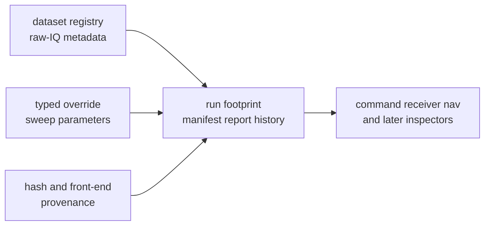

# Invariants

Infra invariants protect repository-state meaning. A dataset, run footprint,
hash, override, sweep, or persisted artifact must remain understandable after
the command that produced it has disappeared from memory.

## Repository-State Flow

## Invariant Families

| family | invariant | breaking symptom |
| --- | --- | --- |
| datasets | registry entries, sidecars, sample rates, coordinate metadata, and capture paths resolve through one infra interpretation | two commands accept the same dataset with different meaning |
| run footprints | manifest, report, history, and artifact headers preserve enough context for replay and review | a stored run cannot be explained without the original command invocation |
| overrides and sweeps | variation is typed, named, and reviewable before execution | a raw string mutation changes receiver or nav behavior without a declared parameter |
| hashes and provenance | hashes describe repository-facing inputs and environment evidence, not product identity | a later inspector cannot tell which input, front end, or build context shaped the run |
| boundaries | infra records repository state and consumes product evidence without redefining product science | infra code starts owning receiver lock policy, signal math, or navigation law |

## Review Gates

- A dataset change names the exact registry, sidecar, or coordinate rule it
  changes.
- A run-layout change preserves old run interpretability or names the migration
  boundary explicitly.
- A sweep or override change exposes typed parameters instead of hidden string
  rewriting.
- A provenance change states whether the evidence identifies inputs, build
  context, front-end context, or replay context.
- A boundary change routes product meaning back to command, receiver, nav,
  signal, or core docs.

## First Proof Check

Inspect the [run layout guide](https://github.com/bijux/bijux-gnss/blob/main/crates/bijux-gnss-infra/docs/RUN_LAYOUT.md),
[dataset guide](https://github.com/bijux/bijux-gnss/blob/main/crates/bijux-gnss-infra/docs/DATASETS.md),
[override guide](https://github.com/bijux/bijux-gnss/blob/main/crates/bijux-gnss-infra/docs/OVERRIDES.md), and
[hashing guide](https://github.com/bijux/bijux-gnss/blob/main/crates/bijux-gnss-infra/docs/HASHING.md). Then inspect
dataset registry source, raw-IQ metadata source, run-layout source, provenance
source, and infra guardrail tests.
