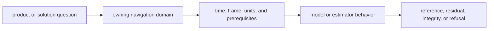

# Code Navigation

Navigate by the scientific question or failed claim. Product interpretation,
state propagation, corrections, estimation, integrity, and public contracts
have separate owners.

## Follow the Scientific Question

| question | start here |
| --- | --- |
| How is a broadcast, RINEX, or precise product interpreted? | [format boundary](https://github.com/bijux/bijux-gnss/blob/main/crates/bijux-gnss-nav/src/formats.rs) and [format contracts](https://github.com/bijux/bijux-gnss/blob/main/crates/bijux-gnss-nav/docs/FORMATS.md) |
| How are satellite position, velocity, clock, and uncertainty produced? | [orbit boundary](https://github.com/bijux/bijux-gnss/blob/main/crates/bijux-gnss-nav/src/orbits/mod.rs) and [orbit contracts](https://github.com/bijux/bijux-gnss/blob/main/crates/bijux-gnss-nav/docs/ORBITS.md) |
| Which physical model supplies atmosphere, antenna, tide, or celestial context? | [model boundary](https://github.com/bijux/bijux-gnss/blob/main/crates/bijux-gnss-nav/src/models/mod.rs) |
| How is a correction or observation combination derived? | [correction boundary](https://github.com/bijux/bijux-gnss/blob/main/crates/bijux-gnss-nav/src/corrections/mod.rs) and [correction contracts](https://github.com/bijux/bijux-gnss/blob/main/crates/bijux-gnss-nav/docs/CORRECTIONS.md) |
| Why did positioning accept, degrade, or refuse a claim? | [position boundary](https://github.com/bijux/bijux-gnss/blob/main/crates/bijux-gnss-nav/src/estimation/position/mod.rs) and [solution claims](https://github.com/bijux/bijux-gnss/blob/main/crates/bijux-gnss-nav/src/estimation/solution_claims.rs) |
| Why did PPP or RTK change state or quality? | [PPP boundary](https://github.com/bijux/bijux-gnss/blob/main/crates/bijux-gnss-nav/src/estimation/ppp/mod.rs) or [RTK boundary](https://github.com/bijux/bijux-gnss/blob/main/crates/bijux-gnss-nav/src/estimation/rtk/mod.rs) |
| Why did time conversion or rollover require context? | [navigation time](https://github.com/bijux/bijux-gnss/blob/main/crates/bijux-gnss-nav/src/time.rs) and [rollover resolution](https://github.com/bijux/bijux-gnss/blob/main/crates/bijux-gnss-nav/src/time/rollover.rs) |

## Find the Product Family

| product | interpretation owner |
| --- | --- |
| GPS LNAV and CNAV | [LNAV decoder](https://github.com/bijux/bijux-gnss/blob/main/crates/bijux-gnss-nav/src/formats/gps_navigation/lnav_decode.rs) and [CNAV decoder](https://github.com/bijux/bijux-gnss/blob/main/crates/bijux-gnss-nav/src/formats/gps_navigation/cnav_decode.rs) |
| Galileo FNAV and INAV | [FNAV decoder](https://github.com/bijux/bijux-gnss/blob/main/crates/bijux-gnss-nav/src/formats/galileo_navigation/galileo_fnav_decode.rs) and [INAV decoder](https://github.com/bijux/bijux-gnss/blob/main/crates/bijux-gnss-nav/src/formats/galileo_navigation/galileo_inav_decode.rs) |
| BeiDou broadcast navigation | [B1I decoder](https://github.com/bijux/bijux-gnss/blob/main/crates/bijux-gnss-nav/src/formats/beidou_navigation/beidou_b1i_navigation_decode.rs) and [D2 decoder](https://github.com/bijux/bijux-gnss/blob/main/crates/bijux-gnss-nav/src/formats/beidou_navigation/beidou_d2_navigation_decode.rs) |
| GLONASS broadcast navigation | [GLONASS navigation format](https://github.com/bijux/bijux-gnss/blob/main/crates/bijux-gnss-nav/src/formats/glonass_navigation/glonass_navigation_decode.rs) |
| RINEX navigation and observations | [RINEX navigation boundary](https://github.com/bijux/bijux-gnss/blob/main/crates/bijux-gnss-nav/src/formats/rinex_navigation/mod.rs) and [RINEX observation boundary](https://github.com/bijux/bijux-gnss/blob/main/crates/bijux-gnss-nav/src/formats/rinex_observation/mod.rs) |
| SP3, CLK, ANTEX, and bias SINEX | [precise-product boundary](https://github.com/bijux/bijux-gnss/blob/main/crates/bijux-gnss-nav/src/formats/precise_products/mod.rs) |

The linked files are family entrypoints, not exhaustive decoder inventories.

## Trace a Failed Claim

| failed claim | representative evidence |
| --- | --- |
| broadcast orbit or clock accuracy | [orbit reference](https://github.com/bijux/bijux-gnss/blob/main/crates/bijux-gnss-nav/tests/integration_broadcast_orbit_reference.rs) and [orbit accuracy budget](https://github.com/bijux/bijux-gnss/blob/main/crates/bijux-gnss-nav/tests/integration_broadcast_orbit_accuracy_budget.rs) |
| precise-product interpretation | [SP3 reference accuracy](https://github.com/bijux/bijux-gnss/blob/main/crates/bijux-gnss-nav/tests/integration_sp3_reference_accuracy.rs) and [CLK reference accuracy](https://github.com/bijux/bijux-gnss/blob/main/crates/bijux-gnss-nav/tests/integration_clk_reference_accuracy.rs) |
| position quality or refusal | [position residual evidence](https://github.com/bijux/bijux-gnss/blob/main/crates/bijux-gnss-nav/tests/integration_position_residual_rms.rs) and [position refusal](https://github.com/bijux/bijux-gnss/blob/main/crates/bijux-gnss-nav/tests/integration_position_refusal.rs) |
| PPP convergence or prerequisites | [public PPP convergence](https://github.com/bijux/bijux-gnss/blob/main/crates/bijux-gnss-nav/tests/integration_public_ppp_convergence.rs) |
| RTK baseline or ambiguity behavior | [RTK baseline accuracy](https://github.com/bijux/bijux-gnss/blob/main/crates/bijux-gnss-nav/tests/integration_rtk_baseline_accuracy.rs) and [ambiguity fixing](https://github.com/bijux/bijux-gnss/blob/main/crates/bijux-gnss-nav/tests/integration_rtk_ambiguity_fixing.rs) |
| RAIM detection, exclusion, or refusal | [RAIM fault detection](https://github.com/bijux/bijux-gnss/blob/main/crates/bijux-gnss-nav/tests/integration_raim_fault_detection.rs) and [underdetermined refusal](https://github.com/bijux/bijux-gnss/blob/main/crates/bijux-gnss-nav/tests/integration_raim_underdetermined_refusal.rs) |

For a public export, start with the
[curated API](https://github.com/bijux/bijux-gnss/blob/main/crates/bijux-gnss-nav/src/api.rs), then confirm the
scientific contract in the
[public API guide](https://github.com/bijux/bijux-gnss/blob/main/crates/bijux-gnss-nav/docs/PUBLIC_API.md).
