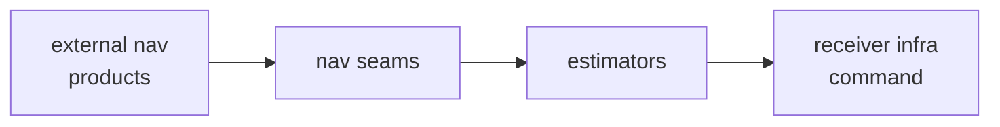

# Integration Seams

This page names the places where `bijux-gnss-nav` intentionally meets
neighboring crates without surrendering ownership.

## Seam Map

## Seam Families

| seam | owned purpose | should not carry |
| --- | --- | --- |
| public API facade | curated downstream surface for navigation science | private module layout |
| `EphemerisProvider` | orbit and ephemeris access without one storage shape | repository path discovery |
| `ProductsProvider` | precise product access for PPP and correction logic | CLI product policy wording |
| bias providers | code and phase bias lookup with source evidence | receiver scheduling state |
| EKF traits | reusable measurement-model integration | command workflow orchestration |
| `NavigationEngine` and `PositionRuntime` | runtime-neutral positioning boundary | sample-source ownership |
| PPP and RTK policy surfaces | precise-input availability and ambiguity/fix evidence | infra run layout |

## Seam Use Standard

- Use the public API facade before reaching for an internal module path.
- Pass scientific inputs and outputs through typed seams.
- Keep repository paths, operator flags, and receiver scheduling state outside
  nav.
- Add provider traits only when multiple callers need the same scientific
  boundary.
- Keep refusal, support, and provenance evidence attached at the seam.

## First Proof Check

Start with the navigation [public API facade](https://github.com/bijux/bijux-gnss/blob/main/crates/bijux-gnss-nav/src/api.rs),
[ephemeris provider](https://github.com/bijux/bijux-gnss/blob/main/crates/bijux-gnss-nav/src/orbits/ephemeris.rs),
[precise-product provider](https://github.com/bijux/bijux-gnss/blob/main/crates/bijux-gnss-nav/src/formats/precise_products/mod.rs),
[bias provider source](https://github.com/bijux/bijux-gnss/blob/main/crates/bijux-gnss-nav/src/corrections/biases.rs),
[EKF trait source](https://github.com/bijux/bijux-gnss/blob/main/crates/bijux-gnss-nav/src/estimation/ekf/traits.rs),
and [positioning source](https://github.com/bijux/bijux-gnss/tree/main/crates/bijux-gnss-nav/src/estimation/position).
Then confirm ownership against the navigation [boundary guide](https://github.com/bijux/bijux-gnss/blob/main/crates/bijux-gnss-nav/docs/BOUNDARY.md).
