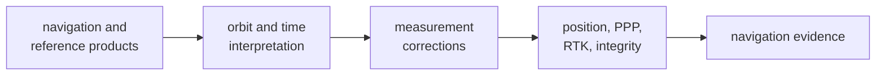

# Module Map

Use this map to enter `bijux-gnss-nav` through the scientific concern you are
changing. The crate is organized as a chain from product interpretation to
satellite state, corrections, and estimation; starting from a filename hides
that dependency order.

## Choose A Scientific Route

| question | owning subsystem | what belongs there |
| --- | --- | --- |
| How does a broadcast message become typed navigation data? | [Navigation format decoders](https://github.com/bijux/bijux-gnss/tree/main/crates/bijux-gnss-nav/src/formats) | constellation message families, bit interpretation, and decoded records |
| How do RINEX observations or navigation products enter the model? | [RINEX navigation](https://github.com/bijux/bijux-gnss/tree/main/crates/bijux-gnss-nav/src/formats/rinex_navigation) and [RINEX observation](https://github.com/bijux/bijux-gnss/tree/main/crates/bijux-gnss-nav/src/formats/rinex_observation) | format parsing and product-domain validation |
| How do SP3, CLK, ANTEX, or bias products enter? | [Precise product readers](https://github.com/bijux/bijux-gnss/tree/main/crates/bijux-gnss-nav/src/formats/precise_products) | external precise-product interpretation |
| How does ephemeris become satellite position and clock state? | [Orbit models](https://github.com/bijux/bijux-gnss/tree/main/crates/bijux-gnss-nav/src/orbits) | constellation propagation, precise-state access, and provider seams |
| Which correction changes a measurement before estimation? | [Correction law](https://github.com/bijux/bijux-gnss/tree/main/crates/bijux-gnss-nav/src/corrections) | atmosphere, bias, combinations, group delay, phase windup, and ionosphere-derived evidence |
| Which physical effect supplies a correction input? | [Supporting physical models](https://github.com/bijux/bijux-gnss/tree/main/crates/bijux-gnss-nav/src/models) | antenna, celestial, tide, atmosphere, and NeQuick models |
| How is a standalone position or integrity result formed? | [Position estimation](https://github.com/bijux/bijux-gnss/tree/main/crates/bijux-gnss-nav/src/estimation/position) | weighted solving, filtering, RAIM, integrity, trajectory, and runtime-neutral position policy |
| How is precise point positioning evolved and qualified? | [PPP estimation](https://github.com/bijux/bijux-gnss/tree/main/crates/bijux-gnss-nav/src/estimation/ppp) | state, stochastic policy, product support, convergence, and quality evidence |
| How are rover/base observations differenced and fixed? | [RTK estimation](https://github.com/bijux/bijux-gnss/tree/main/crates/bijux-gnss-nav/src/estimation/rtk) | alignment, differencing, baseline solving, ambiguity lifecycle, and quality evidence |
| Which reusable filter primitive supports estimators? | [EKF primitives](https://github.com/bijux/bijux-gnss/tree/main/crates/bijux-gnss-nav/src/estimation/ekf) | state, measurements, process models, statistics, and measurement traits |

## Public And Internal Boundaries

The [curated navigation API](https://github.com/bijux/bijux-gnss/blob/main/crates/bijux-gnss-nav/src/api.rs) is the
only downstream entrypoint. The
[crate boundary](https://github.com/bijux/bijux-gnss/blob/main/crates/bijux-gnss-nav/src/lib.rs) keeps scientific
subsystems private so internal decomposition can change without creating new
public contracts.

Two smaller families support the main routes:

- [Navigation time](https://github.com/bijux/bijux-gnss/tree/main/crates/bijux-gnss-nav/src/time) owns rollover
  interpretation above core's shared time contracts.
- [Linear algebra support](https://github.com/bijux/bijux-gnss/blob/main/crates/bijux-gnss-nav/src/linalg.rs) owns
  compact estimator math that has no cross-package contract.

## Boundary Tests

- Parsing belongs in formats; orbit propagation does not belong in a parser.
- A physical correction belongs in corrections or models; estimator state
  policy stays with its estimation family.
- Receiver scheduling and channel lifecycle do not belong here even when they
  invoke navigation.
- Repository persistence and dataset lookup stay in infra.
- Shared identity, units, time primitives, and artifact envelopes stay in core.

Use [Integration Seams](integration-seams.md) when a change crosses these
families and [Code Navigation](code-navigation.md) when you need the shortest
route from a public type to its implementation and proof.
