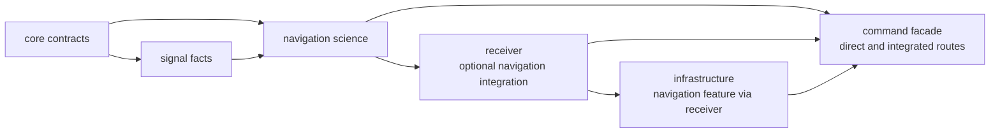
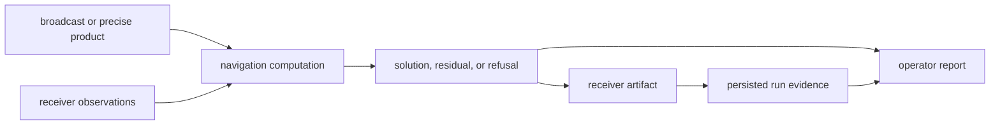

# Repository Fit

`bijux-gnss-nav` owns navigation-domain interpretation and estimation. It turns
shared observations and navigation products into corrections, orbit and clock
state, solutions, uncertainty, integrity decisions, or explicit refusal. It
does not own sample processing, operator commands, dataset discovery, or run
history.

## Compile Direction

Navigation declares production dependencies on core and signal, not on
receiver, infrastructure, or command crates. Receiver enables navigation
through an optional dependency. Infrastructure has no direct navigation
dependency; its navigation feature is forwarded through receiver. The command
crate can depend directly on navigation while also composing receiver and
infrastructure.

This direction matters during design review. A navigation API must not accept a
receiver runtime, repository registry, or command argument merely because a
higher caller already has one.

## Evidence Flow Is Different

Navigation can parse domain files because RINEX, SP3, CLK, ANTEX, and bias
formats carry scientific meaning. That does not give the crate ownership of
where files are discovered, which dataset is active, how a run directory is
named, or how evidence is registered.

## Decide Where A Change Belongs

| question | navigation owns | neighboring owner |
| --- | --- | --- |
| What does a product field, epoch, frame, clock, or orbit value mean? | parsing and scientific interpretation | infrastructure locates the product |
| Which correction applies, with what sign, units, uncertainty, and prerequisites? | correction and model behavior | signal owns carrier and component facts |
| Can observations support SPP, PPP, RTK, or an integrity claim? | estimator readiness, solution, downgrade, and refusal | receiver owns observation production and handoff |
| How is a shared satellite, signal, time, unit, observation, or solution record represented? | navigation consumes the contract | core owns genuinely cross-crate records |
| Where is output written, versioned, indexed, or replayed? | navigation supplies typed evidence | infrastructure owns persistence |
| Which option does an operator invoke and how is the result summarized? | navigation supplies meaning | command owns invocation and presentation |

Use the [navigation boundary](../../../crates/bijux-gnss-nav/docs/BOUNDARY.md)
for crate-local ownership and the
[core ownership guide](../../bijux-gnss-core/foundation/ownership-boundary.md)
before moving records downward.

## Avoid Boundary Leaks

Reject designs that:

- pass repository roots or dataset registries into a model or estimator;
- make a parser choose the active product based on directory convention;
- add receiver channel lifecycle to navigation state;
- duplicate signal carrier, component, or wavelength truth;
- return display-only strings where a caller needs typed refusal or status;
- persist estimator internals as a durable format without an explicit versioned
  contract.

A higher crate may adapt navigation evidence for its own runtime or storage
contract. That adapter does not transfer scientific ownership.

## Review Route

Start with the scientific family, not the caller that exposed the problem:

- [format contracts](../../../crates/bijux-gnss-nav/docs/FORMATS.md) for decoded
  product meaning;
- [orbit contracts](../../../crates/bijux-gnss-nav/docs/ORBITS.md) and
  [time contracts](../../../crates/bijux-gnss-nav/docs/TIME.md) for state and
  epoch interpretation;
- [correction contracts](../../../crates/bijux-gnss-nav/docs/CORRECTIONS.md) and
  [model contracts](../../../crates/bijux-gnss-nav/docs/MODELS.md) for physical
  assumptions;
- [estimation contracts](../../../crates/bijux-gnss-nav/docs/ESTIMATION.md) for
  solution and refusal semantics.

Then follow the result outward through the
[receiver boundary](../../bijux-gnss-receiver/foundation/ownership-boundary.md),
[infrastructure boundary](../../bijux-gnss-infra/foundation/ownership-boundary.md),
or [command boundary](../../bijux-gnss/foundation/ownership-boundary.md) only
when the public effect reaches that layer.
