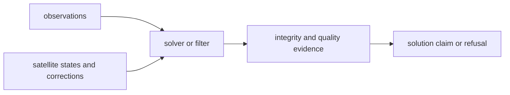

# Estimation Contracts

Estimation contracts are the most sensitive public surface in
`bijux-gnss-nav`. They describe what a position, integrity, PPP, RTK, or filter
claim means, not just the Rust shape of solver structs.

## Estimation Flow

## Contract Families

| family | owns | first proof |
| --- | --- | --- |
| position | PVT, DOP, weighting, smoothing, refusal, and runtime-neutral navigation engine behavior | position-estimation source |
| integrity | RAIM detection, exclusion, solution separation, and downgrade evidence | RAIM source |
| EKF | reusable state, models, statistics, traits, and filter mechanics | EKF source |
| PPP | precise point positioning config, measurements, state, lifecycle, models, quality, and filter behavior | PPP source |
| RTK | differencing, ambiguity, baseline, antenna, execution, and quality evidence | RTK source |
| solution claims | public support, downgrade, refusal, and advanced-claim reporting | solution-claim source |

## Review Rules

- A public estimation type is a scientific promise when downstream crates use
  it to decide quality, support, refusal, or operator reporting.
- Solver-local helpers should stay private unless another owner needs the same
  scientific meaning.
- A successful solution and an honest refusal are both public outcomes; docs
  must describe both.
- PPP and RTK changes need quality and downgrade evidence, not only numeric
  convergence output.

## Reader Checks

- Did the change alter a solution claim or only an implementation detail?
- Which tests prove position, integrity, PPP, RTK, or filter behavior?
- Can receiver and command layers render the result without reinterpreting nav
  science?
- Does core still own the shared observation and navigation-epoch record
  meaning?

## First Proof Check

Inspect the [estimation guide](https://github.com/bijux/bijux-gnss/blob/main/crates/bijux-gnss-nav/docs/ESTIMATION.md),
[public API](https://github.com/bijux/bijux-gnss/blob/main/crates/bijux-gnss-nav/docs/PUBLIC_API.md), estimation
source, and focused integration tests for position, public PPP convergence, and
RTK ambiguity fixing.
