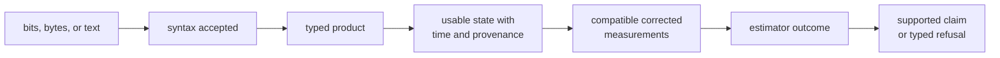
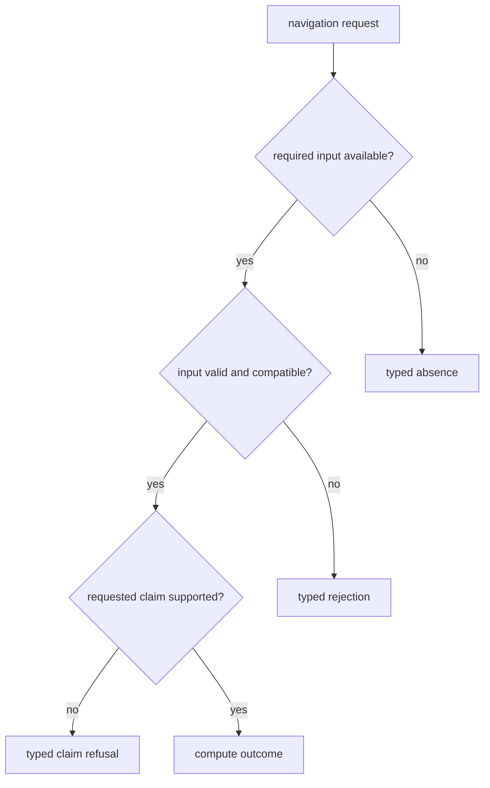

# Navigation Interface Guide

Callers use `bijux_gnss_nav::api` to interpret navigation products, compute
satellite state and corrections, and request position, integrity, PPP, or RTK
outcomes. Every public contract must preserve the assumptions needed to
distinguish a parsed input from a scientifically supported claim.

## Choose The Scientific Contract

| caller need | contract | evidence that must remain visible |
| --- | --- | --- |
| Decode broadcast messages, RINEX, SP3, CLK, ANTEX, or bias products | [Navigation product trust boundary](format-and-product-contracts.md) | format revision, constellation, time context, units, provenance, gaps, and rejection |
| Propagate ephemeris or query precise satellite and clock state | [Orbit contracts](orbit-contracts.md) | epoch, frame, clock convention, source, uncertainty, and availability |
| Apply atmosphere, bias, antenna, combination, or phase effects | [Correction contracts](correction-contracts.md) | required observations and products, model assumptions, sign, units, and refusal |
| Resolve rollover or apply navigation-specific physical models | [Time and model contracts](time-and-model-contracts.md) | reference context, time system, validity interval, and model inputs |
| Produce position, integrity, PPP, RTK, or filter evidence | [Estimation contracts](estimation-contracts.md) | prerequisites, residuals, covariance, convergence, lifecycle, quality, downgrade, and refusal |

## Trust Is Layered

Passing one layer does not establish the next. Valid RINEX syntax does not prove
resolved epochs. A typed orbit record does not prove current coverage. A
converged numeric state does not prove integrity or support for the requested
claim.

## Missing And Invalid Are Different

Do not map absence, malformed data, scientific incompatibility, unsupported
claims, and estimator non-convergence to one generic error. Callers need the
distinction to choose wait, fallback, downgrade, or stop behavior.

## Public Surface Rules

- Import supported contracts through the [API surface](api-surface.md) and
  [public imports](public-imports.md), not private parser or solver modules.
- Keep parser-local records and solver workspaces private unless another
  package needs the same durable scientific meaning.
- Preserve constellation, signal, time system, frame, unit, and provenance
  through every conversion.
- Expose quality and refusal evidence with successful numeric results.
- Document feature-gated behavior as an API and compatibility concern, not only
  as a build detail.

The current `precise-products` feature does not conditionally remove the broad
public precise-product surface. Treat actual compiled behavior as the present
contract; changing feature semantics requires default and feature-disabled API
evidence. The detailed limitation is recorded in the
[product trust boundary](format-and-product-contracts.md).

## Compatibility Questions

Before changing a parser, record, correction, model, or estimator interface,
ask whether existing callers will assign the same time, frame, units,
availability, quality, and refusal meaning. Use
[compatibility commitments](compatibility-commitments.md) and
[entrypoints and examples](entrypoints-and-examples.md) before widening or
reshaping the public surface.

## Sources Of Truth

The [curated navigation API](https://github.com/bijux/bijux-gnss/blob/main/crates/bijux-gnss-nav/src/api.rs) is the
supported import boundary. The
[public API guide](https://github.com/bijux/bijux-gnss/blob/main/crates/bijux-gnss-nav/docs/PUBLIC_API.md),
[format guide](https://github.com/bijux/bijux-gnss/blob/main/crates/bijux-gnss-nav/docs/FORMATS.md),
[correction guide](https://github.com/bijux/bijux-gnss/blob/main/crates/bijux-gnss-nav/docs/CORRECTIONS.md),
[orbit guide](https://github.com/bijux/bijux-gnss/blob/main/crates/bijux-gnss-nav/docs/ORBITS.md), and
[estimation guide](https://github.com/bijux/bijux-gnss/blob/main/crates/bijux-gnss-nav/docs/ESTIMATION.md) define
the contract families behind it.
