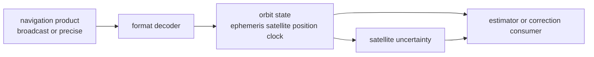

# Orbit Contracts

Orbit contracts define the typed satellite-state and ephemeris meaning consumed
by correction families, position solvers, PPP, RTK, and validation reports. The
contract begins after navigation-product bytes are decoded into domain records
and ends before receiver scheduling or repository persistence.

## Orbit State Flow

## Owned Surfaces

| surface | owner | reader promise |
| --- | --- | --- |
| GPS broadcast orbit | GPS orbit source | GPS ephemeris becomes typed satellite state |
| Galileo broadcast orbit | Galileo orbit source | Galileo ephemeris follows navigation-domain rules |
| BeiDou broadcast orbit | BeiDou orbit source | BeiDou ephemeris uses its own constellation law |
| GLONASS orbit state | GLONASS orbit source | FDMA and GLONASS-specific state stay explicit |
| shared broadcast helpers | broadcast-orbit helper source | common broadcast-orbit behavior is reused deliberately |
| uncertainty | satellite-uncertainty source | orbit quality reaches downstream estimators as typed evidence |

## Boundary Decisions

- File discovery and dataset placement belong to infra before decoded product
  bytes reach nav.
- Receiver acquisition, tracking, and observation scheduling belong to receiver
  after nav returns typed state or refusal evidence.
- Coordinate, unit, and time record semantics come from core, but
  constellation-specific orbit interpretation belongs here.
- A precise-product provider seam is part of nav when it supplies satellite
  state; repository storage for that product remains infra.

## First Proof Check

Inspect orbit source, the [orbit guide](https://github.com/bijux/bijux-gnss/blob/main/crates/bijux-gnss-nav/docs/ORBITS.md),
and focused orbit tests for broadcast reference behavior, broadcast accuracy,
GLONASS broadcast reference behavior, and SP3 reference accuracy.
