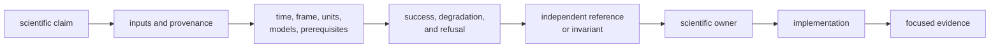
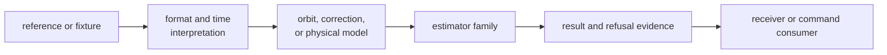

# Navigation Change Guide

Begin a navigation change with the scientific claim, not the module. Name the
input product or observation, time system, frame, units, model assumptions,
quality evidence, and accepted, degraded, and refused outcomes before choosing
implementation.

## Define The Claim Before The Code

If the expected value comes only from the implementation under test, the change
does not yet have independent scientific evidence.

## Choose The Maintenance Route

| changed science | operational route | minimum evidence |
| --- | --- | --- |
| Message decoder, RINEX, or precise-product parser | [Navigation extension guide](navigation-extension-guide.md) | realistic valid input, malformed input, time context, typed rejection, and semantic round trip where applicable |
| Orbit, clock, time, or product interpolation | [Change sequence](change-sequence.md) | independent reference, frame and epoch, coverage edges, uncertainty, and unavailable-product behavior |
| Atmospheric, bias, antenna, combination, or physical model | [Common workflows](common-workflows.md) | formula or dataset independent of implementation, units, domain bounds, and missing-context refusal |
| Position, integrity, EKF, PPP, or RTK | [Review scope](review-scope.md) | prerequisites, lifecycle, residuals, covariance, convergence, quality, downgrade, and refusal |
| Public or precise-product fixture | [Precise product and fixture care](precise-product-and-fixture-care.md) | provenance, reference epoch, frame, original data, and tolerance rationale |
| Focused local proof | [Local development](local-development.md) and [verification commands](verification-commands.md) | exact scientific family and bounded claim |
| Published behavior | [Release and versioning](release-and-versioning.md) | public API, accepted data, result meaning, feature behavior, and migration |

## Carry Evidence Through The Change

A parser change that reaches an estimator needs evidence at both boundaries.
An estimator-only change does not justify rewriting a parser fixture. Select
proof according to where meaning moved.

## Protect Fixture Integrity

- Preserve source, license or public origin, epoch, frame, units, and any
  preprocessing needed to reproduce the expected value.
- Do not broaden a tolerance until a test passes. Tie tolerance to reference
  uncertainty, numerical conditioning, or model limits.
- Keep malformed and partial products alongside accepted cases.
- Distinguish missing data, invalid data, unsupported claims, non-convergence,
  and integrity refusal.
- Keep parser fixtures with format proof and solver fixtures with estimator
  proof.

## Review Downstream Effects

Receiver decides when navigation runs, infrastructure persists results, and the
command package presents them. Review those consumers when public fields,
feature gates, status, quality, or refusal meaning changes. Do not move their
runtime or repository policy into navigation to simplify adaptation.

## Commit Boundary

Commit when one scientific family, its assumptions, implementation, accepted
and refused outcomes, independent evidence, public contract, and necessary
consumer adaptations agree. Keep unrelated estimator families separate even
when they share mathematical helpers.

The [format guide](https://github.com/bijux/bijux-gnss/blob/main/crates/bijux-gnss-nav/docs/FORMATS.md),
[orbit guide](https://github.com/bijux/bijux-gnss/blob/main/crates/bijux-gnss-nav/docs/ORBITS.md),
[correction guide](https://github.com/bijux/bijux-gnss/blob/main/crates/bijux-gnss-nav/docs/CORRECTIONS.md),
[estimation guide](https://github.com/bijux/bijux-gnss/blob/main/crates/bijux-gnss-nav/docs/ESTIMATION.md), and
[test guide](https://github.com/bijux/bijux-gnss/blob/main/crates/bijux-gnss-nav/docs/TESTS.md) are the package-level
authorities.
