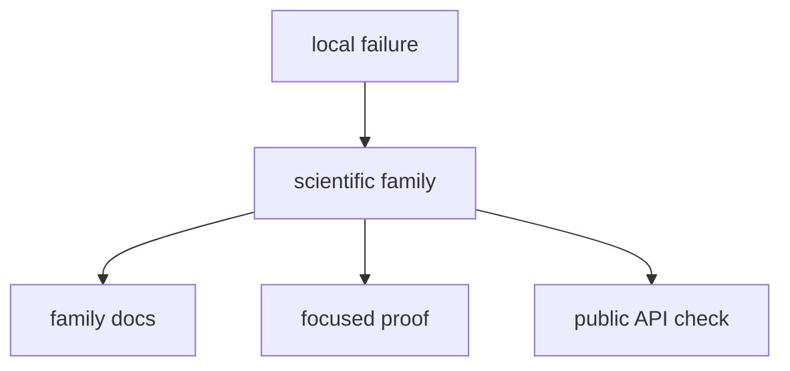

# Local Development

When editing `bijux-gnss-nav`, start from the scientific family, not from the
file that happened to fail first.

## Good Local Loop

- find the owning family in `src/formats/`, `src/orbits/`,
  `src/corrections/`, `src/estimation/position/`, `src/estimation/ppp/`,
  `src/estimation/rtk/`, `src/models/`, or `src/time.rs`
- update the crate-local docs if the scientific meaning moves
- run targeted tests for that family before touching wider suites
- inspect `src/api.rs` if the change affects something public

## What To Avoid

- changing several scientific families at once without naming the shared reason
- using one broad integration test as the only proof for a low-level change
- widening exports to make local development easier

## Local Decision Table

| change | start with | prove with |
| --- | --- | --- |
| format parsing | [Format guide](https://github.com/bijux/bijux-gnss/blob/main/crates/bijux-gnss-nav/docs/FORMATS.md) | format and reference-product tests |
| orbit behavior | [Orbit guide](https://github.com/bijux/bijux-gnss/blob/main/crates/bijux-gnss-nav/docs/ORBITS.md) | broadcast and precise-orbit tests |
| correction model | [Correction guide](https://github.com/bijux/bijux-gnss/blob/main/crates/bijux-gnss-nav/docs/CORRECTIONS.md) | correction-focused numeric tests |
| position, PPP, RTK, or RAIM | [Estimation guide](https://github.com/bijux/bijux-gnss/blob/main/crates/bijux-gnss-nav/docs/ESTIMATION.md) | solver and integrity tests |
| public export | [Public API](https://github.com/bijux/bijux-gnss/blob/main/crates/bijux-gnss-nav/docs/PUBLIC_API.md) | public API and guardrail tests |

## Useful Local Anchors

- [Navigation crate README](https://github.com/bijux/bijux-gnss/blob/main/crates/bijux-gnss-nav/README.md)
- [Navigation crate docs](https://github.com/bijux/bijux-gnss/tree/main/crates/bijux-gnss-nav/docs)
- navigation crate tests
