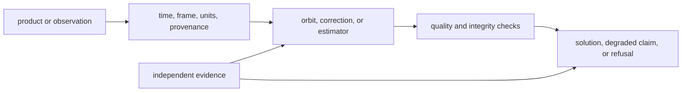

# Release And Versioning

`bijux-gnss-nav` turns external products and receiver observations into
satellite state, corrections, positions, integrity claims, or typed refusals.
A release decision must describe movement in scientific meaning even when the
public Rust surface is unchanged.

## Decide the Compatibility Level

| changed surface | release decision |
| --- | --- |
| support for a new product revision or constellation | additive when existing products retain identical interpretation and refusal behavior |
| parser default, malformed-input handling, or week context | data interpretation change; review every caller that supplies context |
| orbit, clock, atmosphere, antenna, bias, tide, or combination model | numerical behavior change; state frame, units, reference, and affected solution families |
| estimator weighting, covariance, convergence, or outlier policy | solution-contract change; assess accuracy, residuals, uncertainty, and refusal together |
| prerequisite, downgrade, or refusal rule | public behavior change even if successful solutions are numerically unchanged |
| reference fixture or tolerance | evidence change; justify provenance and physical meaning before changing expected values |
| curated export removed, renamed, or moved | breaking public API change |

Do not call a navigation change internal when it can alter a parsed epoch,
satellite state, correction, residual, covariance, protection level, solution,
downgrade, or refusal.

## Trace the Scientific Claim

Identify the owning surface before assessing the release:

- [format guide](https://github.com/bijux/bijux-gnss/blob/main/crates/bijux-gnss-nav/docs/FORMATS.md) for broadcast
  navigation, RINEX, SP3, CLK, ANTEX, and bias-product interpretation
- [time guide](https://github.com/bijux/bijux-gnss/blob/main/crates/bijux-gnss-nav/docs/TIME.md) for time systems,
  reference weeks, rollover, and leap-second behavior
- [orbit guide](https://github.com/bijux/bijux-gnss/blob/main/crates/bijux-gnss-nav/docs/ORBITS.md) for satellite
  state, clock, uncertainty, and missing-product behavior
- [correction guide](https://github.com/bijux/bijux-gnss/blob/main/crates/bijux-gnss-nav/docs/CORRECTIONS.md) for
  atmosphere, antenna, bias, combination, and continuity assumptions
- [estimation guide](https://github.com/bijux/bijux-gnss/blob/main/crates/bijux-gnss-nav/docs/ESTIMATION.md) for SPP,
  RTK, PPP, integrity, covariance, lifecycle, and refusal behavior
- [public API guide](https://github.com/bijux/bijux-gnss/blob/main/crates/bijux-gnss-nav/docs/PUBLIC_API.md) for the
  curated Rust surface

## Require a Complete Claim

Before release, record:

- the input product or observation family and its provenance
- the constellation, signal, time system, coordinate frame, and units
- the old and new model behavior, including expected numerical movement
- successful, degraded, and refused outcomes where each is applicable
- effects on SPP, RTK, PPP, integrity, receiver, infrastructure, or facade
  consumers
- an independent reference, public-data truth set, or physically justified
  invariant

## Match Evidence to the Change

| claim | representative evidence |
| --- | --- |
| precise products retain time and state meaning | [SP3 product integration](https://github.com/bijux/bijux-gnss/blob/main/crates/bijux-gnss-nav/tests/integration_sp3_products.rs), [CLK product integration](https://github.com/bijux/bijux-gnss/blob/main/crates/bijux-gnss-nav/tests/integration_clk_products.rs), and their reference-accuracy tests |
| broadcast orbit remains physically bounded | [broadcast orbit reference](https://github.com/bijux/bijux-gnss/blob/main/crates/bijux-gnss-nav/tests/integration_broadcast_orbit_reference.rs) and [orbit accuracy budget](https://github.com/bijux/bijux-gnss/blob/main/crates/bijux-gnss-nav/tests/integration_broadcast_orbit_accuracy_budget.rs) |
| time interpretation remains explicit | [time-system conversions](https://github.com/bijux/bijux-gnss/blob/main/crates/bijux-gnss-nav/tests/integration_time_system_conversions.rs) and [UTC leap-second behavior](https://github.com/bijux/bijux-gnss/blob/main/crates/bijux-gnss-nav/tests/integration_utc_leap_seconds.rs) |
| position claims include valid refusal behavior | [position reference behavior](https://github.com/bijux/bijux-gnss/blob/main/crates/bijux-gnss-nav/tests/integration_position.rs), [impossible-geometry refusal](https://github.com/bijux/bijux-gnss/blob/main/crates/bijux-gnss-nav/tests/integration_impossible_geometry.rs), and [position refusal integration](https://github.com/bijux/bijux-gnss/blob/main/crates/bijux-gnss-nav/tests/integration_position_refusal.rs) |
| advanced solutions preserve their prerequisites | the affected RTK, PPP, or RAIM proof family listed in the [test guide](https://github.com/bijux/bijux-gnss/blob/main/crates/bijux-gnss-nav/docs/TESTS.md) |

Do not loosen a tolerance before explaining what uncertainty or reference error
the previous bound omitted. Do not regenerate truth data from the implementation
under test.

## Write the Release Entry

The [package changelog](https://github.com/bijux/bijux-gnss/blob/main/crates/bijux-gnss-nav/CHANGELOG.md) must state
the affected scientific family, input and context, old and new outcome,
compatibility impact, refusal behavior, and evidence. Update a downstream
package changelog when that package presents a changed navigation claim to
operators.

The workspace version and publication procedure are defined in the
[release handbook](../../bijux-gnss-dev/operations/release-and-versioning.md).
