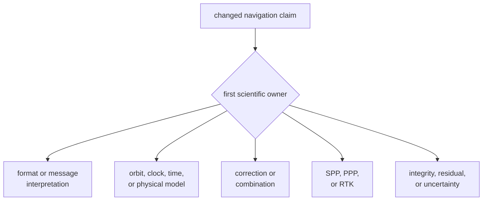
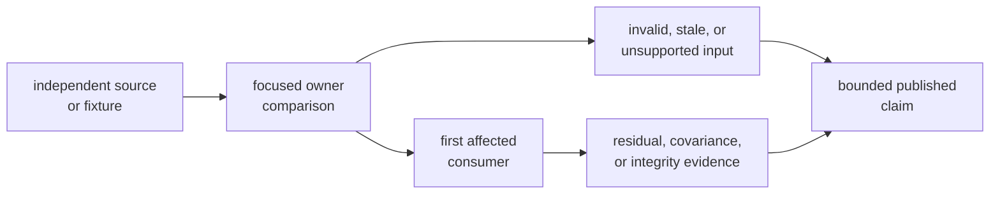

# Navigation Verification Guide

Choose verification from the scientific claim, not from the size of the code
change. Begin where data first acquires changed meaning, prove rejected input,
then follow that meaning to the first affected estimator or consumer.

## Route the Claim



The [test guide](https://github.com/bijux/bijux-gnss/blob/main/crates/bijux-gnss-nav/docs/TESTS.md) maps the full
families. Use the focused routes below to start; do not treat them as a
universal command list.

## Focused Starting Commands

Run from the repository root:

```sh
cargo test -p bijux-gnss-nav --test integration_precise_products
cargo test -p bijux-gnss-nav --test integration_time_system_conversions
cargo test -p bijux-gnss-nav --test integration_broadcast_orbit_reference
cargo test -p bijux-gnss-nav --test integration_broadcast_ionosphere_residuals
cargo test -p bijux-gnss-nav --test integration_position
cargo test -p bijux-gnss-nav --test integration_position_refusal
cargo test -p bijux-gnss-nav --test integration_position_protection_levels
cargo test -p bijux-gnss-nav --test integration_public_ppp_convergence
cargo test -p bijux-gnss-nav --test integration_rtk_baseline_accuracy
```

| Changed meaning | Start with | Add before completion |
| --- | --- | --- |
| Product or navigation-message decoding | matching format or constellation decoder | malformed input, provenance, time interpretation, and first model consumer |
| Time conversion or rollover | time-system conversion or leap-second test | constellation-specific boundary and affected orbit or estimator |
| Broadcast or precise satellite state | matching orbit or clock reference | invalid interval, frame and timescale assertions, then consuming correction or estimator |
| Ionosphere, atmosphere, bias, antenna, or combination model | matching correction residual test | sign and units, inapplicable-input case, public reference, and consuming estimator |
| SPP solution or weighting | position test | impossible geometry, outlier handling, residuals, covariance, and public station truth |
| Integrity or protection level | matching protection-level or RAIM test | fault detection, exclusion or refusal, threshold evidence, and accepted-set consistency |
| PPP | PPP family and public convergence test | prerequisites, downgrade, product policy, covariance, and stable-window evidence |
| RTK | baseline, differencing, or ambiguity family | float and fixed states, refused prerequisites, baseline truth, and downgrade evidence |
| Public API or package boundary | guardrail plus direct public use | owning scientific proof and first downstream consumer |

## Build Evidence in Order



An independent source may be a published product, station coordinate, trusted
reference output, specification-derived vector, or a separately implemented
model. A fixture copied from current output is regression data, not an
independent accuracy reference.

## Define the Comparison

Before interpreting a numeric result, record:

- constellation, product type, station, and fixture provenance
- epoch, timescale, coordinate frame, and physical units
- enabled features and estimator configuration
- correction set and covariance assumptions
- accepted and excluded observations
- comparison metric, threshold, and applicable stable window

Exact comparisons protect identity, ordering, state, selection, diagnostics,
and refusal. Toleranced comparisons protect physical quantities. Keep those
assertions separate so a numeric budget cannot hide a semantic regression.

## Cover Prerequisites and Refusal

Successful output is only half the contract. Exercise the relevant failure:

- malformed, stale, out-of-range, or mismatched products
- unsupported constellation, signal combination, or claim mode
- insufficient observations or impossible geometry
- missing reference coordinates or precise products
- non-finite state, singular solution, failed integrity, or unresolved
  ambiguity

The result should preserve which prerequisite failed and whether the estimator
refused or downgraded the claim. It must not return an ordinary solution with
weakened meaning.

## Account for Feature Scope

Precise-product support is enabled by default. A precise-product change should
prove the enabled behavior and ensure the crate remains coherent without that
feature. A default package pass does not prove every constellation, format,
correction, estimator, or long-run scenario.

Some public-data, convergence, RTK, and stability suites are intentionally
expensive. Use the repository's governed test lanes for broad verification;
do not shorten an epoch window or loosen a scientific threshold to make a test
fast. If expensive evidence is omitted, name the exact scenario and the claim
that remains unverified.

## Interpret Results Narrowly

- Parser success proves syntax and selected semantics, not satellite-state
  accuracy.
- Orbit or clock agreement proves the named product, epochs, frame, and
  tolerance only.
- A correction residual proves the selected model and geometry, not every
  estimator.
- SPP accuracy does not establish PPP convergence or RTK ambiguity fixing.
- PPP convergence on one station does not establish global convergence.
- RTK baseline accuracy does not prove every ambiguity or outage condition.
- An integrity pass does not prove its covariance model is representative
  beyond the tested fault and geometry.
- Long-run stability does not replace an independent truth comparison.

## Record the Verification

Report the changed scientific invariant, exact commands, feature set, fixture
provenance, frame and timescale, thresholds and worst observed values, refused
or downgraded behavior, first affected consumer, and any expensive evidence not
run.

Use [navigation science invariants](../quality/invariants.md) to name the
contract, the [format guide](https://github.com/bijux/bijux-gnss/blob/main/crates/bijux-gnss-nav/docs/FORMATS.md)
for parser claims, and the
[estimation guide](https://github.com/bijux/bijux-gnss/blob/main/crates/bijux-gnss-nav/docs/ESTIMATION.md) for SPP,
PPP, RTK, and integrity ownership.

Verification is complete when a reviewer can reproduce the focused comparison,
see why invalid input cannot become a valid claim, and state precisely what the
evidence does not cover.
